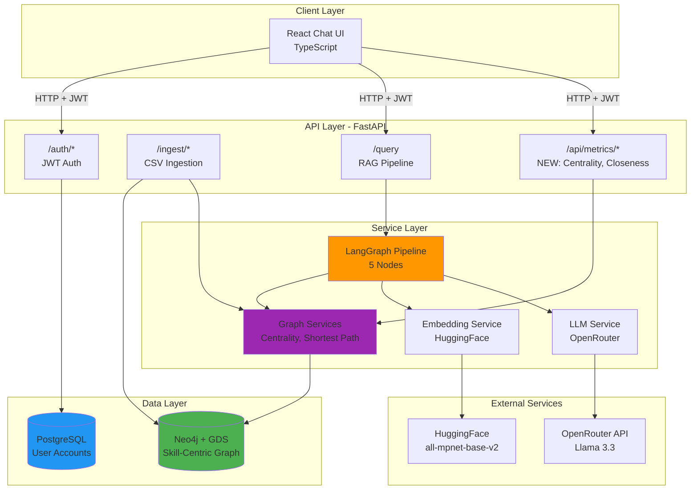
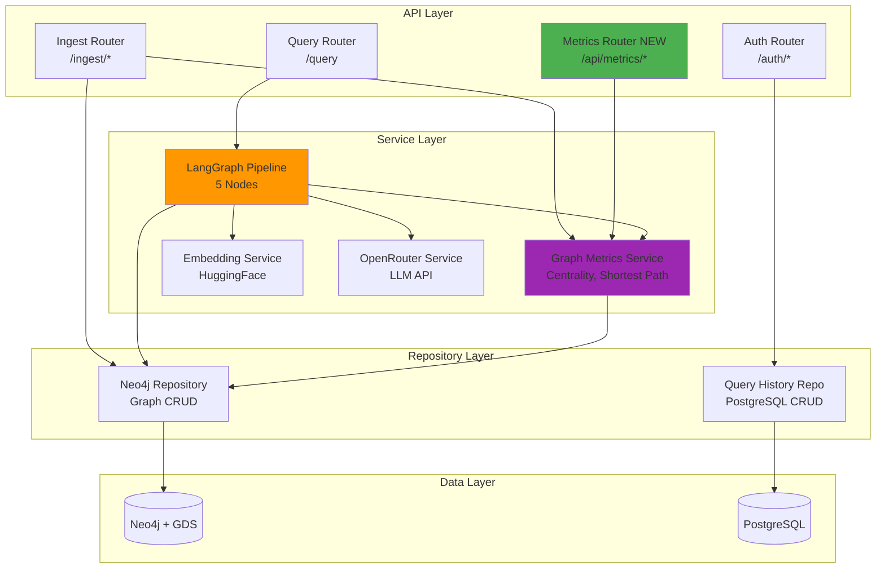
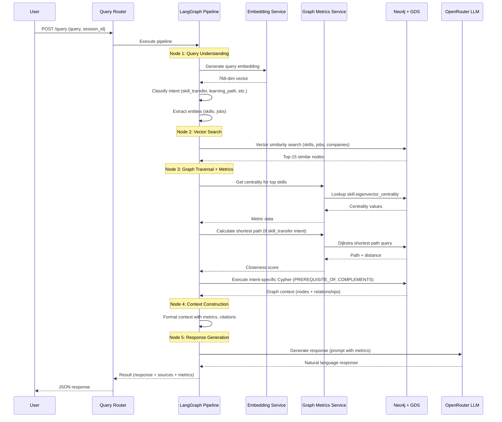
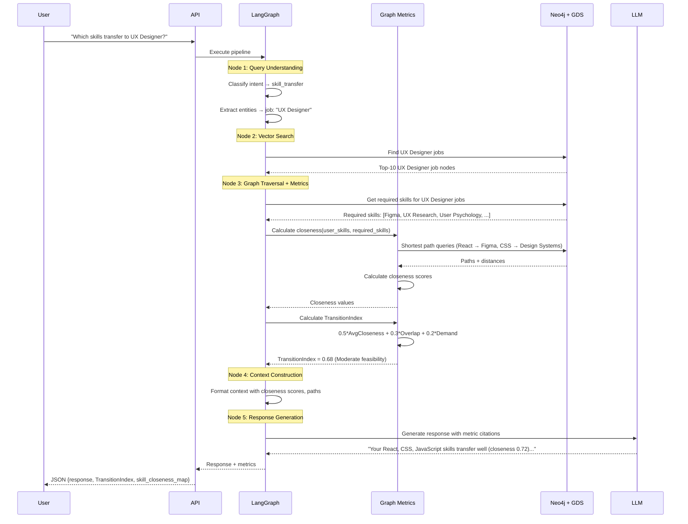
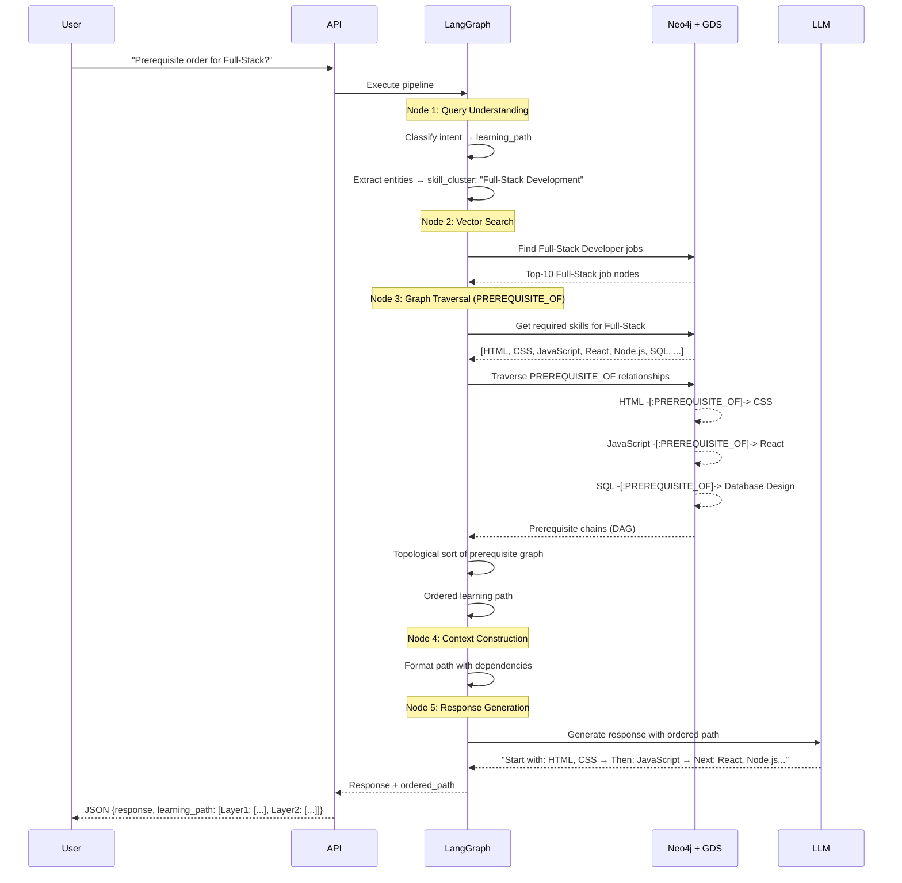
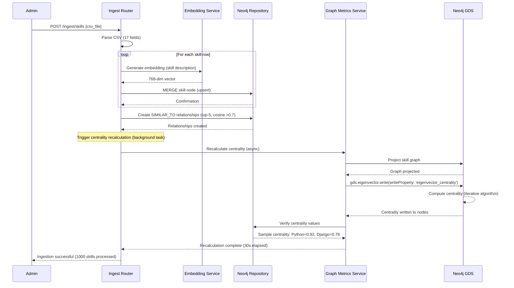

# Career Intelligence AI System v2.0 - Backend Architecture Document

## Introduction

This document outlines the backend architecture for **Career Intelligence AI System v2.0**, a research-validated GraphRAG platform that provides quantified career guidance through network analysis. This architecture builds upon the existing v1.1 MVP, transforming it from a job-centric keyword-matching system into a skill-centric network intelligence platform.

### Relationship to Frontend Architecture

The project includes a React-based chat interface. This document focuses on backend systems (FastAPI, Neo4j, LangGraph orchestration, network metrics). Frontend enhancements (metric visualization, skill path diagrams) are documented separately and MUST be used in conjunction with this document.

**Core Technology Stack Choices:** All technology selections in the Tech Stack section below are definitive for the entire project, including frontend components.

### Starter Template or Existing Project

**Analysis:** This is a **brownfield enhancement project** built on existing v1.1 codebase.

**Existing Foundation:**
- ✅ FastAPI backend with JWT authentication
- ✅ Neo4j knowledge graph (job-centric schema)
- ✅ LangGraph RAG pipeline (5 nodes: Query Understanding → Vector Search → Graph Traversal → Context Construction → Response Generation)
- ✅ PostgreSQL + Prisma ORM for user management
- ✅ React + TypeScript frontend
- ✅ OpenRouter LLM integration (`meta-llama/llama-3.3-8b-instruct:free`)
- ✅ HuggingFace embeddings (`all-MiniLM-L6-v2`, 384-dim)

**v2.0 Enhancements:**
- 🔄 Graph schema migration (job-centric → skill-centric)
- ➕ Neo4j GDS integration (eigenvector centrality, shortest path algorithms)
- ➕ New relationship types (PREREQUISITE_OF, COMPLEMENTS, SUBSTITUTES, TRANSITIONS_TO)
- ➕ Network metrics API (`/api/metrics/centrality`, `/api/metrics/closeness`)
- ➕ Enhanced LangGraph nodes (new query intents: skill transfer, learning path, transition difficulty)
- ➕ Research validation framework (expert evaluation, A/B testing)

**Constraints:**
- Must preserve all v1.1 functionality (backward compatibility requirement - CR1, CR2, CR3, CR4)
- Free-tier Neo4j limits (50K nodes, 175K relationships)
- No containerization for MVP
- CPU-only inference (no GPU)
- Synchronous processing (no async job queue for MVP)

**Decision:** Proceed with **incremental enhancement approach** - extend existing architecture rather than rebuild, ensuring zero regression in v1.1 features.

### Change Log

| Date | Version | Description | Author |
|------|---------|-------------|--------|
| 2025-10-15 | 1.0 | Initial Graph RAG system with authentication, CSV ingestion, Neo4j graph, LangGraph pipeline, React chat | John (PM Agent) |
| 2025-10-15 | 1.1 | Requirements refinement - added intent classification, similarity threshold, upsert behavior, retry strategy | John (PM Agent) |
| 2025-11-17 | 2.0 | Backend architecture for skill-centric transformation with network metrics (centrality, closeness), research validation framework, quantified transition scoring | Winston (Architect) |

---

## High Level Architecture

### Technical Summary

The Career Intelligence AI System v2.0 employs a **hybrid GraphRAG + Network Analytics architecture** built on a skill-centric Neo4j knowledge graph. The system combines vector similarity search (HuggingFace embeddings), structural graph traversal (Cypher queries), and research-validated network metrics (eigenvector centrality, shortest-path closeness) to deliver quantified career intelligence.

**Key Components:** FastAPI REST API, Neo4j + GDS for graph analytics, LangGraph for RAG orchestration, PostgreSQL for user management, and OpenRouter LLM for natural language generation.

**Architecture Style:** Monolithic backend with clear separation of concerns - API layer (FastAPI routers), service layer (graph algorithms, LangGraph nodes), and data layer (Neo4j, PostgreSQL).

**Core Innovation:** Applies network analysis methods from ICT innovation research ("Ties that Bind" methodology) to career domain - using graph closeness to predict skill transfer feasibility and eigenvector centrality to identify high-leverage skills.

This architecture supports PRD goals of enabling structural career queries (prerequisite order, skill bridges, transition difficulty) while maintaining <5s query response time (NFR1) and preserving 100% backward compatibility with v1.1 (NFR14, NFR17).

### High Level Overview

**Architectural Style:**
- **Monolithic backend** with layered service architecture
- **Event-driven elements:** Centrality recalculation triggered post-CSV ingestion (background task)
- **Hybrid data model:** Graph database (Neo4j) for relationships + Relational database (PostgreSQL) for user accounts

**Repository Structure (from PRD):**
- **Monorepo:** Single repository with `/backend` (Python/FastAPI) and `/frontend` (React/TypeScript) directories
- **Service Architecture:** Monolithic backend service (FastAPI) with modular routers and services

**Primary User Interaction Flow:**

```
User Query → FastAPI /query endpoint → LangGraph Pipeline:
  1. Query Understanding (intent classification, entity extraction)
  2. Vector Search (semantic similarity on skill/job embeddings)
  3. Graph Traversal (Cypher queries + network metrics: centrality lookup, shortest path)
  4. Context Construction (format results + metric values for LLM)
  5. Response Generation (OpenRouter LLM with metric citations)
→ Return JSON response (answer + sources + metrics) → React chat UI
```

**Key Architectural Decisions:**

1. **Skill-Centric Graph Model (vs Job-Centric)**
   - **Rationale:** Skills are primary infrastructure nodes; jobs are combinations of skills. Enables prerequisite modeling, centrality calculation, and skill transfer analysis.
   - **Impact:** Requires graph schema migration but unlocks structural queries impossible in v1.1.

2. **Neo4j GDS for Network Metrics (vs Custom Implementation)**
   - **Rationale:** Leverages optimized C++ algorithms (eigenvector centrality, Dijkstra) with free-tier support.
   - **Trade-off:** Dependent on Neo4j GDS availability; fallback to approximate algorithms if performance issues.

3. **Incremental Enhancement (vs Full Rebuild)**
   - **Rationale:** Preserve working v1.1 functionality, minimize risk, enable phased rollout.
   - **Trade-off:** Some technical debt inherited; migration complexity higher than greenfield.

4. **Synchronous Processing for MVP (vs Async Job Queue)**
   - **Rationale:** Simplifies implementation; centrality calculation cached (not per-query).
   - **Trade-off:** Background tasks block API thread; future: migrate to Celery/Redis for async.

### High Level Project Diagram



### Architectural and Design Patterns

**1. Repository Pattern**
- **Implementation:** `Neo4jRepository`, `QueryHistoryRepository` abstract database operations
- **Rationale:** Isolates data access logic, enables testing with mock repositories, supports future database migration flexibility
- **Alignment:** Standard pattern in v1.1, extended for metric queries in v2.0

**2. Strategy Pattern (Graph Algorithms)**
- **Implementation:** Multiple centrality calculation strategies (`EigenvectorStrategy`, `ApproximatePageRankStrategy`)
- **Rationale:** Enables fallback if Neo4j GDS unavailable or performance issues (Risk 1 mitigation)
- **Use Case:** Switch from eigenvector centrality to approximate PageRank if calculation >30s (NFR11 violation)

**3. Decorator Pattern (LangGraph Nodes)**
- **Implementation:** Wrap existing v1.1 nodes with metric calculation decorators
- **Rationale:** Preserves original node logic, adds metrics non-invasively for backward compatibility
- **Example:** `@with_centrality_lookup` decorator on Graph Traversal node

**4. Command Pattern (Graph Migration)**
- **Implementation:** Migration commands (`AddPropertiesCommand`, `CreateRelationshipsCommand`, `ComputeCentralityCommand`)
- **Rationale:** Supports idempotent migration execution, rollback capability, audit logging
- **Use Case:** Execute migration in phases with validation checkpoints (Phase 1-3 deployment strategy)

**5. Circuit Breaker Pattern (External APIs)**
- **Implementation:** OpenRouter LLM calls wrapped with circuit breaker (existing v1.1 pattern)
- **Rationale:** Prevent cascading failures from LLM API timeouts/rate limits
- **Extended:** Apply to Neo4j GDS calls (centrality calculation) in v2.0

**6. Observer Pattern (Centrality Recalculation)**
- **Implementation:** CSV ingestion events trigger centrality recalculation background task
- **Rationale:** Keep centrality values fresh without per-query overhead (NFR13: <200ms for TransitionIndex)
- **Configuration:** `CENTRALITY_UPDATE_FREQUENCY=on_ingestion` (NFR16)

---

## Tech Stack

### Cloud Infrastructure

- **Provider:** None (local development + cloud databases)
- **Key Services:**
  - Neo4j Aura (free tier: 50K nodes, 175K relationships)
  - Supabase PostgreSQL (free tier)
- **Deployment Regions:** N/A (MVP uses cloud database free tiers without custom deployment)

### Technology Stack Table

| Category | Technology | Version | Purpose | Rationale |
|----------|-----------|---------|---------|-----------|
| **Language** | Python | 3.11+ | Backend development | Existing v1.1 choice; strong ecosystem for data science, graph algorithms, LangGraph |
| **Language** | TypeScript | 5.x | Frontend development | Existing v1.1 choice; type safety for React components |
| **Runtime** | Node.js | 20.x LTS | Frontend tooling | Standard React development runtime |
| **Framework** | FastAPI | 0.104+ | Backend REST API | Existing v1.1; auto-generated OpenAPI docs, async support, high performance |
| **Framework** | React | 18+ | Frontend UI | Existing v1.1; component-based architecture for chat interface |
| **Orchestration** | LangGraph | 0.0.60+ | RAG pipeline | Existing v1.1; stateful graph-based workflow for multi-step queries |
| **Graph Database** | Neo4j | 5.x | Knowledge graph storage | Existing v1.1; ACID transactions, Cypher query language, native graph algorithms via GDS |
| **Graph Library** | Neo4j GDS | 2.5+ | Network metrics | **NEW v2.0:** Eigenvector centrality, shortest path (Dijkstra) - optimized C++ implementation |
| **Relational DB** | PostgreSQL | 15+ | User accounts, sessions | Existing v1.1; ACID compliance, mature ecosystem |
| **ORM** | Prisma | 5.x | PostgreSQL access | Existing v1.1; type-safe database client, migration management |
| **LLM API** | OpenRouter | N/A | LLM inference | Existing v1.1; aggregates multiple models, free tier available |
| **LLM Model** | Llama 3.3 8B Instruct | meta-llama/llama-3.3-8b-instruct:free | Response generation | Existing v1.1; free tier, good quality for career domain |
| **Embeddings** | all-mpnet-base-v2 | 768-dim | Skill/job embeddings | **UPGRADED v2.0:** Better semantic capture than v1.1's 384-dim model (FR47) |
| **Embeddings (Fallback)** | all-MiniLM-L6-v2 | 384-dim | Skill/job embeddings | v1.1 model; fallback if performance issues with 768-dim |
| **Validation Library** | Pydantic | 2.x | Data validation | Existing v1.1; LangGraph state management, API request/response validation |
| **Testing** | pytest | 7.x+ | Unit/integration tests | Existing v1.1; extended for network metric tests in v2.0 |
| **HTTP Client** | httpx | 0.25+ | Async HTTP requests | Existing v1.1; OpenRouter API calls |
| **Logging** | Python logging | stdlib | Structured logging | Existing v1.1; extended for graph algorithm metrics in v2.0 |
| **Dev Tools** | uvicorn | 0.24+ | ASGI server | Existing v1.1; development server for FastAPI |
| **Dev Tools** | Vite | 5.x | Frontend build | Existing v1.1; React dev server and build tooling |

### Technology Justification Notes

**Embedding Model Upgrade (v1.1 → v2.0):**
- **Decision:** Upgrade from `all-MiniLM-L6-v2` (384-dim) to `all-mpnet-base-v2` (768-dim)
- **Rationale:** Career domain has specialized terminology (Kubernetes, GraphQL, Django) requiring better semantic capture
- **Validation Plan:** Benchmark on 1000 skill pairs with expert ratings; target correlation >0.7 before production (FR47)
- **Fallback:** Revert to 384-dim or try `BAAI/bge-large-en-v1.5` (1024-dim) if performance issues

**Neo4j GDS (NEW for v2.0):**
- **Decision:** Use Neo4j Graph Data Science library (free tier supported)
- **Rationale:** Provides optimized implementations of eigenvector centrality, Dijkstra shortest path - critical for FR31-FR34
- **Risk Mitigation:** Benchmark centrality on 1K/5K/8K node datasets; fallback to approximate PageRank if >30s (Risk 1)

**No Async Job Queue for MVP:**
- **Decision:** Use FastAPI background tasks for centrality recalculation (not Celery/Redis)
- **Rationale:** Simplifies deployment, reduces infrastructure cost for MVP
- **Trade-off:** Background tasks block API thread; migrate to Celery in Phase 2 if needed
- **Constraint:** Acceptable for MVP with low user volume; recalculation triggered only on CSV ingestion (not per-query)

---

## Data Models

### Skill (Primary Node - Skill-Centric Model)

**Purpose:** Represent individual skills (programming languages, frameworks, soft skills, tools) as primary infrastructure nodes in the career graph. Skills are the fundamental building blocks; jobs are combinations of required skills.

**Key Attributes:**
- `skill_id`: String (UUID) - Unique identifier
- `name`: String - Skill name (e.g., "Python", "Django", "Communication")
- `description`: String - Detailed description of skill
- `category`: String - High-level category (e.g., "Programming Language", "Framework", "Soft Skill")
- `subcategory`: String - Optional granular classification
- `level`: String - Skill complexity level (BEGINNER | INTERMEDIATE | ADVANCED | EXPERT)
- `embedding`: List[Float] (768-dim) - Vector representation for semantic search
- `eigenvector_centrality`: Float (0-1) - **NEW v2.0:** Importance score based on connections to other important skills (FR31)
- `market_demand`: Integer - **NEW v2.0:** Number of jobs requiring this skill (FR29)
- `avg_salary_impact`: Float - **NEW v2.0:** Average salary premium for this skill (FR29)

**Relationships:**
- `(Skill)-[:REQUIRES]->(Skill)` - Prerequisite relationship (HTML → React)
- `(Skill)-[:PREREQUISITE_OF]->(Skill)` - **NEW v2.0:** Inverse of REQUIRES, explicit prerequisite order (FR30)
- `(Skill)-[:COMPLEMENTS]->(Skill)` - **NEW v2.0:** Co-occurring skills (Python ↔ PostgreSQL) (FR30)
- `(Skill)-[:SUBSTITUTES]->(Skill)` - **NEW v2.0:** Competing alternatives (Django ↔ Flask) (FR30)
- `(Skill)-[:TRANSITIONS_TO]->(Skill)` - **NEW v2.0:** Common career transition paths (FR30, FR37)
- `(Skill)-[:SIMILAR_TO]->(Skill)` - Semantic similarity (top 5, cosine >0.7) [v1.1 preserved]
- `(Skill)-[:BELONGS_TO_CATEGORY]->(Category)` - Category classification [v1.1 preserved]

**Design Decision:**
- Centrality stored as property (not computed per-query) for <200ms TransitionIndex calculation (NFR13)
- Embedding dimension increased to 768 for better career domain coverage (FR47)

### Job (Derived Cluster - Skill Combination)

**Purpose:** Represent job postings as combinations of required skills. Jobs are no longer primary nodes but clusters defined by their skill requirements.

**Key Attributes:**
- `job_id`: String (UUID) - Unique identifier [v1.1 preserved]
- `job_title`: String - Job title (e.g., "Backend Developer", "UX Designer") [v1.1 preserved]
- `company_name`: String - Hiring company [v1.1 preserved]
- `salary_min`: Integer - Minimum salary (INR) [v1.1 preserved]
- `salary_max`: Integer - Maximum salary (INR) [v1.1 preserved]
- `location`: String - Job location [v1.1 preserved]
- `description`: String - Job description text [v1.1 preserved]
- `embedding`: List[Float] (768-dim) - Vector representation [v1.1 preserved, upgraded to 768-dim]
- `creation_index`: Float (0-1) - **NEW v2.0:** Novel skill combination score (FR36)
- `reuse_index`: Float (0-1) - **NEW v2.0:** Established skill combination score (FR36)
- `classification`: String - **NEW v2.0:** CUTTING_EDGE | EMERGING | ESTABLISHED (FR36)

**Relationships:**
- `(Job)-[:REQUIRES]->(Skill)` - Required skills for job [v1.1 preserved]
- `(Job)-[:POSTED_BY]->(Company)` - Hiring company [v1.1 preserved]
- `(Job)-[:LOCATED_IN]->(Location)` - Job location [v1.1 preserved]

**Design Decision:**
- Recombinant innovation indices (creation_index, reuse_index) classify jobs by novelty of skill combinations
- Hypothesis: CUTTING_EDGE jobs correlate with salary premium (to be validated in Epic 4)

### Company

**Purpose:** Represent hiring companies for job posting attribution.

**Key Attributes:**
- `company_name`: String (Primary Key) - Company name [v1.1 preserved]
- `industry`: String - Industry classification (optional) [v1.1 preserved]
- `embedding`: List[Float] (768-dim) - Vector representation [v1.1 preserved, upgraded to 768-dim]

**Relationships:**
- `(Company)<-[:POSTED_BY]-(Job)` - Jobs posted by company [v1.1 preserved]

### Category / Subcategory

**Purpose:** Hierarchical classification of skills for taxonomy navigation.

**Key Attributes:**
- `category_id`: String - Category identifier [v1.1 preserved]
- `name`: String - Category name (e.g., "Programming Languages", "Frameworks") [v1.1 preserved]

**Relationships:**
- `(Category)<-[:BELONGS_TO_CATEGORY]-(Skill)` - Skill categorization [v1.1 preserved]
- `(Subcategory)<-[:BELONGS_TO_SUBCATEGORY]-(Skill)` - Granular classification [v1.1 preserved]

### User (PostgreSQL)

**Purpose:** User account management for authentication and query history.

**Key Attributes:**
- `id`: UUID (Primary Key) - User identifier [v1.1 preserved]
- `email`: String (Unique) - User email [v1.1 preserved]
- `password_hash`: String - Bcrypt hashed password [v1.1 preserved]
- `full_name`: String - User's full name [v1.1 preserved]
- `created_at`: Timestamp - Account creation timestamp [v1.1 preserved]

**Relationships (PostgreSQL Foreign Keys):**
- `User` (1) → (N) `QueryHistory` - User's query history [v1.1 preserved]

### QueryHistory (PostgreSQL)

**Purpose:** Log user queries and responses for conversation context and analytics.

**Key Attributes:**
- `id`: UUID (Primary Key) - Query record identifier [v1.1 preserved]
- `user_id`: UUID (Foreign Key → User) - User who submitted query [v1.1 preserved]
- `session_id`: UUID - Conversation session identifier [v1.1 preserved]
- `query_text`: String - User's query [v1.1 preserved]
- `response_text`: String - System's response [v1.1 preserved]
- `metadata`: JSON - Intent, sources, processing time, **NEW: metric values** [v1.1 + v2.0 extension]
- `created_at`: Timestamp - Query timestamp [v1.1 preserved]

**Design Decision:**
- `metadata` JSON field extended in v2.0 to include centrality values, closeness scores, TransitionIndex breakdown
- Enables research validation analysis (correlation checks in Epic 4)

### Network Metrics (Computed, Not Stored as Entities)

**TransitionIndex:**
- **Formula:** `0.50 * AvgCloseness + 0.30 * CoreSkillOverlap + 0.20 * MarketDemand` (FR35)
- **Range:** [0, 1]
- **Interpretation:** >0.7 = High feasibility, 0.4-0.7 = Moderate, <0.4 = Major pivot
- **Computed:** Per-query, not stored (too dynamic)

**Closeness:**
- **Formula:** `Closeness(A, B) = 1 / (1 + Distance(A, B))` where Distance = shortest path via Dijkstra (FR33)
- **Range:** [0, 1] where 1 = direct connection, 0 = very distant/no path
- **Computed:** On-demand or cached for common skill pairs

**User-to-Job Closeness:**
- **Formula:** `JobCloseness = (1/m) * Σ closeness_j` where m = number of required skills (FR34)
- **Enhancement:** Weight core skills 2.0x in average
- **Use Case:** Rank jobs by transition feasibility from user's current skill set

---

## Components

### 1. API Gateway (FastAPI Routers)

**Responsibility:** Handle HTTP requests, authentication, routing to service layer.

**Key Interfaces:**
- `POST /auth/register` - User registration (v1.1)
- `POST /auth/login` - JWT token generation (v1.1)
- `POST /ingest/skills` - CSV skill ingestion (v1.1)
- `POST /ingest/jobs` - CSV job ingestion (v1.1)
- `POST /query` - RAG query execution (v1.1 + v2.0 enhanced)
- `GET /api/metrics/centrality` - **NEW:** Centrality rankings (FR43)
- `GET /api/metrics/closeness` - **NEW:** Skill-to-skill closeness (FR44)
- `GET /health` - Health check (v1.1)

**Dependencies:**
- Authentication middleware (JWT validation)
- Rate limiting middleware (10 requests/min per user)
- Service layer (LangGraphService, GraphMetricsService)

**Technology Stack:** FastAPI 0.104+, Pydantic 2.x for request/response validation

### 2. LangGraph RAG Pipeline

**Responsibility:** Orchestrate multi-step query processing with stateful workflow management.

**Key Interfaces:**
- `ainvoke(GraphRAGState)` - Execute pipeline asynchronously
- Node interfaces: `query_understanding()`, `vector_search()`, `graph_traversal()`, `context_construction()`, `response_generation()`

**Dependencies:**
- EmbeddingService (HuggingFace API)
- Neo4jRepository (graph queries)
- GraphMetricsService (centrality, shortest path)
- OpenRouterService (LLM API)

**Technology Stack:** LangGraph 0.0.60+, Pydantic for state management

**v2.0 Enhancements:**
- **Query Understanding Node:** Add intent types (skill_transfer, learning_path, transition_difficulty, skill_bridge, high_leverage) (FR38)
- **Graph Traversal Node:** Inject centrality lookups, shortest path queries (FR39)
- **Context Construction Node:** Include metric values, research citations (FR40)
- **Response Generation Node:** Update prompts to cite metrics, explain graph structure reasoning (FR41)

### 3. Graph Metrics Service

**Responsibility:** Compute and retrieve network metrics from Neo4j + GDS.

**Key Interfaces:**
- `calculate_eigenvector_centrality()` - Compute centrality for all skills (FR31)
- `get_skill_centrality(skill_id: str) -> float` - Retrieve cached centrality value
- `calculate_shortest_path(skill_a: str, skill_b: str) -> Path` - Dijkstra shortest path (FR32)
- `calculate_closeness(skill_a: str, skill_b: str) -> float` - Closeness metric (FR33)
- `calculate_transition_index(user_skills: List[str], job_id: str) -> TransitionIndex` - Transition scoring (FR35)
- `infer_transitions_to_relationships()` - Infer TRANSITIONS_TO from static data (FR37)

**Dependencies:**
- Neo4jRepository (graph access)
- Neo4j GDS library (centrality, shortest path algorithms)

**Technology Stack:** Python 3.11+, Neo4j Python Driver, Neo4j GDS 2.5+

**Performance Targets:**
- Centrality calculation: <30s for 5K-8K skills (NFR11)
- Shortest path query: <500ms (NFR12)
- TransitionIndex calculation: <200ms (NFR13)

### 4. Embedding Service

**Responsibility:** Generate vector embeddings for skills, jobs, queries.

**Key Interfaces:**
- `generate_embedding(text: str) -> List[float]` - Generate 768-dim embedding
- `batch_generate_embeddings(texts: List[str]) -> List[List[float]]` - Batch processing for CSV ingestion

**Dependencies:**
- HuggingFace Transformers library
- Model: `all-mpnet-base-v2` (768-dim) or fallback to `all-MiniLM-L6-v2` (384-dim)

**Technology Stack:** HuggingFace Transformers, CPU-only inference

**v2.0 Enhancement:** Upgraded from 384-dim to 768-dim for better career domain terminology capture (FR47)

### 5. OpenRouter LLM Service

**Responsibility:** Call OpenRouter API for natural language response generation.

**Key Interfaces:**
- `generate_completion(system_prompt: str, user_prompt: str) -> str` - Generate LLM response
- Circuit breaker pattern for API failures (v1.1 existing)

**Dependencies:**
- OpenRouter API (external)
- httpx for async HTTP requests

**Technology Stack:** httpx 0.25+, OpenRouter API

**v2.0 Enhancement:** Updated prompts to cite network metrics, explain graph reasoning (FR41)

### 6. Neo4j Repository

**Responsibility:** Abstract Neo4j database operations (CRUD, Cypher queries).

**Key Interfaces:**
- `execute_read(query: str, params: dict) -> List[dict]` - Execute read-only query
- `execute_write(query: str, params: dict) -> dict` - Execute write query
- `vector_search(embedding: List[float], top_k: int) -> List[dict]` - Vector similarity search (v1.1)
- `create_relationship(start_id: str, end_id: str, rel_type: str, properties: dict)` - Create relationship (v2.0)

**Dependencies:**
- Neo4j Python Driver
- Neo4j database (cloud instance)

**Technology Stack:** Neo4j Python Driver 5.x, Neo4j 5.x + GDS

**v2.0 Extensions:**
- Add methods for new relationship types (PREREQUISITE_OF, COMPLEMENTS, SUBSTITUTES, TRANSITIONS_TO)
- Schema migration utilities (add properties, create indexes)

### 7. Query History Repository (PostgreSQL)

**Responsibility:** Store and retrieve user query history for conversation context.

**Key Interfaces:**
- `create_query_history(user_id: str, query: str, response: str, metadata: dict)` - Log query (v1.1)
- `get_conversation_history(session_id: str, limit: int) -> List[dict]` - Retrieve session history (v1.1)

**Dependencies:**
- Prisma ORM
- PostgreSQL database

**Technology Stack:** Prisma 5.x, PostgreSQL 15+

**v2.0 Enhancement:** Extend `metadata` field to include metric values (centrality, closeness, TransitionIndex) for research validation

### Component Diagrams



**LangGraph Pipeline Sequence (v2.0 Enhanced):**



---

## External APIs

### OpenRouter API

- **Purpose:** LLM inference for natural language response generation
- **Documentation:** https://openrouter.ai/docs
- **Base URL:** https://openrouter.ai/api/v1
- **Authentication:** Bearer token (API key in `Authorization` header)
- **Rate Limits:** Free tier: ~10 requests/min (model-dependent)

**Key Endpoints Used:**
- `POST /chat/completions` - Generate chat completion (OpenAI-compatible format)

**Integration Notes:**
- Existing v1.1 integration preserved
- v2.0 enhancement: Updated system/user prompts to cite network metrics (FR41)
- Circuit breaker pattern implemented (3 retries, exponential backoff)
- Error handling: Return generic response on API failure (avoid exposing errors to user)

### HuggingFace Inference API (Optional)

- **Purpose:** Embedding generation (alternative to local inference)
- **Documentation:** https://huggingface.co/docs/api-inference
- **Base URL:** https://api-inference.huggingface.co/models
- **Authentication:** Bearer token (API key in `Authorization` header)
- **Rate Limits:** Free tier: ~1000 requests/day

**Key Endpoints Used:**
- `POST /sentence-transformers/all-mpnet-base-v2` - Generate embeddings

**Integration Notes:**
- **Current Implementation:** Local inference using HuggingFace Transformers library (CPU-only)
- **Future Enhancement:** Migrate to HuggingFace API if local inference too slow (>2s per query)
- **Trade-off:** API reduces local compute but adds network latency + rate limit dependency

### Neo4j Aura (Cloud Database)

- **Purpose:** Managed Neo4j graph database hosting
- **Documentation:** https://neo4j.com/docs/aura/
- **Base URL:** neo4j+s://<instance-id>.databases.neo4j.io
- **Authentication:** Username/password (Bolt protocol)
- **Rate Limits:** Free tier: 50K nodes, 175K relationships (storage limit, not request rate)

**Key Features Used:**
- Vector indexes for similarity search (v1.1)
- Neo4j GDS for centrality, shortest path (v2.0 NEW)
- Cypher query language
- APOC procedures (if available on free tier)

**Integration Notes:**
- Free tier Neo4j GDS support confirmed (eigenvector centrality, Dijkstra algorithms available)
- Risk: Free tier may have query timeout limits (<30s); mitigation in Risk 1

---

## Core Workflows

### Workflow 1: Skill Transfer Query (NEW v2.0)

**Use Case:** User asks "Which of my skills transfer to UX Designer roles?"



### Workflow 2: Learning Path Query (NEW v2.0)

**Use Case:** User asks "What's the prerequisite order to learn Full-Stack Development?"



### Workflow 3: CSV Ingestion with Centrality Recalculation (v2.0 Enhanced)

**Use Case:** Admin uploads skills CSV, triggering centrality update



**Performance Note:** Centrality recalculation runs asynchronously in background to avoid blocking API response (NFR11: <30s for 5K-8K skills).

---

## REST API Spec

```yaml
openapi: 3.0.0
info:
  title: Career Intelligence AI System API
  version: 2.0.0
  description: |
    GraphRAG-based career intelligence platform with network metrics.
    v2.0 adds skill-centric graph model, eigenvector centrality, shortest-path closeness.

servers:
  - url: http://localhost:8000
    description: Local development server
  - url: https://api.career-intelligence.example.com
    description: Production API (future)

components:
  securitySchemes:
    BearerAuth:
      type: http
      scheme: bearer
      bearerFormat: JWT

  schemas:
    QueryRequest:
      type: object
      required: [query]
      properties:
        query:
          type: string
          example: "Which skills transfer to UX Designer?"
        session_id:
          type: string
          format: uuid
          example: "550e8400-e29b-41d4-a716-446655440000"
        include_metrics:
          type: boolean
          default: true
          description: Include network metrics in response (v2.0)

    QueryResponse:
      type: object
      properties:
        query:
          type: string
        response:
          type: string
        sources:
          type: array
          items:
            type: object
            properties:
              node_type:
                type: string
                enum: [Skill, Job, Company]
              node_id:
                type: string
              properties:
                type: object
        processing_time_ms:
          type: number
        metadata:
          type: object
          properties:
            intent:
              type: string
              enum: [skill_requirement, career_path, salary_analysis, skill_transfer, learning_path, transition_difficulty, skill_bridge, high_leverage]
            intent_confidence:
              type: number
            vector_results_count:
              type: integer
            graph_nodes_count:
              type: integer
            graph_relationships_count:
              type: integer
            metrics:
              type: object
              properties:
                transition_index:
                  type: number
                  minimum: 0
                  maximum: 1
                skill_closeness_map:
                  type: object
                  additionalProperties:
                    type: number
                centrality_values:
                  type: object
                  additionalProperties:
                    type: number

    CentralityResponse:
      type: object
      properties:
        skill_id:
          type: string
        skill_name:
          type: string
        eigenvector_centrality:
          type: number
          minimum: 0
          maximum: 1
        rank:
          type: integer
        market_demand:
          type: integer

    ClosenessRequest:
      type: object
      required: [skill_a, skill_b]
      properties:
        skill_a:
          type: string
          example: "Python"
        skill_b:
          type: string
          example: "Django"

    ClosenessResponse:
      type: object
      properties:
        skill_a:
          type: string
        skill_b:
          type: string
        distance:
          type: number
        closeness:
          type: number
          minimum: 0
          maximum: 1
        shortest_path:
          type: array
          items:
            type: string
          example: ["Python", "Web Development", "Django"]
        path_length:
          type: integer

paths:
  /auth/register:
    post:
      summary: Register new user
      tags: [Authentication]
      requestBody:
        required: true
        content:
          application/json:
            schema:
              type: object
              required: [email, password, full_name]
              properties:
                email:
                  type: string
                  format: email
                password:
                  type: string
                  minLength: 8
                full_name:
                  type: string
      responses:
        '201':
          description: User created successfully
          content:
            application/json:
              schema:
                type: object
                properties:
                  access_token:
                    type: string
                  user_id:
                    type: string
                    format: uuid

  /auth/login:
    post:
      summary: User login
      tags: [Authentication]
      requestBody:
        required: true
        content:
          application/json:
            schema:
              type: object
              required: [email, password]
              properties:
                email:
                  type: string
                password:
                  type: string
      responses:
        '200':
          description: Login successful
          content:
            application/json:
              schema:
                type: object
                properties:
                  access_token:
                    type: string
                  token_type:
                    type: string
                    example: bearer

  /query:
    post:
      summary: Execute RAG query
      tags: [Query]
      security:
        - BearerAuth: []
      requestBody:
        required: true
        content:
          application/json:
            schema:
              $ref: '#/components/schemas/QueryRequest'
      responses:
        '200':
          description: Query executed successfully
          content:
            application/json:
              schema:
                $ref: '#/components/schemas/QueryResponse'
        '429':
          description: Rate limit exceeded (10 requests/min)

  /api/metrics/centrality:
    get:
      summary: Get skill centrality rankings (v2.0 NEW)
      tags: [Metrics]
      security:
        - BearerAuth: []
      parameters:
        - in: query
          name: skill_id
          schema:
            type: string
          description: Optional skill ID (returns specific skill centrality)
        - in: query
          name: top_n
          schema:
            type: integer
            default: 20
          description: Number of top skills to return (if skill_id not provided)
      responses:
        '200':
          description: Centrality data retrieved
          content:
            application/json:
              schema:
                oneOf:
                  - $ref: '#/components/schemas/CentralityResponse'
                  - type: array
                    items:
                      $ref: '#/components/schemas/CentralityResponse'

  /api/metrics/closeness:
    post:
      summary: Calculate skill-to-skill closeness (v2.0 NEW)
      tags: [Metrics]
      security:
        - BearerAuth: []
      requestBody:
        required: true
        content:
          application/json:
            schema:
              $ref: '#/components/schemas/ClosenessRequest'
      responses:
        '200':
          description: Closeness calculated successfully
          content:
            application/json:
              schema:
                $ref: '#/components/schemas/ClosenessResponse'

  /ingest/skills:
    post:
      summary: Ingest skills CSV (v1.1, enhanced in v2.0)
      tags: [Ingestion]
      security:
        - BearerAuth: []
      requestBody:
        required: true
        content:
          multipart/form-data:
            schema:
              type: object
              properties:
                file:
                  type: string
                  format: binary
      responses:
        '200':
          description: Skills ingested, centrality recalculation triggered
          content:
            application/json:
              schema:
                type: object
                properties:
                  skills_processed:
                    type: integer
                  centrality_recalculation_status:
                    type: string
                    enum: [queued, in_progress, completed]

  /health:
    get:
      summary: Health check
      tags: [Health]
      responses:
        '200':
          description: Service healthy
          content:
            application/json:
              schema:
                type: object
                properties:
                  status:
                    type: string
                    example: healthy
                  neo4j_connected:
                    type: boolean
                  postgres_connected:
                    type: boolean
                  neo4j_gds_available:
                    type: boolean
```

---

## Database Schema

### Neo4j Graph Schema (v2.0 Skill-Centric Model)

```cypher
// ============================================
// NODE LABELS
// ============================================

// Primary Node: Skill (Skill-Centric Model)
CREATE CONSTRAINT skill_id_unique IF NOT EXISTS FOR (s:Skill) REQUIRE s.skill_id IS UNIQUE;
CREATE INDEX skill_name_index IF NOT EXISTS FOR (s:Skill) ON (s.name);

// Skill properties:
// - skill_id: String (UUID)
// - name: String
// - description: String
// - category: String
// - subcategory: String (optional)
// - level: String (BEGINNER | INTERMEDIATE | ADVANCED | EXPERT)
// - embedding: List<Float> (768-dim vector)
// - eigenvector_centrality: Float (0-1) [NEW v2.0]
// - market_demand: Integer [NEW v2.0]
// - avg_salary_impact: Float [NEW v2.0]

// Derived Cluster: Job
CREATE CONSTRAINT job_id_unique IF NOT EXISTS FOR (j:Job) REQUIRE j.job_id IS UNIQUE;

// Job properties:
// - job_id: String (UUID)
// - job_title: String
// - company_name: String
// - salary_min: Integer
// - salary_max: Integer
// - location: String
// - description: String
// - embedding: List<Float> (768-dim)
// - creation_index: Float (0-1) [NEW v2.0]
// - reuse_index: Float (0-1) [NEW v2.0]
// - classification: String (CUTTING_EDGE | EMERGING | ESTABLISHED) [NEW v2.0]

// Supporting Nodes
CREATE CONSTRAINT company_name_unique IF NOT EXISTS FOR (c:Company) REQUIRE c.company_name IS UNIQUE;
CREATE CONSTRAINT category_id_unique IF NOT EXISTS FOR (cat:Category) REQUIRE cat.category_id IS UNIQUE;

// ============================================
// VECTOR INDEXES (for similarity search)
// ============================================

// Skill embeddings (768-dim, upgraded from 384-dim in v1.1)
CALL db.index.vector.createNodeIndex(
  'skill_embeddings',
  'Skill',
  'embedding',
  768,
  'cosine'
);

// Job embeddings (768-dim)
CALL db.index.vector.createNodeIndex(
  'job_embeddings',
  'Job',
  'embedding',
  768,
  'cosine'
);

// Company embeddings (768-dim)
CALL db.index.vector.createNodeIndex(
  'company_embeddings',
  'Company',
  'embedding',
  768,
  'cosine'
);

// ============================================
// RELATIONSHIPS (v1.1 Preserved + v2.0 NEW)
// ============================================

// v1.1 Relationships (Preserved)
// (Job)-[:REQUIRES]->(Skill) - Job skill requirements
// (Job)-[:POSTED_BY]->(Company) - Job posting company
// (Job)-[:LOCATED_IN]->(Location) - Job location
// (Skill)-[:SIMILAR_TO]->(Skill) - Semantic similarity (top-5, cosine >0.7)
// (Skill)-[:BELONGS_TO_CATEGORY]->(Category) - Skill categorization

// v2.0 NEW Relationships
// (Skill)-[:PREREQUISITE_OF]->(Skill)
//   Properties: confidence_score (0-1), source (manual_curated | inferred)
//   Example: HTML -[:PREREQUISITE_OF {confidence_score: 0.95}]-> React

// (Skill)-[:COMPLEMENTS]->(Skill)
//   Properties: co_occurrence_rate (0-1), job_count (integer)
//   Example: Python -[:COMPLEMENTS {co_occurrence_rate: 0.78, job_count: 1200}]-> PostgreSQL

// (Skill)-[:SUBSTITUTES]->(Skill)
//   Properties: substitution_score (0-1), context (string)
//   Example: Django -[:SUBSTITUTES {substitution_score: 0.82, context: "web frameworks"}]-> Flask

// (Skill)-[:TRANSITIONS_TO]->(Skill)
//   Properties: transition_likelihood (0-1), estimated_learning_time_hours (integer)
//   Example: Python -[:TRANSITIONS_TO {transition_likelihood: 0.65, estimated_learning_time_hours: 40}]-> Django

// ============================================
// GRAPH PROJECTION (for Neo4j GDS)
// ============================================

// Project skill graph for centrality calculation
CALL gds.graph.project(
  'skill-centrality-graph',
  'Skill',
  {
    SIMILAR_TO: {orientation: 'UNDIRECTED'},
    COMPLEMENTS: {orientation: 'UNDIRECTED', properties: 'co_occurrence_rate'},
    PREREQUISITE_OF: {orientation: 'DIRECTED'}
  }
);

// Compute eigenvector centrality and write to skill.eigenvector_centrality property
CALL gds.eigenvector.write(
  'skill-centrality-graph',
  {
    writeProperty: 'eigenvector_centrality',
    maxIterations: 100,
    tolerance: 0.0001
  }
);

// ============================================
// MIGRATION SCRIPT (v1.1 → v2.0)
// ============================================

// Phase 1: Add new properties to existing Skill nodes
MATCH (s:Skill)
SET s.eigenvector_centrality = COALESCE(s.eigenvector_centrality, 0.0),
    s.market_demand = COALESCE(s.market_demand, 0),
    s.avg_salary_impact = COALESCE(s.avg_salary_impact, 0.0);

// Phase 2: Add new properties to existing Job nodes
MATCH (j:Job)
SET j.creation_index = COALESCE(j.creation_index, 0.0),
    j.reuse_index = COALESCE(j.reuse_index, 0.0),
    j.classification = COALESCE(j.classification, 'ESTABLISHED');

// Phase 3: Create COMPLEMENTS relationships from job skill co-occurrence
MATCH (j:Job)-[:REQUIRES]->(s1:Skill)
MATCH (j)-[:REQUIRES]->(s2:Skill)
WHERE id(s1) < id(s2) // Avoid duplicates
WITH s1, s2, count(j) AS co_occurrence_count, count(j) * 1.0 / (SELECT count(*) FROM Job) AS co_occurrence_rate
WHERE co_occurrence_count >= 5 // Minimum 5 jobs
MERGE (s1)-[c:COMPLEMENTS]->(s2)
SET c.co_occurrence_rate = co_occurrence_rate,
    c.job_count = co_occurrence_count;

// Phase 4: Compute initial centrality (manual trigger, not in migration script)
// Run via Neo4j GDS as shown in Graph Projection section above

// ============================================
// ROLLBACK SCRIPT (if v2.0 issues)
// ============================================

// Remove new properties from Skill nodes
MATCH (s:Skill)
REMOVE s.eigenvector_centrality, s.market_demand, s.avg_salary_impact;

// Remove new properties from Job nodes
MATCH (j:Job)
REMOVE j.creation_index, j.reuse_index, j.classification;

// Remove new relationship types
MATCH ()-[r:PREREQUISITE_OF|COMPLEMENTS|SUBSTITUTES|TRANSITIONS_TO]->()
DELETE r;
```

### PostgreSQL Schema (v1.1 Preserved, No Changes in v2.0)

```sql
-- Users table (v1.1, unchanged)
CREATE TABLE users (
    id UUID PRIMARY KEY DEFAULT gen_random_uuid(),
    email VARCHAR(255) UNIQUE NOT NULL,
    password_hash VARCHAR(255) NOT NULL,
    full_name VARCHAR(255) NOT NULL,
    created_at TIMESTAMP WITH TIME ZONE DEFAULT CURRENT_TIMESTAMP
);

-- Query history table (v1.1, metadata extended in v2.0)
CREATE TABLE query_history (
    id UUID PRIMARY KEY DEFAULT gen_random_uuid(),
    user_id UUID NOT NULL REFERENCES users(id) ON DELETE CASCADE,
    session_id UUID NOT NULL,
    query_text TEXT NOT NULL,
    response_text TEXT NOT NULL,
    metadata JSONB NOT NULL, -- Extended in v2.0 to include metric values
    created_at TIMESTAMP WITH TIME ZONE DEFAULT CURRENT_TIMESTAMP
);

-- Indexes for query performance
CREATE INDEX idx_query_history_user_id ON query_history(user_id);
CREATE INDEX idx_query_history_session_id ON query_history(session_id);
CREATE INDEX idx_query_history_created_at ON query_history(created_at);

-- Example metadata structure (v2.0)
-- {
--   "intent": "skill_transfer",
--   "intent_confidence": 0.92,
--   "processing_time_ms": 1234,
--   "sources": [...],
--   "metrics": {
--     "transition_index": 0.68,
--     "skill_closeness_map": {"React": 0.72, "CSS": 0.85},
--     "centrality_values": {"Python": 0.92, "Django": 0.78}
--   }
-- }
```

---

## Source Tree

```
career-intelligence-system/
├── backend/                          # FastAPI backend
│   ├── app/
│   │   ├── main.py                   # FastAPI app initialization
│   │   ├── config.py                 # Environment configuration (NFR16 variables)
│   │   ├── dependencies.py           # Dependency injection (repositories, services)
│   │   │
│   │   ├── routers/                  # API endpoints
│   │   │   ├── auth.py               # [v1.1] /auth/* - JWT authentication
│   │   │   ├── ingest.py             # [v1.1] /ingest/* - CSV ingestion
│   │   │   ├── query.py              # [v1.1 + v2.0] /query - RAG execution
│   │   │   └── metrics.py            # [NEW v2.0] /api/metrics/* - Centrality, closeness
│   │   │
│   │   ├── services/
│   │   │   ├── embedding_service.py  # [v1.1 + v2.0] HuggingFace embeddings (768-dim)
│   │   │   ├── openrouter_service.py # [v1.1] LLM API client
│   │   │   ├── langgraph_service.py  # [v1.1 + v2.0] LangGraph pipeline orchestration
│   │   │   │
│   │   │   └── graph/                # [NEW v2.0] Graph algorithm services
│   │   │       ├── centrality.py     # Eigenvector centrality calculation (Neo4j GDS)
│   │   │       ├── shortest_path.py  # Dijkstra shortest path queries
│   │   │       ├── transition_index.py # TransitionIndex calculation
│   │   │       └── schema_migration.py # v1.1 → v2.0 migration utilities
│   │   │
│   │   ├── agents/                   # LangGraph nodes
│   │   │   ├── graph.py              # [v1.1] Workflow definition (5 nodes)
│   │   │   └── nodes/
│   │   │       ├── query_understanding.py # [v1.1 + v2.0] Intent + entity extraction
│   │   │       ├── vector_search.py       # [v1.1] Semantic similarity
│   │   │       ├── graph_traversal.py     # [v1.1 + v2.0] Cypher queries + metrics
│   │   │       ├── context_construction.py# [v1.1 + v2.0] Context formatting + citations
│   │   │       └── response_generation.py # [v1.1 + v2.0] LLM response
│   │   │
│   │   ├── repositories/
│   │   │   ├── neo4j_repository.py   # [v1.1 + v2.0] Neo4j CRUD operations
│   │   │   └── query_history_repository.py # [v1.1] PostgreSQL query logging
│   │   │
│   │   ├── models/                   # Pydantic models
│   │   │   ├── graph.py              # [v1.1] GraphRAGState (LangGraph state)
│   │   │   ├── query.py              # [v1.1] QueryRequest, QueryResponse
│   │   │   └── metrics.py            # [NEW v2.0] TransitionIndex, Closeness, CentralityResponse
│   │   │
│   │   ├── middleware/
│   │   │   ├── auth.py               # [v1.1] JWT validation
│   │   │   └── rate_limit.py         # [v1.1] 10 requests/min per user
│   │   │
│   │   └── utils/
│   │       ├── logger.py             # [v1.1 + v2.0] Structured logging
│   │       └── metrics.py            # [v1.1 + v2.0] Performance tracking
│   │
│   ├── scripts/                      # Migration and admin scripts
│   │   ├── migrate_graph_v2.py       # [NEW v2.0] Execute Neo4j schema migration
│   │   ├── compute_centrality.py     # [NEW v2.0] Manual centrality recalculation
│   │   └── validate_migration.py     # [NEW v2.0] Validate v1.1 → v2.0 data integrity
│   │
│   ├── tests/
│   │   ├── unit/
│   │   │   ├── test_centrality.py    # [NEW v2.0] Centrality calculation accuracy
│   │   │   ├── test_shortest_path.py # [NEW v2.0] Dijkstra correctness
│   │   │   └── test_transition_index.py # [NEW v2.0] TransitionIndex formula
│   │   ├── integration/
│   │   │   ├── test_query_flow.py    # [v1.1 + v2.0] End-to-end query with metrics
│   │   │   └── test_migration.py     # [NEW v2.0] Migration idempotence
│   │   └── fixtures/                 # Test data (skills, jobs, expected metrics)
│   │
│   ├── prisma/
│   │   └── schema.prisma             # [v1.1] PostgreSQL schema definition
│   │
│   ├── requirements.txt              # [v1.1 + v2.0] Python dependencies
│   ├── .env.example                  # [v1.1 + v2.0] Environment variable template
│   └── README.md                     # Backend setup instructions
│
├── frontend/                         # React frontend
│   ├── src/
│   │   ├── components/
│   │   │   ├── chat/                 # [v1.1] Chat interface components
│   │   │   │   ├── ChatContainer.tsx
│   │   │   │   ├── ChatMessage.tsx   # [v1.1 + v2.0] Enhanced to render metrics
│   │   │   │   └── ChatInput.tsx
│   │   │   │
│   │   │   └── metrics/              # [NEW v2.0] Metric visualization
│   │   │       ├── MetricBadge.tsx   # Display centrality, closeness inline
│   │   │       ├── TransitionIndexBreakdown.tsx # TransitionIndex component breakdown
│   │   │       └── SkillPathVisualization.tsx # Optional: D3.js skill path diagram
│   │   │
│   │   ├── api/
│   │   │   ├── queryClient.ts        # [v1.1 + v2.0] /query API calls
│   │   │   └── metricsClient.ts      # [NEW v2.0] /api/metrics/* API calls
│   │   │
│   │   ├── types/
│   │   │   ├── query.ts              # [v1.1 + v2.0] Query request/response types
│   │   │   └── metrics.ts            # [NEW v2.0] Metric data types
│   │   │
│   │   ├── App.tsx                   # [v1.1] Main app component
│   │   └── main.tsx                  # [v1.1] React entry point
│   │
│   ├── package.json                  # [v1.1] Frontend dependencies
│   ├── vite.config.ts                # [v1.1] Vite configuration
│   └── README.md                     # Frontend setup instructions
│
├── docs/                             # Documentation
│   ├── prd/                          # [v2.0] Product requirements
│   │   ├── index.md
│   │   ├── epic-1-skill-centric-graph-restructuring.md
│   │   ├── epic-2-network-metrics-implementation.md
│   │   ├── epic-3-advanced-query-intelligence.md
│   │   └── epic-4-research-validation-framework.md
│   │
│   ├── architecture/                 # [v2.0] Architecture documents
│   │   ├── backend-architecture-v2.md  # THIS DOCUMENT
│   │   └── frontend-architecture.md    # (To be created)
│   │
│   └── research/                     # [v2.0] Research methodology
│       ├── network-metrics-methodology.md
│       └── validation-framework.md
│
├── .github/
│   └── workflows/
│       └── ci.yml                    # [v1.1 + v2.0] CI/CD pipeline (test + lint)
│
├── .gitignore
├── README.md                         # Project overview
└── LICENSE
```

---

## Infrastructure and Deployment

### Infrastructure as Code

- **Tool:** N/A (No IaC for MVP - using cloud database free tiers)
- **Location:** N/A
- **Approach:** Manual provisioning of Neo4j Aura, Supabase PostgreSQL via web consoles

**Future Enhancement (Post-MVP):**
- **Tool:** Terraform or Pulumi for cloud database provisioning
- **Location:** `infrastructure/` directory
- **Rationale:** Enable reproducible staging/production environments, automated backups

### Deployment Strategy

- **Strategy:** Manual deployment (local development + cloud databases)
- **CI/CD Platform:** GitHub Actions (for automated testing only, not deployment in MVP)
- **Pipeline Configuration:** `.github/workflows/ci.yml` (linting, unit tests, integration tests)

**Phased Rollout (v2.0):**

1. **Phase 1 (Week 1):** Deploy schema migration to staging Neo4j instance
   - Run `python scripts/migrate_graph_v2.py` on staging database copy
   - Validate data integrity with `python scripts/validate_migration.py`
   - Benchmark centrality calculation time (target: <30s for 5K-8K skills)

2. **Phase 2 (Week 2):** Deploy backend enhancements to local development
   - Test new `/api/metrics/*` endpoints
   - Validate LangGraph pipeline with metric integration
   - Run regression tests (all v1.1 acceptance criteria must pass)

3. **Phase 3 (Week 3):** Deploy frontend enhancements to local development
   - Test metric display in chat interface
   - Validate TransitionIndex visualization
   - End-to-end testing with real user queries

4. **Phase 4 (Week 4):** Production deployment with feature flag
   - Set `ENABLE_NETWORK_METRICS=true` in production environment
   - Monitor query response times (target: <5s, NFR1)
   - Monitor Neo4j GDS performance (centrality <30s, NFR11)

### Environments

- **Development:** Local (localhost:8000 backend, localhost:5173 frontend) - Full feature access, debug logging enabled
- **Staging:** Cloud databases only (Neo4j Aura + Supabase) - v2.0 migration testing, performance benchmarking
- **Production:** Same as staging for MVP (future: separate production database instances) - Feature flag controlled rollout, monitoring enabled

### Environment Promotion Flow

```
Development (local) → Staging (cloud databases) → Production (cloud databases + feature flag)
```

**Promotion Criteria:**
- Development → Staging: All unit tests pass, migration script validated locally
- Staging → Production: Integration tests pass, performance benchmarks met (NFR11-13), regression tests pass (v1.1 acceptance criteria)

### Rollback Strategy

- **Primary Method:** Feature flag toggle (`ENABLE_NETWORK_METRICS=false`)
- **Trigger Conditions:**
  - Query response time >5s (NFR1 violation)
  - Centrality calculation >30s (NFR11 violation)
  - >5% error rate in graph metric queries
  - User-reported errors in v1.1 functionality (backward compatibility breakage)
- **Recovery Time Objective:** <15 minutes (toggle feature flag, restart backend service)

**Full Rollback (if feature flag insufficient):**
1. Revert backend code to v1.1 (git tag: `v1.1-stable`)
2. Run Neo4j rollback script: `scripts/rollback_graph_v2.cypher`
3. Verify v1.1 functionality with regression tests
4. RTO: <30 minutes

---

## Error Handling Strategy

### General Approach

- **Error Model:** Structured exception hierarchy with domain-specific exceptions
  - `GraphServiceError` → `CentralityCalculationError`, `ShortestPathError`
  - `LangGraphExecutionError` → `NodeExecutionError`, `StateValidationError`
  - `APIError` → `AuthenticationError`, `RateLimitError`, `ValidationError`
- **Exception Hierarchy:** Python standard `Exception` base class, custom exceptions inherit
- **Error Propagation:**
  - Services raise domain-specific exceptions
  - Routers catch exceptions, translate to HTTP status codes
  - LangGraph nodes catch exceptions, store in `state.metadata` for diagnostic responses

### Logging Standards

- **Library:** Python `logging` module (stdlib)
- **Format:** JSON structured logging for machine parsing
  ```json
  {
    "timestamp": "2025-11-17T10:30:45.123Z",
    "level": "INFO",
    "logger": "GraphMetricsService",
    "message": "Centrality calculation completed",
    "context": {
      "duration_ms": 28543,
      "skill_count": 5234,
      "avg_centrality": 0.42
    }
  }
  ```
- **Levels:**
  - `DEBUG`: Algorithm intermediate values (centrality iterations, path exploration)
  - `INFO`: Stage completion (centrality calculated, shortest path found)
  - `WARNING`: Performance degradation (centrality >20s, path query >400ms)
  - `ERROR`: Failures (Neo4j GDS unavailable, LLM API timeout)
  - `CRITICAL`: System-level failures (database connection lost)
- **Required Context:**
  - **Correlation ID:** `request_id` (UUID) for tracing query through pipeline
  - **Service Context:** `service_name` (e.g., "GraphMetricsService", "LangGraphService")
  - **User Context:** `user_id` (if authenticated, omit password_hash/email for security)

### Error Handling Patterns

#### External API Errors

**OpenRouter LLM API:**
- **Retry Policy:** 3 retries with exponential backoff (1s, 2s, 4s)
- **Circuit Breaker:** Open circuit after 5 consecutive failures, half-open after 60s
- **Timeout Configuration:** 30s per request
- **Error Translation:**
  - 429 (rate limit) → Return cached response or generic fallback
  - 500 (server error) → Retry, fallback to shorter prompt
  - Timeout → Return partial response with disclaimer

**Neo4j GDS:**
- **Retry Policy:** 1 retry for transient errors (connection timeout), no retry for algorithm errors
- **Circuit Breaker:** N/A (database dependency, system unusable if down)
- **Timeout Configuration:** Centrality: 35s (NFR11 + 5s buffer), Shortest path: 1s
- **Error Translation:**
  - GDS unavailable → Fallback to approximate PageRank (centrality) or return "metric unavailable"
  - Timeout → Log warning, return query response without metric values

#### Business Logic Errors

**Invalid Query Input:**
- **Custom Exceptions:** `InvalidQueryError` (empty query, unsupported intent)
- **User-Facing Errors:**
  ```json
  {
    "error": "Query cannot be empty",
    "error_code": "INVALID_QUERY_001",
    "suggestion": "Please provide a career-related question"
  }
  ```
- **Error Codes:** `INVALID_QUERY_*`, `SKILL_NOT_FOUND_*`, `JOB_NOT_FOUND_*`

**Metric Calculation Failures:**
- **Custom Exceptions:** `CentralityCalculationError`, `ShortestPathError`
- **User-Facing Errors:** Return query response with disclaimer
  ```
  "Note: Network metrics temporarily unavailable due to system maintenance. Basic career guidance provided."
  ```
- **Error Codes:** `METRIC_CALC_001` (centrality timeout), `METRIC_CALC_002` (no path found)

#### Data Consistency

**Graph Schema Migration:**
- **Transaction Strategy:** Cypher transactions with `COMMIT` on success, `ROLLBACK` on failure
- **Compensation Logic:** Rollback script (`rollback_graph_v2.cypher`) to remove new properties/relationships
- **Idempotency:** Use `MERGE` instead of `CREATE` for upsert behavior, `COALESCE` for property defaults

**CSV Ingestion:**
- **Transaction Strategy:** Batch processing (1000 rows per transaction), commit per batch
- **Compensation Logic:** Log failed rows to `ingestion_errors.csv`, manual review and re-ingestion
- **Idempotency:** `MERGE` on skill_id/job_id prevents duplicates, update embeddings on re-ingestion

---

## Coding Standards

### Core Standards

- **Languages & Runtimes:**
  - Python 3.11+ (backend)
  - TypeScript 5.x (frontend)
  - Node.js 20.x LTS (frontend tooling)
- **Style & Linting:**
  - Python: `black` formatter (line length 100), `ruff` linter
  - TypeScript: `prettier` formatter, `eslint` linter (Airbnb style guide)
  - Cypher: Use `UPPER_CASE` for keywords, `camelCase` for parameters, indentation 2 spaces
- **Test Organization:**
  - Unit tests: `tests/unit/test_<module>.py` (mirror `app/` structure)
  - Integration tests: `tests/integration/test_<feature>.py`
  - Fixtures: `tests/fixtures/` (sample skills, jobs, expected metrics)

### Naming Conventions

| Element | Convention | Example |
|---------|-----------|---------|
| Python functions | snake_case | `calculate_eigenvector_centrality()` |
| Python classes | PascalCase | `GraphMetricsService` |
| Python constants | UPPER_SNAKE_CASE | `MAX_CENTRALITY_ITERATIONS` |
| TypeScript functions | camelCase | `calculateTransitionIndex()` |
| TypeScript components | PascalCase | `MetricBadge` |
| Neo4j node labels | PascalCase | `Skill`, `Job` |
| Neo4j relationships | UPPER_SNAKE_CASE | `PREREQUISITE_OF`, `COMPLEMENTS` |
| Neo4j properties | snake_case | `eigenvector_centrality`, `co_occurrence_rate` |
| API endpoints | kebab-case | `/api/metrics/centrality` |
| Environment variables | UPPER_SNAKE_CASE | `NEO4J_GDS_ENABLED` |

### Critical Rules

**1. Metric Calculation Transparency**
- **Rule:** All metric calculation functions MUST include mathematical formula in docstring
- **Rationale:** Research validation requires reproducible methodology (FR45, FR46)
- **Example:**
  ```python
  def calculate_closeness(skill_a: str, skill_b: str) -> float:
      """
      Calculate closeness between two skills using shortest path distance.

      Formula: Closeness(A, B) = 1 / (1 + Distance(A, B))
      where Distance = shortest path via Dijkstra (edge weight = 1/co_occurrence_count)

      Research citation: Adapted from "Ties that Bind: ICT Network" (Page 15-16)

      Args:
          skill_a: Source skill name
          skill_b: Target skill name

      Returns:
          Closeness score in range [0, 1]

      Raises:
          ShortestPathError: If no path exists between skills
      """
  ```

**2. Backward Compatibility Enforcement**
- **Rule:** Never modify v1.1 API contracts (request/response schemas) - only extend
- **Rationale:** Avoid breaking existing clients (CR1, NFR17)
- **Validation:** Run v1.1 regression tests in CI/CD pipeline

**3. Graph Algorithm Timeout Handling**
- **Rule:** All Neo4j GDS calls MUST have explicit timeout with fallback behavior
- **Rationale:** Prevent query timeout cascades (NFR11, NFR12, Risk 1)
- **Example:**
  ```python
  try:
      centrality = neo4j_gds.eigenvector(timeout=30)
  except TimeoutError:
      logger.warning("Centrality calculation timeout, using approximate PageRank")
      centrality = neo4j_gds.pagerank(timeout=10)
  ```

**4. LangGraph State Validation**
- **Rule:** All LangGraph nodes MUST validate `state.metadata` for pipeline errors before processing
- **Rationale:** Prevent error propagation through pipeline (error handling pattern)
- **Example:**
  ```python
  def response_generation(state: GraphRAGState) -> dict:
      if state.metadata.get("vector_search_error"):
          return {"final_response": "⚠️ PIPELINE ERROR: Vector search failed..."}
      # Normal processing
  ```

**5. Metric Disclaimer for Heuristics**
- **Rule:** TransitionIndex and unvalidated metrics MUST include disclaimer in UI/API responses
- **Rationale:** Ethical requirement - users must know heuristic vs validated metrics (FR46, NFR18)
- **Example:** Response includes: "TransitionIndex is a heuristic score, not a research-validated probability"

---

## Test Strategy and Standards

### Testing Philosophy

- **Approach:** Test-after development for MVP (TDD for critical algorithms post-MVP)
- **Coverage Goals:**
  - Backend: >80% line coverage (pytest-cov)
  - Frontend: >70% component coverage (Jest + React Testing Library)
- **Test Pyramid:**
  - 70% Unit tests (fast, isolated, algorithm correctness)
  - 20% Integration tests (API endpoints, database queries)
  - 10% End-to-end tests (full query flow with UI)

### Test Types and Organization

#### Unit Tests

- **Framework:** pytest 7.x (backend), Jest 29.x (frontend)
- **File Convention:** `test_<module>.py` (backend), `<Component>.test.tsx` (frontend)
- **Location:** `backend/tests/unit/`, `frontend/src/__tests__/`
- **Mocking Library:** `unittest.mock` (Python), `jest.mock()` (TypeScript)
- **Coverage Requirement:** >80% (backend), >70% (frontend)

**AI Agent Requirements (Backend):**
- Generate tests for all public methods in services (GraphMetricsService, EmbeddingService)
- Cover edge cases: empty input, invalid skill_id, no path found
- Follow AAA pattern (Arrange, Act, Assert)
- Mock external dependencies (Neo4j, HuggingFace API, OpenRouter)

**Critical Test Cases (v2.0):**
1. **Centrality Calculation Accuracy** (`test_centrality.py`)
   - Compare Neo4j GDS output to reference values (hand-calculated or from research paper)
   - Validate range [0, 1], sum of centrality ≈ number of nodes
   - Test convergence (max iterations reached without oscillation)

2. **Shortest Path Correctness** (`test_shortest_path.py`)
   - Validate Dijkstra results on known graphs (triangle inequality)
   - Test edge cases: no path (disconnected skills), self-loop (same skill)
   - Performance: <500ms for typical skill-to-skill queries (NFR12)

3. **TransitionIndex Formula** (`test_transition_index.py`)
   - Test edge cases: closeness=0 (no path), overlap=1 (all skills match), demand=0 (unknown skills)
   - Validate range [0, 1], component weights sum to 1.0
   - Regression: Ensure formula unchanged (0.5 closeness + 0.3 overlap + 0.2 demand)

#### Integration Tests

- **Scope:** API endpoints + database interactions (Neo4j, PostgreSQL)
- **Location:** `backend/tests/integration/`
- **Test Infrastructure:**
  - **Neo4j:** Testcontainers for isolated Neo4j instance (or in-memory H2 graph if available)
  - **PostgreSQL:** Testcontainers PostgreSQL
  - **OpenRouter LLM:** WireMock for stubbing API responses (avoid real API calls in tests)

**Critical Integration Tests (v2.0):**
1. **Query Flow with Metrics** (`test_query_flow.py`)
   - Submit query → Verify metric values in response (centrality, closeness, TransitionIndex)
   - Validate sources include skill paths, centrality rankings
   - Performance: <5s total query time (NFR1)

2. **Graph Migration Idempotence** (`test_migration.py`)
   - Run migration script 2x on same database
   - Verify no duplicate properties, relationships
   - Validate data integrity (node count unchanged, new properties present)

3. **CSV Ingestion + Centrality Recalculation** (`test_ingestion.py`)
   - Ingest 100 skills → Trigger centrality recalculation
   - Verify centrality values updated, `market_demand` incremented
   - Performance: Centrality <30s for 5K skills (NFR11)

#### End-to-End Tests

- **Framework:** Playwright (browser automation)
- **Scope:** Full user journey (login → query → view response with metrics)
- **Environment:** Local development (backend + frontend running)
- **Test Data:** Seeded database with known skills, jobs (fixtures)

**Critical E2E Tests:**
1. User submits "Which skills transfer to UX Designer?" → Response includes closeness scores, TransitionIndex
2. User clicks "View skill path" → SkillPathVisualization renders correctly
3. Regression: v1.1 query "What skills for Backend Developer?" returns same results (no degradation)

### Test Data Management

- **Strategy:** Fixtures with known expected values (deterministic)
- **Fixtures:** `tests/fixtures/skills.json`, `tests/fixtures/jobs.json`
- **Factories:** `SkillFactory.create()` for dynamic test data generation
- **Cleanup:** Tear down Testcontainers after each test suite, clear in-memory state

**Example Fixture (Centrality Validation):**
```json
{
  "skills": [
    {"skill_id": "1", "name": "Python", "expected_centrality": 0.92},
    {"skill_id": "2", "name": "Django", "expected_centrality": 0.78},
    {"skill_id": "3", "name": "Flask", "expected_centrality": 0.75}
  ],
  "relationships": [
    {"type": "SIMILAR_TO", "from": "1", "to": "2", "weight": 0.85},
    {"type": "COMPLEMENTS", "from": "1", "to": "3", "weight": 0.72}
  ]
}
```

### Continuous Testing

- **CI Integration:** GitHub Actions workflow (`.github/workflows/ci.yml`)
  - On push: Linting (black, ruff, eslint)
  - On pull request: Unit tests, integration tests
  - Nightly: E2E tests (heavier, not blocking)
- **Performance Tests:** Benchmark centrality, shortest path on 1K/5K/8K skill datasets
- **Security Tests:** `bandit` (Python static analysis), `npm audit` (dependency vulnerabilities)

---

## Security

### Input Validation

- **Validation Library:** Pydantic 2.x (request/response models)
- **Validation Location:** API boundary (FastAPI route handlers, before service layer)
- **Required Rules:**
  - All external inputs (query text, CSV files, skill IDs) MUST be validated
  - Validation at API boundary before processing (never trust client input)
  - Whitelist approach preferred over blacklist (e.g., allowed characters for skill names)

**Example (Query Validation):**
```python
class QueryRequest(BaseModel):
    query: str = Field(..., min_length=1, max_length=1000)  # Prevent empty or excessive queries
    session_id: Optional[UUID] = None
    include_metrics: bool = True

    @validator('query')
    def validate_query(cls, v):
        if not v.strip():
            raise ValueError("Query cannot be empty or whitespace")
        # Basic XSS prevention (backend generates responses, but defense in depth)
        if any(char in v for char in ['<', '>', '&']):
            raise ValueError("Query contains invalid characters")
        return v
```

### Authentication & Authorization

- **Auth Method:** JWT (JSON Web Tokens) with HS256 signing
- **Session Management:** Stateless tokens (30-day expiration), refresh token rotation not implemented in MVP
- **Required Patterns:**
  - All protected endpoints MUST verify JWT token via `@requires_auth` decorator
  - Password storage: bcrypt hashing (cost factor 12)
  - Token payload: `{user_id, email, exp}` (no sensitive data in token)

**Example (JWT Middleware):**
```python
from fastapi import Depends, HTTPException, Header
import jwt

def verify_jwt_token(authorization: str = Header(...)) -> str:
    """Extract and verify JWT token from Authorization header."""
    if not authorization.startswith("Bearer "):
        raise HTTPException(401, "Invalid authorization header")

    token = authorization.split(" ")[1]
    try:
        payload = jwt.decode(token, SECRET_KEY, algorithms=["HS256"])
        return payload["user_id"]
    except jwt.ExpiredSignatureError:
        raise HTTPException(401, "Token expired")
    except jwt.InvalidTokenError:
        raise HTTPException(401, "Invalid token")
```

### Secrets Management

- **Development:** `.env` file (gitignored, example in `.env.example`)
- **Production:** Environment variables injected via hosting platform (e.g., Vercel, Railway)
- **Code Requirements:**
  - NEVER hardcode secrets (API keys, database passwords, JWT secret)
  - Access via `os.getenv()` or Pydantic `BaseSettings` configuration
  - No secrets in logs or error messages (mask sensitive values)

**Example (Configuration):**
```python
from pydantic_settings import BaseSettings

class Settings(BaseSettings):
    neo4j_uri: str
    neo4j_password: str
    openrouter_api_key: str
    jwt_secret: str

    class Config:
        env_file = ".env"
        case_sensitive = False

settings = Settings()  # Loads from .env or environment variables
```

### API Security

- **Rate Limiting:** 10 requests/min per user (sliding window, in-memory cache for MVP)
- **CORS Policy:**
  - Development: Allow `http://localhost:5173` (React dev server)
  - Production: Allow `https://career-intelligence.example.com` (whitelist only)
- **Security Headers:**
  - `X-Content-Type-Options: nosniff`
  - `X-Frame-Options: DENY`
  - `Content-Security-Policy: default-src 'self'`
- **HTTPS Enforcement:** Required in production (redirect HTTP → HTTPS)

**Example (FastAPI CORS):**
```python
from fastapi.middleware.cors import CORSMiddleware

app.add_middleware(
    CORSMiddleware,
    allow_origins=["http://localhost:5173"],  # Dev only
    allow_credentials=True,
    allow_methods=["GET", "POST"],
    allow_headers=["*"],
)
```

### Data Protection

- **Encryption at Rest:**
  - Neo4j Aura: TLS encryption for data in transit + cloud provider encryption at rest
  - PostgreSQL (Supabase): TLS + encryption at rest (default)
- **Encryption in Transit:**
  - TLS 1.2+ for all external API calls (OpenRouter, HuggingFace)
  - Neo4j: `neo4j+s://` (secure Bolt protocol)
- **PII Handling:**
  - Minimal PII (email, full_name)
  - No collection of résumés, phone numbers, addresses
  - User can request data deletion (GDPR compliance for future)
- **Logging Restrictions:**
  - NEVER log: password_hash, JWT tokens, API keys
  - Mask email in logs (e.g., `u***@example.com`)
  - Log `user_id` only for debugging, not personal details

### Dependency Security

- **Scanning Tool:** `pip-audit` (Python), `npm audit` (JavaScript)
- **Update Policy:** Monthly dependency updates, critical security patches within 48 hours
- **Approval Process:**
  - New dependencies require justification (why needed, alternatives considered)
  - Security scan before adding to `requirements.txt` / `package.json`
  - Pin versions (no `^` or `~` ranges in production)

### Security Testing

- **SAST Tool:** `bandit` (Python static analysis for security issues)
- **DAST Tool:** Manual penetration testing for MVP (future: OWASP ZAP automation)
- **Penetration Testing:** Pre-production manual testing (SQL injection, XSS, auth bypass attempts)

**Security Checklist (Pre-Deployment):**
- [ ] All secrets removed from code (grep for API keys, passwords)
- [ ] JWT secret rotation plan in place
- [ ] Rate limiting active on all public endpoints
- [ ] CORS configured for production domain only
- [ ] Security headers verified (CSP, X-Frame-Options)
- [ ] Dependency scan clean (no high/critical vulnerabilities)

---

## Next Steps

### Immediate Next Steps (Post-Architecture Approval)

1. **Create Frontend Architecture Document**
   - Use "Frontend Architecture Mode" or `frontend-architect` agent
   - Reference this backend architecture for tech stack alignment
   - Focus on: React component structure, metric visualization (TransitionIndex, SkillPathVisualization), state management

2. **Review with Product Owner**
   - Validate alignment with PRD v2.0 goals
   - Confirm Epic 1-4 implementation approach
   - Approve phased rollout timeline (4 weeks)

3. **Begin Story Implementation (Epic 1)**
   - Start with Story 1.1 (Graph Schema Enhancement - Add Node Properties)
   - Use Dev agent for backend implementation
   - Follow migration strategy (Phase 1: Add properties, Phase 2: Create relationships, Phase 3: Compute centrality)

4. **Set Up Infrastructure**
   - Provision staging Neo4j Aura instance (separate from production for v2.0 testing)
   - Configure CI/CD pipeline (GitHub Actions: linting, unit tests, integration tests)
   - Set up monitoring (performance tracking for NFR11-13)

### Handoff Prompts

#### Architect Prompt (Frontend Architecture)

```
Context: Backend architecture for Career Intelligence AI System v2.0 is complete (backend-architecture-v2.md).

The system is a skill-centric GraphRAG platform with:
- FastAPI backend (Python 3.11+)
- Neo4j + GDS for graph analytics (centrality, shortest path)
- LangGraph RAG pipeline (5 nodes)
- Network metrics: TransitionIndex (0-1 score), closeness, centrality
- New API endpoints: /api/metrics/centrality, /api/metrics/closeness

Frontend requirements:
- React 18+ with TypeScript
- Enhance existing chat interface to display network metrics
- Create new components: MetricBadge, TransitionIndexBreakdown, SkillPathVisualization (optional)
- Maintain v1.1 chat UI functionality (backward compatibility)

Request: Create detailed frontend architecture document covering:
- Component hierarchy and data flow
- State management strategy (React Context vs local state)
- Metric visualization approach (inline badges vs separate dashboard)
- API integration patterns (queryClient, metricsClient)
- Responsive design considerations
- Performance optimization (lazy loading, code splitting)

Reference: This backend architecture (tech stack alignment required)
```

---

**End of Backend Architecture Document v2.0**

*Generated by Winston (Architect) on 2025-11-17*
*Based on Career Intelligence AI System PRD v2.0*
