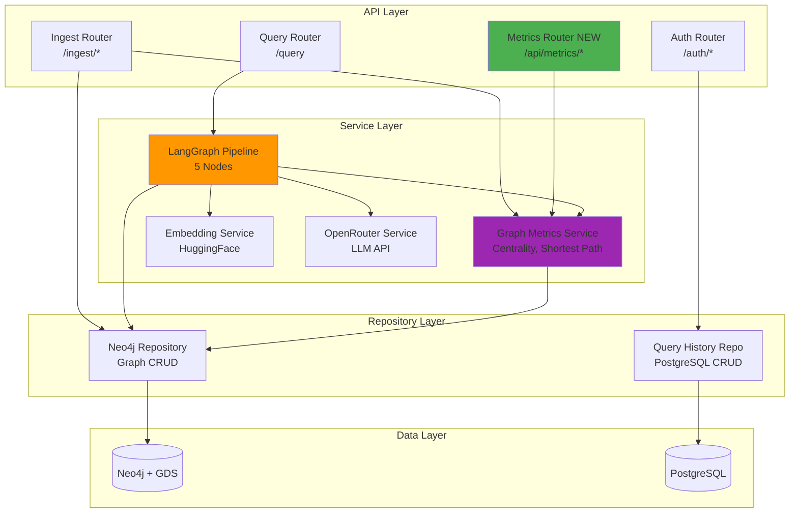
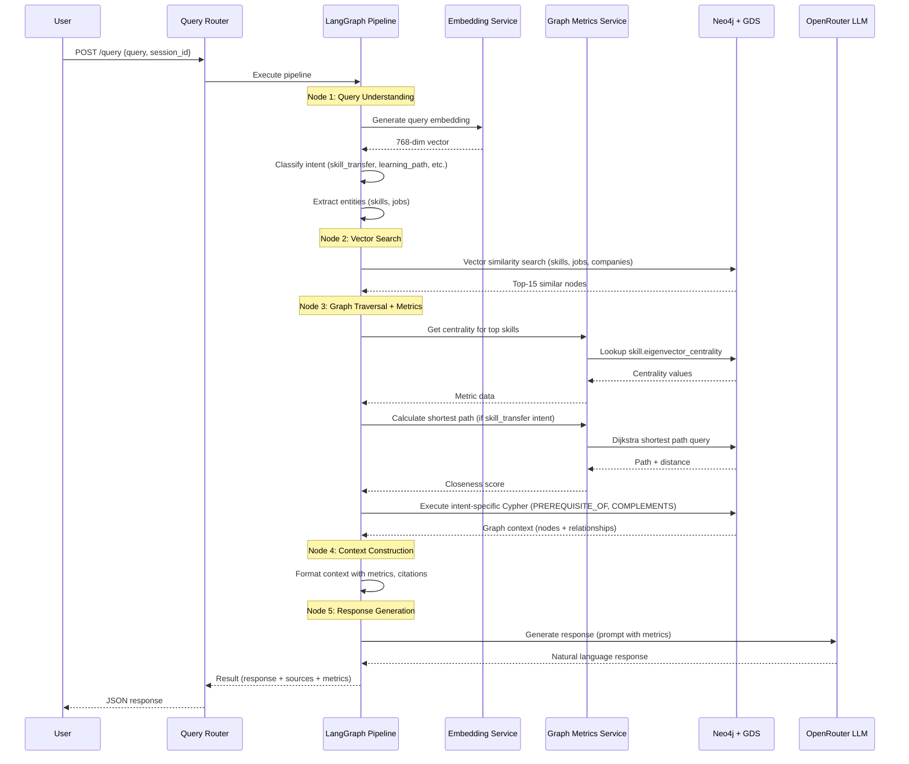

# Components

## 1. API Gateway (FastAPI Routers)

**Responsibility:** Handle HTTP requests, authentication, routing to service layer.

**Key Interfaces:**
- `POST /auth/register` - User registration (v1.1)
- `POST /auth/login` - JWT token generation (v1.1)
- `POST /ingest/skills` - CSV skill ingestion (v1.1)
- `POST /ingest/jobs` - CSV job ingestion (v1.1)
- `POST /query` - RAG query execution (v1.1 + v2.0 enhanced)
- `GET /api/metrics/centrality` - **NEW:** Centrality rankings (FR43)
- `GET /api/metrics/closeness` - **NEW:** Skill-to-skill closeness (FR44)
- `GET /health` - Health check (v1.1)

**Dependencies:**
- Authentication middleware (JWT validation)
- Rate limiting middleware (10 requests/min per user)
- Service layer (LangGraphService, GraphMetricsService)

**Technology Stack:** FastAPI 0.104+, Pydantic 2.x for request/response validation

## 2. LangGraph RAG Pipeline

**Responsibility:** Orchestrate multi-step query processing with stateful workflow management.

**Key Interfaces:**
- `ainvoke(GraphRAGState)` - Execute pipeline asynchronously
- Node interfaces: `query_understanding()`, `vector_search()`, `graph_traversal()`, `context_construction()`, `response_generation()`

**Dependencies:**
- EmbeddingService (HuggingFace API)
- Neo4jRepository (graph queries)
- GraphMetricsService (centrality, shortest path)
- OpenRouterService (LLM API)

**Technology Stack:** LangGraph 0.0.60+, Pydantic for state management

**v2.0 Enhancements:**
- **Query Understanding Node:** Add intent types (skill_transfer, learning_path, transition_difficulty, skill_bridge, high_leverage) (FR38)
- **Graph Traversal Node:** Inject centrality lookups, shortest path queries (FR39)
- **Context Construction Node:** Include metric values, research citations (FR40)
- **Response Generation Node:** Update prompts to cite metrics, explain graph structure reasoning (FR41)

## 3. Graph Metrics Service

**Responsibility:** Compute and retrieve network metrics from Neo4j + GDS.

**Key Interfaces:**
- `calculate_eigenvector_centrality()` - Compute centrality for all skills (FR31)
- `get_skill_centrality(skill_id: str) -> float` - Retrieve cached centrality value
- `calculate_shortest_path(skill_a: str, skill_b: str) -> Path` - Dijkstra shortest path (FR32)
- `calculate_closeness(skill_a: str, skill_b: str) -> float` - Closeness metric (FR33)
- `calculate_transition_index(user_skills: List[str], job_id: str) -> TransitionIndex` - Transition scoring (FR35)
- `infer_transitions_to_relationships()` - Infer TRANSITIONS_TO from static data (FR37)

**Dependencies:**
- Neo4jRepository (graph access)
- Neo4j GDS library (centrality, shortest path algorithms)

**Technology Stack:** Python 3.11+, Neo4j Python Driver, Neo4j GDS 2.5+

**Performance Targets:**
- Centrality calculation: <30s for 5K-8K skills (NFR11)
- Shortest path query: <500ms (NFR12)
- TransitionIndex calculation: <200ms (NFR13)

## 4. Embedding Service

**Responsibility:** Generate vector embeddings for skills, jobs, queries.

**Key Interfaces:**
- `generate_embedding(text: str) -> List[float]` - Generate 768-dim embedding
- `batch_generate_embeddings(texts: List[str]) -> List[List[float]]` - Batch processing for CSV ingestion

**Dependencies:**
- HuggingFace Transformers library
- Model: `all-mpnet-base-v2` (768-dim) or fallback to `all-MiniLM-L6-v2` (384-dim)

**Technology Stack:** HuggingFace Transformers, CPU-only inference

**v2.0 Enhancement:** Upgraded from 384-dim to 768-dim for better career domain terminology capture (FR47)

## 5. OpenRouter LLM Service

**Responsibility:** Call OpenRouter API for natural language response generation.

**Key Interfaces:**
- `generate_completion(system_prompt: str, user_prompt: str) -> str` - Generate LLM response
- Circuit breaker pattern for API failures (v1.1 existing)

**Dependencies:**
- OpenRouter API (external)
- httpx for async HTTP requests

**Technology Stack:** httpx 0.25+, OpenRouter API

**v2.0 Enhancement:** Updated prompts to cite network metrics, explain graph reasoning (FR41)

## 6. Neo4j Repository

**Responsibility:** Abstract Neo4j database operations (CRUD, Cypher queries).

**Key Interfaces:**
- `execute_read(query: str, params: dict) -> List[dict]` - Execute read-only query
- `execute_write(query: str, params: dict) -> dict` - Execute write query
- `vector_search(embedding: List[float], top_k: int) -> List[dict]` - Vector similarity search (v1.1)
- `create_relationship(start_id: str, end_id: str, rel_type: str, properties: dict)` - Create relationship (v2.0)

**Dependencies:**
- Neo4j Python Driver
- Neo4j database (cloud instance)

**Technology Stack:** Neo4j Python Driver 5.x, Neo4j 5.x + GDS

**v2.0 Extensions:**
- Add methods for new relationship types (PREREQUISITE_OF, COMPLEMENTS, SUBSTITUTES, TRANSITIONS_TO)
- Schema migration utilities (add properties, create indexes)

## 7. Query History Repository (PostgreSQL)

**Responsibility:** Store and retrieve user query history for conversation context.

**Key Interfaces:**
- `create_query_history(user_id: str, query: str, response: str, metadata: dict)` - Log query (v1.1)
- `get_conversation_history(session_id: str, limit: int) -> List[dict]` - Retrieve session history (v1.1)

**Dependencies:**
- Prisma ORM
- PostgreSQL database

**Technology Stack:** Prisma 5.x, PostgreSQL 15+

**v2.0 Enhancement:** Extend `metadata` field to include metric values (centrality, closeness, TransitionIndex) for research validation

## Component Diagrams

**LangGraph Pipeline Sequence (v2.0 Enhanced):**

---
