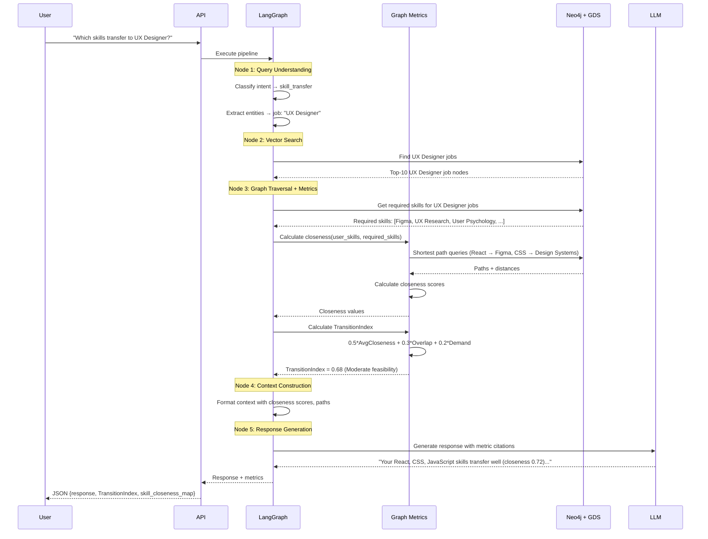
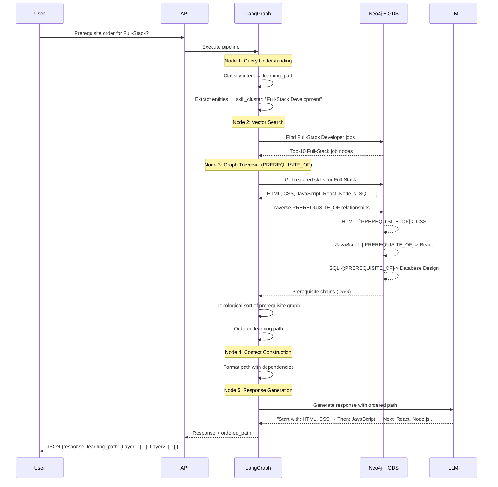
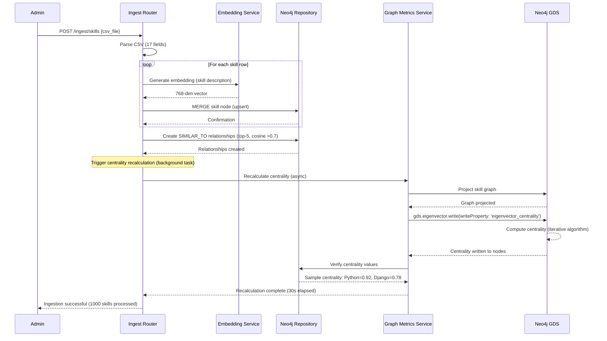

# Core Workflows

## Workflow 1: Skill Transfer Query (NEW v2.0)

**Use Case:** User asks "Which of my skills transfer to UX Designer roles?"

## Workflow 2: Learning Path Query (NEW v2.0)

**Use Case:** User asks "What's the prerequisite order to learn Full-Stack Development?"

## Workflow 3: CSV Ingestion with Centrality Recalculation (v2.0 Enhanced)

**Use Case:** Admin uploads skills CSV, triggering centrality update

**Performance Note:** Centrality recalculation runs asynchronously in background to avoid blocking API response (NFR11: <30s for 5K-8K skills).

---
