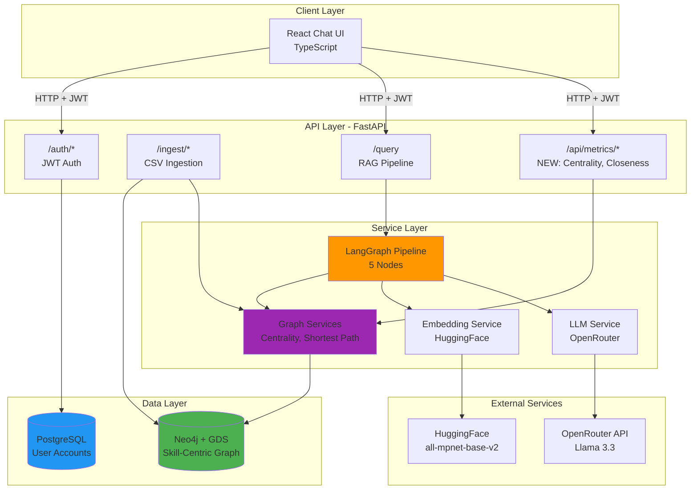

# High Level Architecture

## Technical Summary

The Career Intelligence AI System v2.0 employs a **hybrid GraphRAG + Network Analytics architecture** built on a skill-centric Neo4j knowledge graph. The system combines vector similarity search (HuggingFace embeddings), structural graph traversal (Cypher queries), and research-validated network metrics (eigenvector centrality, shortest-path closeness) to deliver quantified career intelligence.

**Key Components:** FastAPI REST API, Neo4j + GDS for graph analytics, LangGraph for RAG orchestration, PostgreSQL for user management, and OpenRouter LLM for natural language generation.

**Architecture Style:** Monolithic backend with clear separation of concerns - API layer (FastAPI routers), service layer (graph algorithms, LangGraph nodes), and data layer (Neo4j, PostgreSQL).

**Core Innovation:** Applies network analysis methods from ICT innovation research ("Ties that Bind" methodology) to career domain - using graph closeness to predict skill transfer feasibility and eigenvector centrality to identify high-leverage skills.

This architecture supports PRD goals of enabling structural career queries (prerequisite order, skill bridges, transition difficulty) while maintaining <5s query response time (NFR1) and preserving 100% backward compatibility with v1.1 (NFR14, NFR17).

## High Level Overview

**Architectural Style:**
- **Monolithic backend** with layered service architecture
- **Event-driven elements:** Centrality recalculation triggered post-CSV ingestion (background task)
- **Hybrid data model:** Graph database (Neo4j) for relationships + Relational database (PostgreSQL) for user accounts

**Repository Structure (from PRD):**
- **Monorepo:** Single repository with `/backend` (Python/FastAPI) and `/frontend` (React/TypeScript) directories
- **Service Architecture:** Monolithic backend service (FastAPI) with modular routers and services

**Primary User Interaction Flow:**

```
User Query → FastAPI /query endpoint → LangGraph Pipeline:
  1. Query Understanding (intent classification, entity extraction)
  2. Vector Search (semantic similarity on skill/job embeddings)
  3. Graph Traversal (Cypher queries + network metrics: centrality lookup, shortest path)
  4. Context Construction (format results + metric values for LLM)
  5. Response Generation (OpenRouter LLM with metric citations)
→ Return JSON response (answer + sources + metrics) → React chat UI
```

**Key Architectural Decisions:**

1. **Skill-Centric Graph Model (vs Job-Centric)**
   - **Rationale:** Skills are primary infrastructure nodes; jobs are combinations of skills. Enables prerequisite modeling, centrality calculation, and skill transfer analysis.
   - **Impact:** Requires graph schema migration but unlocks structural queries impossible in v1.1.

2. **Neo4j GDS for Network Metrics (vs Custom Implementation)**
   - **Rationale:** Leverages optimized C++ algorithms (eigenvector centrality, Dijkstra) with free-tier support.
   - **Trade-off:** Dependent on Neo4j GDS availability; fallback to approximate algorithms if performance issues.

3. **Incremental Enhancement (vs Full Rebuild)**
   - **Rationale:** Preserve working v1.1 functionality, minimize risk, enable phased rollout.
   - **Trade-off:** Some technical debt inherited; migration complexity higher than greenfield.

4. **Synchronous Processing for MVP (vs Async Job Queue)**
   - **Rationale:** Simplifies implementation; centrality calculation cached (not per-query).
   - **Trade-off:** Background tasks block API thread; future: migrate to Celery/Redis for async.

## High Level Project Diagram



## Architectural and Design Patterns

**1. Repository Pattern**
- **Implementation:** `Neo4jRepository`, `QueryHistoryRepository` abstract database operations
- **Rationale:** Isolates data access logic, enables testing with mock repositories, supports future database migration flexibility
- **Alignment:** Standard pattern in v1.1, extended for metric queries in v2.0

**2. Strategy Pattern (Graph Algorithms)**
- **Implementation:** Multiple centrality calculation strategies (`EigenvectorStrategy`, `ApproximatePageRankStrategy`)
- **Rationale:** Enables fallback if Neo4j GDS unavailable or performance issues (Risk 1 mitigation)
- **Use Case:** Switch from eigenvector centrality to approximate PageRank if calculation >30s (NFR11 violation)

**3. Decorator Pattern (LangGraph Nodes)**
- **Implementation:** Wrap existing v1.1 nodes with metric calculation decorators
- **Rationale:** Preserves original node logic, adds metrics non-invasively for backward compatibility
- **Example:** `@with_centrality_lookup` decorator on Graph Traversal node

**4. Command Pattern (Graph Migration)**
- **Implementation:** Migration commands (`AddPropertiesCommand`, `CreateRelationshipsCommand`, `ComputeCentralityCommand`)
- **Rationale:** Supports idempotent migration execution, rollback capability, audit logging
- **Use Case:** Execute migration in phases with validation checkpoints (Phase 1-3 deployment strategy)

**5. Circuit Breaker Pattern (External APIs)**
- **Implementation:** OpenRouter LLM calls wrapped with circuit breaker (existing v1.1 pattern)
- **Rationale:** Prevent cascading failures from LLM API timeouts/rate limits
- **Extended:** Apply to Neo4j GDS calls (centrality calculation) in v2.0

**6. Observer Pattern (Centrality Recalculation)**
- **Implementation:** CSV ingestion events trigger centrality recalculation background task
- **Rationale:** Keep centrality values fresh without per-query overhead (NFR13: <200ms for TransitionIndex)
- **Configuration:** `CENTRALITY_UPDATE_FREQUENCY=on_ingestion` (NFR16)

---
