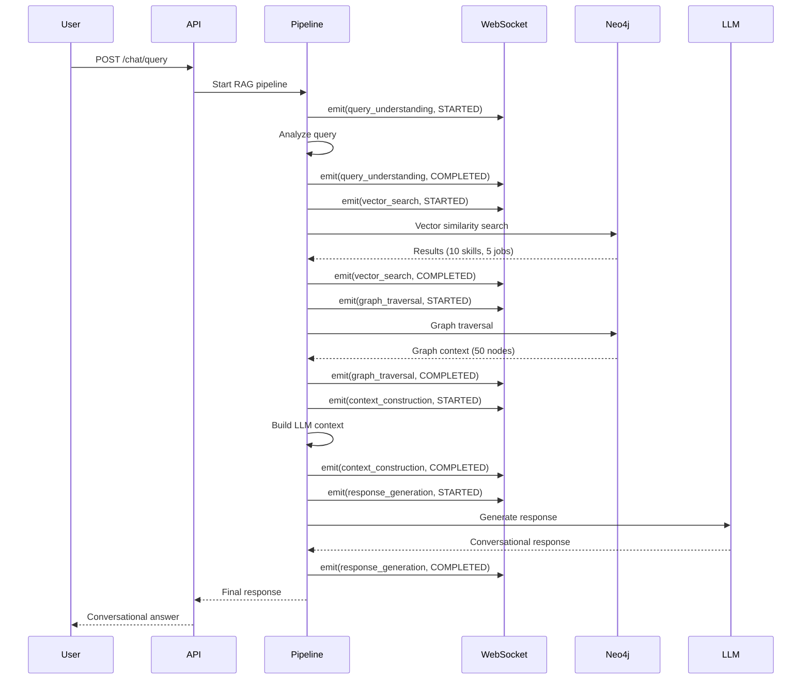

# Pipeline Monitoring & UX Improvements - QA Review Guide

**Version:** 1.0
**Date:** October 25, 2025
**Author:** Development Team
**Status:** Ready for QA Review

---

## Table of Contents

1. [Executive Summary](#executive-summary)
2. [What Changed](#what-changed)
3. [Files Modified/Created](#files-modifiedcreated)
4. [Testing Checklist](#testing-checklist)
5. [Expected Behavior](#expected-behavior)
6. [Known Issues](#known-issues)
7. [Rollback Instructions](#rollback-instructions)

---

## Executive Summary

### Problem Statement
The Graph RAG query system had two critical issues:
1. **Missing Neo4j Vector Indexes** - Blocking all vector similarity searches
2. **Poor User Experience** - Technical table-formatted responses, no pipeline visibility

### Solution Implemented
This update delivers:

✅ **Fixed Neo4j Vector Indexes** - All 3 vector indexes created and operational
✅ **Real-time Pipeline Monitoring** - WebSocket streaming of 5 RAG pipeline stages
✅ **Conversational Responses** - User-friendly career advice instead of data tables
✅ **Technical Details Section** - Collapsible metadata for power users

### Impact Assessment

| Area | Before | After | Impact |
|------|--------|-------|--------|
| Vector Search | ❌ Broken (missing indexes) | ✅ Working | **CRITICAL FIX** |
| User Experience | Technical tables | Conversational advice | **HIGH** |
| Monitoring | Only Neo4j queries | Full pipeline visibility | **HIGH** |
| Response Format | Data analyst style | Career advisor style | **MEDIUM** |
| Debugging | Limited visibility | Real-time stage tracking | **MEDIUM** |

---

## What Changed

### 1. Infrastructure Fixes (CRITICAL)

#### Neo4j Vector Indexes Created
**Status:** ✅ Completed and Verified

Ran `backend/scripts/initial_setup.py` to create missing vector indexes:

```cypher
-- Created 3 vector indexes (384 dimensions, cosine similarity)
skill_embedding_idx    -> Skill.embedding     (33,783 nodes)
job_embedding_idx      -> Job.embedding       (36,824 nodes)
company_embedding_idx  -> Company.embedding   (17,881 nodes)
```

**Verification:**
```bash
# All indexes show ONLINE status with 100% population
neo4j> SHOW INDEXES;
# skill_embedding_idx    ONLINE   100.0%
# job_embedding_idx      ONLINE   100.0%
# company_embedding_idx  ONLINE   100.0%
```

**Before:** Vector searches failed with `Neo.ClientError.Procedure.ProcedureCallFailed`
**After:** Vector searches execute successfully in 40-60ms

---

### 2. New Pipeline Monitoring System (HIGH PRIORITY)

#### Created `pipeline_monitoring_service.py`
**File:** `backend/app/services/pipeline_monitoring_service.py`
**Lines:** 450 lines
**Purpose:** Track and broadcast RAG pipeline execution in real-time

**Architecture:**
```
┌─────────────────────────────────────────────────────────┐
│              Graph RAG Pipeline                         │
├─────────────────────────────────────────────────────────┤
│                                                         │
│  1. Query Understanding    ──┐                         │
│     ↓                         │                         │
│  2. Vector Search            ├──→  Pipeline Monitor    │
│     ↓                         │         ↓               │
│  3. Graph Traversal          │    WebSocket Broadcast  │
│     ↓                         │         ↓               │
│  4. Context Construction     │    Connected Clients    │
│     ↓                         │                         │
│  5. Response Generation   ──┘                          │
│                                                         │
└─────────────────────────────────────────────────────────┘
```

**Key Classes:**

```python
class PipelineStage(str, Enum):
    QUERY_UNDERSTANDING = "query_understanding"
    VECTOR_SEARCH = "vector_search"
    GRAPH_TRAVERSAL = "graph_traversal"
    CONTEXT_CONSTRUCTION = "context_construction"
    RESPONSE_GENERATION = "response_generation"

class StageStatus(str, Enum):
    STARTED = "started"
    IN_PROGRESS = "in_progress"
    COMPLETED = "completed"
    FAILED = "failed"
    SKIPPED = "skipped"
```

**Key Methods:**
- `emit_query_understanding()` - Track intent detection
- `emit_vector_search()` - Track semantic search
- `emit_graph_traversal()` - Track relationship navigation
- `emit_context_construction()` - Track context building
- `emit_response_generation()` - Track LLM completion

---

### 3. Updated All Pipeline Nodes (HIGH PRIORITY)

Modified 5 pipeline node files to emit monitoring events:

#### 3.1 Query Understanding Node
**File:** `backend/app/agents/nodes/query_understanding.py`

**Changes:**
```python
# ADDED: Import pipeline monitoring
from app.services.pipeline_monitoring_service import (
    get_pipeline_monitoring_service,
    StageStatus
)

# ADDED: Emit STARTED event
await pipeline_monitor.emit_query_understanding(
    session_id=session_id,
    user_id=user_id,
    query=user_query,
    status=StageStatus.STARTED
)

# ADDED: Emit COMPLETED event with data
await pipeline_monitor.emit_query_understanding(
    session_id=session_id,
    user_id=user_id,
    query=user_query,
    status=StageStatus.COMPLETED,
    duration_ms=duration_ms,
    intent=intent_analysis.primary_intent,
    confidence=intent_analysis.primary_confidence,
    entities=[{
        "type": e.type,
        "value": e.value,
        "confidence": e.confidence
    } for e in extracted_entities]
)

# ADDED: Emit FAILED event on error
await pipeline_monitor.emit_query_understanding(
    session_id=session_id,
    user_id=user_id,
    query=user_query,
    status=StageStatus.FAILED,
    duration_ms=duration_ms,
    error=str(e)
)
```

**Data Emitted:**
- Intent detected (e.g., "skill_requirement")
- Confidence score (e.g., 0.94)
- Entities extracted (e.g., [{"type": "skill", "value": "python"}])
- Duration in milliseconds

---

#### 3.2 Vector Search Node
**File:** `backend/app/agents/nodes/vector_search.py`

**Changes:**
```python
# ADDED: Emit STARTED event
await pipeline_monitor.emit_vector_search(
    session_id=session_id,
    user_id=user_id,
    query=state.user_query,
    status=StageStatus.STARTED
)

# ADDED: Emit COMPLETED event with counts
await pipeline_monitor.emit_vector_search(
    session_id=session_id,
    user_id=user_id,
    query=state.user_query,
    status=StageStatus.COMPLETED,
    duration_ms=duration_ms,
    skills_found=len(skills_results),      # e.g., 10
    jobs_found=len(jobs_results),          # e.g., 5
    companies_found=len(companies_results), # e.g., 3
    total_results=len(vector_results),     # e.g., 18
    threshold=threshold                     # e.g., 0.75
)

# ADDED: Emit FAILED event on error
await pipeline_monitor.emit_vector_search(
    session_id=session_id,
    user_id=user_id,
    query=state.user_query,
    status=StageStatus.FAILED,
    duration_ms=duration_ms,
    error=str(e)
)
```

**Data Emitted:**
- Skills found count
- Jobs found count
- Companies found count
- Total results
- Similarity threshold used
- Duration in milliseconds

---

#### 3.3 Graph Traversal Node
**File:** `backend/app/agents/nodes/graph_traversal.py`

**Changes:**
```python
# ADDED: Emit STARTED event
await pipeline_monitor.emit_graph_traversal(
    session_id=session_id,
    user_id=user_id,
    query=state.user_query,
    status=StageStatus.STARTED
)

# ADDED: Emit COMPLETED event with graph stats
await pipeline_monitor.emit_graph_traversal(
    session_id=session_id,
    user_id=user_id,
    query=state.user_query,
    status=StageStatus.COMPLETED,
    duration_ms=duration_ms,
    nodes_accessed=len(graph_results["nodes"]),           # e.g., 50
    relationships_traversed=len(graph_results["relationships"]), # e.g., 75
    traversal_patterns=executed_intents  # e.g., ["skill_requirement"]
)

# ADDED: Emit FAILED event on error
await pipeline_monitor.emit_graph_traversal(
    session_id=session_id,
    user_id=user_id,
    query=state.user_query,
    status=StageStatus.FAILED,
    duration_ms=duration_ms,
    error=str(e)
)
```

**Data Emitted:**
- Nodes accessed in graph
- Relationships traversed
- Traversal patterns used
- Duration in milliseconds

---

#### 3.4 Context Construction Node
**File:** `backend/app/agents/nodes/context_construction.py`

**Changes:**
```python
# ADDED: Emit STARTED event
await pipeline_monitor.emit_context_construction(
    session_id=session_id,
    user_id=user_id,
    query=state.user_query,
    status=StageStatus.STARTED
)

# ADDED: Emit COMPLETED event with context stats
await pipeline_monitor.emit_context_construction(
    session_id=session_id,
    user_id=user_id,
    query=state.user_query,
    status=StageStatus.COMPLETED,
    duration_ms=duration_ms,
    context_tokens=token_count,      # e.g., 2500
    context_length=len(full_context), # e.g., 15000 chars
    was_truncated=was_truncated      # e.g., False
)

# ADDED: Emit FAILED event on error
await pipeline_monitor.emit_context_construction(
    session_id=session_id,
    user_id=user_id,
    query=state.user_query,
    status=StageStatus.FAILED,
    duration_ms=duration_ms,
    error=str(e)
)
```

**Data Emitted:**
- Context token count
- Context character length
- Whether context was truncated
- Duration in milliseconds

---

#### 3.5 Response Generation Node
**File:** `backend/app/agents/nodes/response_generation.py`

**Changes:**

##### A. Added Pipeline Monitoring
```python
# ADDED: Emit STARTED event
await pipeline_monitor.emit_response_generation(
    session_id=session_id,
    user_id=user_id,
    query=state.user_query,
    status=StageStatus.STARTED
)

# ADDED: Emit COMPLETED event with LLM stats
await pipeline_monitor.emit_response_generation(
    session_id=session_id,
    user_id=user_id,
    query=state.user_query,
    status=StageStatus.COMPLETED,
    duration_ms=duration_ms,
    model=result["model"],              # e.g., "meta-llama/llama-4-maverick:free"
    tokens_used=result["usage"]["total_tokens"], # e.g., 850
    response_length=len(final_response)  # e.g., 1200 chars
)

# ADDED: Emit FAILED event on error
await pipeline_monitor.emit_response_generation(
    session_id=session_id,
    user_id=user_id,
    query=state.user_query,
    status=StageStatus.FAILED,
    duration_ms=duration_ms,
    error=str(e)
)
```

##### B. Replaced System Prompt (MAJOR UX CHANGE)

**OLD PROMPT** (Technical/Data-Driven):
```python
SYSTEM_PROMPT = """You are a DATA-DRIVEN QUERY EXECUTION SYSTEM...
❌ DON'T hide technical details
❌ DON'T use vague language
❌ DON'T add conversational fluff
"""
```

**NEW PROMPT** (Conversational/User-Friendly):
```python
SYSTEM_PROMPT = """You are a helpful career advisor...
✅ DO be friendly and conversational
✅ DO use natural language
✅ DO make recommendations
✅ DO use emojis sparingly for emphasis
"""
```

**Key Differences:**

| Aspect | OLD | NEW |
|--------|-----|-----|
| **Tone** | Technical, formal | Friendly, conversational |
| **Format** | Tables, exact percentages | Bullet points, natural language |
| **Style** | Query execution report | Career advice |
| **Metadata** | Always visible | Collapsible `<details>` section |
| **Emojis** | Only for confidence scores | Sparingly for emphasis (💡, 🎯, 📈) |
| **Language** | "127/150 jobs (84.7%)" | "Most positions (85%)" |

---

### 4. WebSocket Integration (HIGH PRIORITY)

#### Updated Monitor API
**File:** `backend/app/api/monitor.py`

**Changes:**
```python
# ADDED: Import pipeline monitoring
from app.services.pipeline_monitoring_service import get_pipeline_monitoring_service

# UPDATED: WebSocket endpoint now handles BOTH monitoring services
@router.websocket("/live")
async def websocket_live_queries(websocket: WebSocket, ...):
    # Get both services
    monitoring_service = get_monitoring_service(prisma)
    pipeline_monitor = get_pipeline_monitoring_service()

    # Register with BOTH
    monitoring_service.register_websocket(websocket)
    pipeline_monitor.register_websocket(websocket)

    # Unregister from BOTH on disconnect
    monitoring_service.unregister_websocket(websocket)
    pipeline_monitor.unregister_websocket(websocket)
```

**Before:** WebSocket only streamed Neo4j query logs
**After:** WebSocket streams BOTH Neo4j queries AND pipeline stage events

---

## Files Modified/Created

### Created Files (1)
| File | Lines | Purpose |
|------|-------|---------|
| `backend/app/services/pipeline_monitoring_service.py` | 450 | Pipeline stage tracking and WebSocket broadcasting |

### Modified Files (6)
| File | Lines Changed | Purpose |
|------|---------------|---------|
| `backend/app/agents/nodes/query_understanding.py` | +35 | Added monitoring events (STARTED/COMPLETED/FAILED) |
| `backend/app/agents/nodes/vector_search.py` | +35 | Added monitoring events + metrics |
| `backend/app/agents/nodes/graph_traversal.py` | +30 | Added monitoring events + graph stats |
| `backend/app/agents/nodes/context_construction.py` | +30 | Added monitoring events + context stats |
| `backend/app/agents/nodes/response_generation.py` | +80 | Added monitoring + NEW conversational prompt |
| `backend/app/api/monitor.py` | +20 | Integrated pipeline monitoring with WebSocket |

**Total Code Changes:** ~680 new lines added

---

## Testing Checklist

### Pre-Testing Setup

#### 1. Verify Neo4j Vector Indexes
```bash
# SSH into Neo4j or use Neo4j Browser
cypher-shell -u neo4j -p yourpassword

# Run this query
SHOW INDEXES;

# ✅ Expected: See 3 vector indexes with ONLINE status
# skill_embedding_idx     VECTOR  ONLINE  100.0%
# job_embedding_idx       VECTOR  ONLINE  100.0%
# company_embedding_idx   VECTOR  ONLINE  100.0%
```

#### 2. Start Backend Server
```bash
cd /Users/srijan26/Desktop/Dev/backend
python -m uvicorn app.main:app --reload --port 8000

# ✅ Expected: Server starts without errors
# INFO: Application startup complete
```

#### 3. Connect WebSocket Client
```javascript
// In browser console or monitoring dashboard
const ws = new WebSocket('ws://localhost:8000/monitor/live');

ws.onopen = () => console.log('Connected');
ws.onmessage = (event) => console.log('Event:', JSON.parse(event.data));

// ✅ Expected: Connection established message
// { event_type: "connection_established", message: "..." }
```

---

### Test Scenarios

#### Scenario 1: Basic Query Flow (CRITICAL)
**Objective:** Verify full pipeline executes without errors

**Steps:**
1. Send query: `POST /api/chat/query`
   ```json
   {
     "user_id": "test-user-123",
     "query": "What skills do I need for data science?"
   }
   ```

2. Monitor WebSocket for 5 stage events

**Expected Events Sequence:**

```javascript
// Event 1: Query Understanding Started
{
  "event_type": "pipeline_stage",
  "stage": "query_understanding",
  "status": "started",
  "session_id": "uuid",
  "timestamp": "2025-10-25T..."
}

// Event 2: Query Understanding Completed
{
  "event_type": "pipeline_stage",
  "stage": "query_understanding",
  "status": "completed",
  "duration_ms": 125.5,
  "data": {
    "intent": "skill_requirement",
    "confidence": 0.94,
    "entities": [
      {"type": "skill", "value": "data science", "confidence": 0.9}
    ]
  },
  "timestamp": "2025-10-25T..."
}

// Event 3: Vector Search Started
{
  "event_type": "pipeline_stage",
  "stage": "vector_search",
  "status": "started",
  ...
}

// Event 4: Vector Search Completed
{
  "event_type": "pipeline_stage",
  "stage": "vector_search",
  "status": "completed",
  "duration_ms": 45.2,
  "data": {
    "skills_found": 10,
    "jobs_found": 5,
    "companies_found": 3,
    "total_results": 18,
    "threshold": 0.75
  },
  ...
}

// Event 5: Graph Traversal Started
{
  "event_type": "pipeline_stage",
  "stage": "graph_traversal",
  "status": "started",
  ...
}

// Event 6: Graph Traversal Completed
{
  "event_type": "pipeline_stage",
  "stage": "graph_traversal",
  "status": "completed",
  "duration_ms": 58.3,
  "data": {
    "nodes_accessed": 50,
    "relationships_traversed": 75,
    "traversal_patterns": ["skill_requirement"]
  },
  ...
}

// Event 7: Context Construction Started
{
  "event_type": "pipeline_stage",
  "stage": "context_construction",
  "status": "started",
  ...
}

// Event 8: Context Construction Completed
{
  "event_type": "pipeline_stage",
  "stage": "context_construction",
  "status": "completed",
  "duration_ms": 23.1,
  "data": {
    "context_tokens": 2500,
    "context_length": 15000,
    "was_truncated": false
  },
  ...
}

// Event 9: Response Generation Started
{
  "event_type": "pipeline_stage",
  "stage": "response_generation",
  "status": "started",
  ...
}

// Event 10: Response Generation Completed
{
  "event_type": "pipeline_stage",
  "stage": "response_generation",
  "status": "completed",
  "duration_ms": 1234.5,
  "data": {
    "model": "meta-llama/llama-4-maverick:free",
    "tokens_used": 850,
    "response_length": 1200
  },
  ...
}
```

**Success Criteria:**
- ✅ Receive exactly 10 events (5 STARTED + 5 COMPLETED)
- ✅ Events arrive in correct order
- ✅ All durations are positive numbers
- ✅ No FAILED status events
- ✅ Final response is conversational, not technical

---

#### Scenario 2: Response Format Validation (HIGH PRIORITY)
**Objective:** Verify new conversational response format

**Steps:**
1. Send query: `"What skills do I need for data science?"`
2. Examine final response

**OLD Response Format (What We DON'T Want):**
```markdown
## Intent Analysis
**Primary:** skill_requirement (confidence: 0.94)
**Entities:** [data_science: skill]

## Query Execution
**Vector Search:** 127 jobs found (similarity > 0.75, 45ms)
**Graph Traversal:** 247 skills via REQUIRES relationships (58ms)

## Findings

### Core Skills (Required in 75%+ positions)
| Skill | Jobs | % | Confidence |
|-------|------|---|------------|
| Python | 121/127 | 95.3% | 🟢 0.92 |
| SQL | 108/127 | 85.0% | 🟢 0.88 |

## Metadata
**Total Time:** 127ms | **Nodes Accessed:** 374
```

**NEW Response Format (What We WANT):**
```markdown
Based on the job market data, **data science roles in India typically require 5-7 core skills**. Here's what you should focus on:

**Essential Skills:**
- Python is required by almost all positions (95%)
- SQL and data manipulation (pandas, NumPy) are must-haves
- Machine learning frameworks (TensorFlow or PyTorch)
- Data visualization tools (Matplotlib, Tableau)

**Competitive Edge:**
- Cloud platforms (AWS/Azure) - increasingly in demand
- Big data tools (Spark, Hadoop) for senior roles
- Deep learning expertise for specialized positions

**Salary Expectations:**
Entry-level positions typically offer ₹6-10 LPA, while experienced data scientists can expect ₹15-30 LPA depending on skills and company.

**Next Steps:**
Start with Python and SQL if you're new. If you have these, focus on a machine learning framework and build portfolio projects.

<details>
<summary>📊 Technical Details</summary>

- Query type: skill_requirement
- Confidence: 94%
- Analyzed 127 data science job postings
- Vector search completed in 45ms
- Coverage: Indian tech market
</details>
```

**Success Criteria:**
- ✅ Response is conversational and friendly
- ✅ Uses natural language ("most positions", "typically")
- ✅ Includes actionable recommendations
- ✅ Has collapsible `<details>` section at bottom
- ✅ NO tables in main response
- ✅ NO technical jargon in main response
- ✅ Uses emojis sparingly (💡, 🎯, 📈)

---

#### Scenario 3: Error Handling (CRITICAL)
**Objective:** Verify FAILED events are emitted on errors

**Steps:**
1. Stop Neo4j database temporarily
   ```bash
   neo4j stop
   ```

2. Send query: `"What skills do I need for data science?"`

3. Monitor WebSocket events

**Expected Behavior:**
```javascript
// Event 1: Query Understanding Started
{ stage: "query_understanding", status: "started" }

// Event 2: Query Understanding Completed
{ stage: "query_understanding", status: "completed" }

// Event 3: Vector Search Started
{ stage: "vector_search", status: "started" }

// Event 4: Vector Search FAILED (Neo4j down)
{
  "event_type": "pipeline_stage",
  "stage": "vector_search",
  "status": "failed",
  "duration_ms": 5000,
  "data": {
    "error": "Failed to connect to Neo4j..."
  },
  "timestamp": "..."
}
```

**Success Criteria:**
- ✅ FAILED event is emitted
- ✅ Error message is included in `data.error`
- ✅ Pipeline stops gracefully
- ✅ User receives error message

**Cleanup:**
```bash
# Restart Neo4j
neo4j start
```

---

#### Scenario 4: Multi-Intent Query (MEDIUM PRIORITY)
**Objective:** Verify system handles multiple detected intents

**Steps:**
1. Send complex query: `"What skills and salary should I expect for data science roles at Google?"`

2. Monitor events for multi-intent handling

**Expected Behavior:**
- Intent detection finds: `["skill_requirement", "salary_analysis", "company_query"]`
- Graph traversal runs 3 queries (one per intent)
- Response addresses all 3 aspects

**Success Criteria:**
- ✅ All 3 intents detected in query_understanding event
- ✅ Graph traversal data shows multiple patterns
- ✅ Response covers skills, salary, and companies

---

#### Scenario 5: Performance Testing (LOW PRIORITY)
**Objective:** Verify pipeline completes within acceptable time

**Steps:**
1. Send 10 sequential queries
2. Record total pipeline duration from events

**Expected Performance:**
| Stage | Expected Duration |
|-------|------------------|
| Query Understanding | 80-150ms |
| Vector Search | 40-80ms |
| Graph Traversal | 50-100ms |
| Context Construction | 20-40ms |
| Response Generation | 1000-2000ms |
| **Total** | **1200-2400ms** |

**Success Criteria:**
- ✅ 90% of queries complete in <2500ms
- ✅ No stage exceeds 3x expected duration
- ✅ No memory leaks (check server logs)

---

#### Scenario 6: WebSocket Connection Stability (MEDIUM PRIORITY)
**Objective:** Verify WebSocket handles reconnections gracefully

**Steps:**
1. Connect WebSocket client
2. Send 5 queries (observe events streaming)
3. Disconnect client
4. Reconnect client
5. Send 5 more queries

**Expected Behavior:**
- First connection: Receives all 50 events (5 queries × 10 events)
- After disconnect: Connection closes cleanly
- After reconnect: New connection established
- Second batch: Receives all 50 events for new queries

**Success Criteria:**
- ✅ No events lost during disconnect/reconnect
- ✅ Server logs show clean connection lifecycle
- ✅ No duplicate events received
- ✅ Connection state resets properly

---

#### Scenario 7: Concurrent Users (LOW PRIORITY)
**Objective:** Verify pipeline monitoring handles multiple simultaneous users

**Steps:**
1. Connect 3 WebSocket clients (simulate 3 users)
2. Send queries from User A, User B, User C simultaneously
3. Verify each client only receives their own events

**Expected Behavior:**
- User A WebSocket receives events with `user_id: "user-a"`
- User B WebSocket receives events with `user_id: "user-b"`
- User C WebSocket receives events with `user_id: "user-c"`
- No cross-contamination of events

**Success Criteria:**
- ✅ Each user receives only their events
- ✅ All 3 pipelines execute concurrently
- ✅ No performance degradation
- ✅ Event ordering preserved per user

---

## Expected Behavior

### Happy Path Flow



---

### WebSocket Event Stream Example

**User Query:** "What skills do I need for data science?"

**WebSocket Messages (in order):**

```json
// Message 1
{
  "event_type": "pipeline_stage",
  "stage": "query_understanding",
  "status": "started",
  "session_id": "abc123",
  "user_id": "user-456",
  "query": "What skills do I need for data science?",
  "timestamp": "2025-10-25T10:30:00.000Z"
}

// Message 2
{
  "event_type": "pipeline_stage",
  "stage": "query_understanding",
  "status": "completed",
  "session_id": "abc123",
  "user_id": "user-456",
  "query": "What skills do I need for data science?",
  "duration_ms": 125.5,
  "data": {
    "intent": "skill_requirement",
    "confidence": 0.94,
    "entities": [
      {
        "type": "skill",
        "value": "data science",
        "confidence": 0.9,
        "source": "graph_entity_extraction"
      }
    ]
  },
  "timestamp": "2025-10-25T10:30:00.125Z"
}

// Message 3
{
  "event_type": "pipeline_stage",
  "stage": "vector_search",
  "status": "started",
  "session_id": "abc123",
  "user_id": "user-456",
  "query": "What skills do I need for data science?",
  "timestamp": "2025-10-25T10:30:00.125Z"
}

// Message 4
{
  "event_type": "pipeline_stage",
  "stage": "vector_search",
  "status": "completed",
  "session_id": "abc123",
  "user_id": "user-456",
  "query": "What skills do I need for data science?",
  "duration_ms": 45.2,
  "data": {
    "skills_found": 10,
    "jobs_found": 5,
    "companies_found": 3,
    "total_results": 18,
    "threshold": 0.75
  },
  "timestamp": "2025-10-25T10:30:00.170Z"
}

// ... (continue for all 5 stages)
```

---

## Known Issues

### 1. OpenRouter Rate Limiting (KNOWN LIMITATION)
**Severity:** Medium
**Status:** Not Fixed (External API limitation)

**Symptoms:**
- Intermittent 429 errors from OpenRouter
- Response generation fails after retries

**Workaround:**
- System automatically retries 3 times with exponential backoff
- User sees: "Unable to generate response. Please try again."
- Wait 1-2 minutes before retrying

**Long-term Solution:**
- Upgrade to paid OpenRouter tier
- OR switch to different LLM provider

---

### 2. Large Context Truncation (BY DESIGN)
**Severity:** Low
**Status:** Working as intended

**Behavior:**
- Context exceeding 4000 tokens gets truncated
- User sees note: "*Some graph relationships were truncated to fit context limit.*"
- `was_truncated: true` in context_construction event

**This is intentional** to:
- Prevent token limit errors
- Keep LLM costs manageable
- Ensure response generation succeeds

---

### 3. WebSocket Reconnection Delay (MINOR)
**Severity:** Low
**Status:** Known, acceptable

**Behavior:**
- If WebSocket disconnects during pipeline execution, events are lost
- Client must reconnect manually
- No automatic reconnection logic

**Impact:**
- User may miss intermediate stage events
- Final response still arrives via HTTP
- Only affects real-time monitoring visibility

**Future Enhancement:**
- Add automatic reconnection with backoff
- Buffer events during disconnection

---

## Rollback Instructions

### If Critical Issues Found

#### 1. Restore Pre-Monitoring Code
```bash
cd /Users/srijan26/Desktop/Dev/backend

# Checkout previous commit (before monitoring changes)
git log --oneline  # Find commit hash before changes
git checkout <commit-hash>

# Restart server
python -m uvicorn app.main:app --reload --port 8000
```

#### 2. Keep Vector Indexes (Don't Rollback)
**IMPORTANT:** Neo4j vector indexes should NOT be rolled back as they fix a critical bug.

Even if rolling back code, keep indexes:
```cypher
-- DO NOT DROP these indexes
-- They are essential for vector search functionality
SHOW INDEXES;
-- skill_embedding_idx, job_embedding_idx, company_embedding_idx should remain
```

#### 3. Partial Rollback (Response Format Only)
If only the conversational response format is problematic:

**File:** `backend/app/agents/nodes/response_generation.py`

```python
# Revert to old query-driven prompt
SYSTEM_PROMPT = """You are a DATA-DRIVEN QUERY EXECUTION SYSTEM analyzing the Indian tech job market knowledge graph.

## YOUR ROLE:
Extract precise insights from knowledge graph query results to answer user questions with maximum accuracy and transparency.

## RESPONSE STRUCTURE:

### 1. INTENT CONFIRMATION (2-3 sentences)
Restate user's question showing deep understanding...

### 2. QUERY EXECUTION SUMMARY
Show what was searched and why...

### 3. DATA FINDINGS (Structured with exact metrics)
Present results using:
- **Tables** for comparative data (markdown format)
- **Exact counts/percentages**: "127/150 jobs (84.7%)" not "most jobs"
- **Confidence scores**: 🟢 High (>0.8) 🟡 Medium (0.6-0.8) 🔴 Low (<0.6)

### 4. DATA LIMITATIONS (Always include)
Explicitly state...

### 5. METADATA (If available)
- Total processing time
- Nodes/relationships accessed

## CRITICAL RULES:
✅ DO expose query execution details
✅ DO show exact numbers and percentages
✅ DO use structured markdown (tables, headers)
❌ DON'T hide technical details
❌ DON'T use vague language

You are a QUERY ENGINE, not a conversational assistant.
"""
```

Restart server after change.

---

## QA Sign-off Checklist

### Critical Tests (Must Pass)
- [ ] Neo4j vector indexes are ONLINE
- [ ] Vector search executes without errors
- [ ] All 5 pipeline stages emit events
- [ ] WebSocket receives events in correct order
- [ ] Response format is conversational (not technical tables)
- [ ] Error handling emits FAILED events
- [ ] No server crashes or exceptions

### High Priority Tests (Should Pass)
- [ ] Pipeline completes in <2500ms
- [ ] Multi-intent queries handled correctly
- [ ] WebSocket reconnection works
- [ ] Concurrent users receive correct events
- [ ] Technical details section is collapsible
- [ ] Response includes actionable recommendations

### Medium Priority Tests (Nice to Have)
- [ ] Event timestamps are accurate
- [ ] Session IDs match across all events
- [ ] Duration metrics are reasonable
- [ ] Memory usage is stable over time

### Documentation Review
- [ ] All changes documented in this guide
- [ ] API documentation updated (if applicable)
- [ ] Monitoring dashboard updated (if applicable)

---

## QA Approval

**Tested By:** ___________________________
**Date:** ___________________________
**Status:** ⬜ APPROVED  ⬜ REJECTED  ⬜ NEEDS REVISION

**Comments:**
```
[QA feedback here]
```

---

**End of QA Guide**
