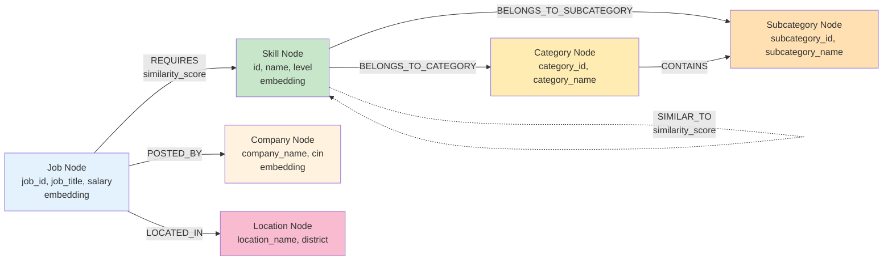

# Data Models

This section defines the complete data architecture for both Neo4j (knowledge graph) and PostgreSQL (relational data). All schemas are designed to align with the CSV data structures defined in the PRD (Appendix A).

## Overview

The system uses two databases with distinct responsibilities:

- **Neo4j (Graph Database)**: Stores Skills, Jobs, Companies, Locations, and their relationships + embeddings
- **PostgreSQL (Relational Database)**: Stores Users, Ingestion Jobs, Query History

**Data Flow**:
1. CSV upload → PostgreSQL (IngestionJob tracking)
2. CSV processing → Neo4j (graph nodes + relationships)
3. User query → LangGraph reads Neo4j, logs to PostgreSQL

---

## Neo4j Graph Schema

### Node Types

**1. Skill Node**

Represents a professional skill from the skills taxonomy CSV.

**Properties**:
| Property | Type | Required | Source CSV Column | Description |
|----------|------|----------|-------------------|-------------|
| `id` | String | Yes | `ID` | Unique skill identifier (primary key) |
| `name` | String | Yes | `NAME` | Canonical skill name (normalized, lowercase) |
| `level` | Integer | No | `LEVEL` | Skill complexity level (1-5) |
| `type` | String | No | `TYPE` | Skill type classification |
| `is_software` | Boolean | No | `IS_SOFTWARE` | Software skill flag |
| `is_language` | Boolean | No | `IS_LANGUAGE` | Programming language flag |
| `description` | String | No | `DESCRIPTION` | Skill description |
| `description_source` | String | No | `DESCRIPTION_SOURCE` | Source of the description (e.g., "wikipedia", "manual") |
| `version` | String | No | `VERSION` | Current version of the technology/tool |
| `latest_version` | String | No | `LATEST_VERSION` | Latest available version |
| `wiki_link` | String | No | `WIKI_LINK` | Wikipedia reference URL |
| `wiki_extract` | String | No | `WIKI_EXTRACT` | Wikipedia summary |
| `embedding` | List[Float] | Yes | (Generated) | 384-dimensional vector |
| `embedding_model_version` | String | Yes | (Generated) | Embedding model identifier (e.g., "all-MiniLM-L6-v2:2024-01") |
| `embedding_generated_at` | DateTime | Yes | (Generated) | Timestamp when embedding was generated |
| `created_at` | DateTime | Yes | (Generated) | Node creation timestamp |

**Indexes**:
- **Unique Constraint**: `CREATE CONSTRAINT skill_id_unique IF NOT EXISTS FOR (s:Skill) REQUIRE s.id IS UNIQUE`
- **Name Index**: `CREATE INDEX skill_name_idx IF NOT EXISTS FOR (s:Skill) ON (s.name)`
- **Vector Index**: `CREATE VECTOR INDEX skill_embedding_idx IF NOT EXISTS FOR (s:Skill) ON (s.embedding) OPTIONS {indexConfig: {`vector.dimensions`: 384, `vector.similarity_function`: 'cosine'}}`

**Cypher Creation Example**:
```cypher
CREATE (s:Skill {
  id: $id,
  name: toLower(trim($name)),
  level: $level,
  type: $type,
  is_software: $is_software,
  is_language: $is_language,
  description: $description,
  description_source: $description_source,
  version: $version,
  latest_version: $latest_version,
  wiki_link: $wiki_link,
  wiki_extract: $wiki_extract,
  embedding: $embedding,
  embedding_model_version: $embedding_model_version,  // e.g., "all-MiniLM-L6-v2:2024-01"
  embedding_generated_at: datetime(),
  created_at: datetime()
})
```

---

**2. Job Node**

Represents a job posting from the jobs taxonomy CSV.

**Properties**:
| Property | Type | Required | Source CSV Column | Description |
|----------|------|----------|-------------------|-------------|
| `job_id` | String | Yes | `Job ID` | Unique job identifier (primary key) |
| `job_title` | String | Yes | `Job Title` | Job position name |
| `location` | String | No | `Location` | Job location |
| `district` | String | No | `District` | Geographic district |
| `via` | String | No | `Via` | Job source/platform (e.g., "LinkedIn", "Indeed") |
| `salary` | String | No | `Salary` | Salary range text |
| `min_salary` | Float | No | `Minimum Salary` | Minimum salary value |
| `max_salary` | Float | No | `Maximum Salary` | Maximum salary value |
| `mean_salary` | Float | No | `Mean Salary` | Average salary |
| `salary_unit` | String | No | `Unit of Measure` | Salary unit (annual/monthly) |
| `schedule_type` | String | No | `Schedule Type` | Full-time/Part-time |
| `work_from_home` | Boolean | No | `Work From Home` | Remote work flag (0/1) |
| `posted_at` | DateTime | No | `Posted At` | Job posting date |
| `description` | String | No | `Description` | Full job description |
| `job_description` | String | No | `Job Description` | Detailed job description |
| `apply_options` | String | No | `Apply Options` | Application methods/links (JSON or comma-separated) |
| `exact_matched_company` | Boolean | No | `Exact Matched Company` | Company name matching confidence flag |
| `nco_code` | String | No | `NCO_Code_algo` | National Classification of Occupations |
| `description_token_count` | Integer | No | `Description Token Count` | Token count for LLM cost optimization |
| `company_description_token_count` | Integer | No | `Company Description Token Count` | Token count for company description |
| `job_description_token_count` | Integer | No | `Job Description Token Count` | Token count for job description |
| `embedding` | List[Float] | Yes | (Generated) | 384-dimensional vector |
| `embedding_model_version` | String | Yes | (Generated) | Embedding model identifier (e.g., "all-MiniLM-L6-v2:2024-01") |
| `embedding_generated_at` | DateTime | Yes | (Generated) | Timestamp when embedding was generated |
| `created_at` | DateTime | Yes | (Generated) | Node creation timestamp |

**Indexes**:
- **Unique Constraint**: `CREATE CONSTRAINT job_id_unique IF NOT EXISTS FOR (j:Job) REQUIRE j.job_id IS UNIQUE`
- **Title Index**: `CREATE INDEX job_title_idx IF NOT EXISTS FOR (j:Job) ON (j.job_title)`
- **Vector Index**: `CREATE VECTOR INDEX job_embedding_idx IF NOT EXISTS FOR (j:Job) ON (j.embedding) OPTIONS {indexConfig: {`vector.dimensions`: 384, `vector.similarity_function`: 'cosine'}}`

**Cypher Creation Example**:
```cypher
CREATE (j:Job {
  job_id: $job_id,
  job_title: $job_title,
  location: $location,
  district: $district,
  via: $via,
  salary: $salary,
  min_salary: $min_salary,
  max_salary: $max_salary,
  mean_salary: $mean_salary,
  salary_unit: $salary_unit,
  schedule_type: $schedule_type,
  work_from_home: $work_from_home,
  posted_at: datetime($posted_at),
  description: $description,
  job_description: $job_description,
  apply_options: $apply_options,
  exact_matched_company: $exact_matched_company,
  nco_code: $nco_code,
  description_token_count: $description_token_count,
  company_description_token_count: $company_description_token_count,
  job_description_token_count: $job_description_token_count,
  embedding: $embedding,
  embedding_model_version: $embedding_model_version,  // e.g., "all-MiniLM-L6-v2:2024-01"
  embedding_generated_at: datetime(),
  created_at: datetime()
})
```

---

**3. Company Node**

Represents an employer from the jobs CSV.

**Properties**:
| Property | Type | Required | Source CSV Column | Description |
|----------|------|----------|-------------------|-------------|
| `company_name` | String | Yes | `Company Name` | Employer name (primary key) |
| `cin` | String | No | `CIN` | Corporate Identification Number |
| `company_description` | String | No | `Company Description` | Company overview |
| `industry_classification` | String | No | `CompanyIndustrialClassification` | Industry classification |
| `nic_code` | String | No | `NIC_Code_algo` | National Industrial Classification |
| `nic_code_2008` | String | No | `nic_code_2_2008` | NIC 2008 classification code |
| `embedding` | List[Float] | No | (Generated) | 384-dimensional vector (if company_description exists) |
| `created_at` | DateTime | Yes | (Generated) | Node creation timestamp |

**Indexes**:
- **Unique Constraint**: `CREATE CONSTRAINT company_name_unique IF NOT EXISTS FOR (c:Company) REQUIRE c.company_name IS UNIQUE`
- **Name Index**: `CREATE INDEX company_name_idx IF NOT EXISTS FOR (c:Company) ON (toLower(c.company_name))`

**Cypher Creation Example**:
```cypher
MERGE (c:Company {company_name: $company_name})
ON CREATE SET
  c.cin = $cin,
  c.company_description = $company_description,
  c.industry_classification = $industry_classification,
  c.nic_code = $nic_code,
  c.nic_code_2008 = $nic_code_2008,
  c.embedding = $embedding,
  c.created_at = datetime()
```

---

**4. Location Node**

Represents geographic location from jobs CSV.

**Properties**:
| Property | Type | Required | Source CSV Column | Description |
|----------|------|----------|-------------------|-------------|
| `location_name` | String | Yes | `Location` | Location name (primary key) |
| `district` | String | No | `District` | Geographic district |
| `created_at` | DateTime | Yes | (Generated) | Node creation timestamp |

**Indexes**:
- **Unique Constraint**: `CREATE CONSTRAINT location_name_unique IF NOT EXISTS FOR (l:Location) REQUIRE l.location_name IS UNIQUE`

**Cypher Creation Example**:
```cypher
MERGE (l:Location {location_name: $location_name})
ON CREATE SET
  l.district = $district,
  l.created_at = datetime()
```

---

**5. Category Node**

Represents skill category from skills taxonomy CSV.

**Properties**:
| Property | Type | Required | Source CSV Column | Description |
|----------|------|----------|-------------------|-------------|
| `category_id` | String | Yes | `CATEGORY` | Category ID (primary key) |
| `category_name` | String | Yes | `CATEGORY_NAME` | Category name |
| `created_at` | DateTime | Yes | (Generated) | Node creation timestamp |

**Indexes**:
- **Unique Constraint**: `CREATE CONSTRAINT category_id_unique IF NOT EXISTS FOR (cat:Category) REQUIRE cat.category_id IS UNIQUE`

**Cypher Creation Example**:
```cypher
MERGE (cat:Category {category_id: $category_id})
ON CREATE SET
  cat.category_name = $category_name,
  cat.created_at = datetime()
```

---

**6. Subcategory Node**

Represents skill subcategory from skills taxonomy CSV.

**Properties**:
| Property | Type | Required | Source CSV Column | Description |
|----------|------|----------|-------------------|-------------|
| `subcategory_id` | String | Yes | `SUBCATEGORY` | Subcategory ID (primary key) |
| `subcategory_name` | String | Yes | `SUBCATEGORY_NAME` | Subcategory name |
| `created_at` | DateTime | Yes | (Generated) | Node creation timestamp |

**Indexes**:
- **Unique Constraint**: `CREATE CONSTRAINT subcategory_id_unique IF NOT EXISTS FOR (sub:Subcategory) REQUIRE sub.subcategory_id IS UNIQUE`

**Cypher Creation Example**:
```cypher
MERGE (sub:Subcategory {subcategory_id: $subcategory_id})
ON CREATE SET
  sub.subcategory_name = $subcategory_name,
  sub.created_at = datetime()
```

---

### Relationship Types

**1. REQUIRES (Job → Skill)**

Represents job-skill requirement relationship from `standardized_skills` in jobs CSV.

**Properties**:
| Property | Type | Required | Description |
|----------|------|----------|-------------|
| `similarity_score` | Float | No | Pre-computed skill match confidence (0.0-1.0) from CSV |
| `created_at` | DateTime | Yes | Relationship creation timestamp |

**Cypher Creation Example**:
```cypher
MATCH (j:Job {job_id: $job_id})
MATCH (s:Skill {name: toLower(trim($skill_name))})
MERGE (j)-[r:REQUIRES]->(s)
ON CREATE SET
  r.similarity_score = $similarity_score,
  r.created_at = datetime()
```

**Matching Logic** (from PRD):
1. Parse `standardized_skills` list from jobs CSV (e.g., `["Python", "FastAPI", "Neo4j"]`)
2. Normalize each skill name: `toLower(trim(skill_name))`
3. Match against Skill nodes: `WHERE toLower(s.name) = normalized_name`
4. Create REQUIRES relationship
5. If `similarity_scores` array exists and aligns with `standardized_skills` (same length/order), store as `similarity_score` property

---

**2. POSTED_BY (Job → Company)**

Represents employer relationship.

**Properties**:
| Property | Type | Required | Description |
|----------|------|----------|-------------|
| `created_at` | DateTime | Yes | Relationship creation timestamp |

**Cypher Creation Example**:
```cypher
MATCH (j:Job {job_id: $job_id})
MATCH (c:Company {company_name: $company_name})
MERGE (j)-[r:POSTED_BY]->(c)
ON CREATE SET r.created_at = datetime()
```

---

**3. LOCATED_IN (Job → Location)**

Represents job location relationship.

**Properties**:
| Property | Type | Required | Description |
|----------|------|----------|-------------|
| `created_at` | DateTime | Yes | Relationship creation timestamp |

**Cypher Creation Example**:
```cypher
MATCH (j:Job {job_id: $job_id})
MATCH (l:Location {location_name: $location_name})
MERGE (j)-[r:LOCATED_IN]->(l)
ON CREATE SET r.created_at = datetime()
```

---

**4. BELONGS_TO_CATEGORY (Skill → Category)**

Represents skill-category hierarchy.

**Properties**:
| Property | Type | Required | Description |
|----------|------|----------|-------------|
| `created_at` | DateTime | Yes | Relationship creation timestamp |

**Cypher Creation Example**:
```cypher
MATCH (s:Skill {id: $skill_id})
MATCH (cat:Category {category_id: $category_id})
MERGE (s)-[r:BELONGS_TO_CATEGORY]->(cat)
ON CREATE SET r.created_at = datetime()
```

---

**5. BELONGS_TO_SUBCATEGORY (Skill → Subcategory)**

Represents skill-subcategory hierarchy.

**Properties**:
| Property | Type | Required | Description |
|----------|------|----------|-------------|
| `created_at` | DateTime | Yes | Relationship creation timestamp |

**Cypher Creation Example**:
```cypher
MATCH (s:Skill {id: $skill_id})
MATCH (sub:Subcategory {subcategory_id: $subcategory_id})
MERGE (s)-[r:BELONGS_TO_SUBCATEGORY]->(sub)
ON CREATE SET r.created_at = datetime()
```

---

**6. CONTAINS (Category → Subcategory)**

Represents category-subcategory hierarchy.

**Properties**:
| Property | Type | Required | Description |
|----------|------|----------|-------------|
| `created_at` | DateTime | Yes | Relationship creation timestamp |

**Cypher Creation Example**:
```cypher
MATCH (cat:Category {category_id: $category_id})
MATCH (sub:Subcategory {subcategory_id: $subcategory_id})
MERGE (cat)-[r:CONTAINS]->(sub)
ON CREATE SET r.created_at = datetime()
```

---

**7. SIMILAR_TO (Skill → Skill)**

Represents semantic similarity between skills (computed from embeddings, optional for MVP).

**Properties**:
| Property | Type | Required | Description |
|----------|------|----------|-------------|
| `similarity_score` | Float | Yes | Cosine similarity (0.0-1.0) |
| `created_at` | DateTime | Yes | Relationship creation timestamp |

**Cypher Creation Example** (post-ingestion computation):
```cypher
// Find similar skills via vector similarity
CALL db.index.vector.queryNodes('skill_embedding_idx', 5, $embedding)
YIELD node, score
WHERE score > 0.8 AND node.id <> $skill_id
MATCH (s:Skill {id: $skill_id})
MERGE (s)-[r:SIMILAR_TO]->(node)
ON CREATE SET
  r.similarity_score = score,
  r.created_at = datetime()
```

---

### Embedding Version Management & Reindexing Strategy

**Purpose**: Track embedding model versions to enable safe model upgrades without invalidating existing vectors.

**Problem Statement**:
- Embedding models evolve over time (performance improvements, dimension changes, algorithm updates)
- When the model changes, all existing embeddings become incompatible with new embeddings
- Vector similarity searches between old and new embeddings produce incorrect results
- System must be able to identify outdated embeddings and regenerate them systematically

**Solution**: Version tracking with automated detection and batch reindexing.

---

#### 1. Version Tracking Implementation

All nodes with embeddings (Skill, Job, Company) include version metadata:

```python
# app/services/embedding_service.py
class EmbeddingService:
    """
    Embedding generation service with version tracking.

    Version Format: {model-name}:{release-date}
    Example: "all-MiniLM-L6-v2:2024-01"
    """

    # Current embedding model configuration
    CURRENT_MODEL_NAME = "sentence-transformers/all-MiniLM-L6-v2"
    CURRENT_MODEL_VERSION = "all-MiniLM-L6-v2:2024-01"
    EMBEDDING_DIMENSIONS = 384

    def __init__(self):
        self.model = SentenceTransformer(self.CURRENT_MODEL_NAME)

    async def generate_embedding(self, text: str) -> dict:
        """
        Generate embedding with version metadata.

        Returns:
            dict: {
                "embedding": [0.123, -0.456, ...],  # 384 dimensions
                "model_version": "all-MiniLM-L6-v2:2024-01",
                "generated_at": datetime.utcnow()
            }
        """
        embedding_vector = self.model.encode(text).tolist()

        return {
            "embedding": embedding_vector,
            "model_version": self.CURRENT_MODEL_VERSION,
            "generated_at": datetime.utcnow()
        }
```

---

#### 2. Identify Outdated Embeddings

**Query 1: Count outdated embeddings by node type**
```cypher
// Check how many nodes need reindexing
MATCH (n)
WHERE n.embedding IS NOT NULL
  AND n.embedding_model_version <> $current_model_version
RETURN labels(n)[0] as node_type,
       count(n) as outdated_count,
       n.embedding_model_version as old_version
ORDER BY outdated_count DESC
```

**Example Output**:
```
node_type    | outdated_count | old_version
-------------|----------------|------------------------
Skill        | 15,234         | all-MiniLM-L6-v2:2023-06
Job          | 8,921          | all-MiniLM-L6-v2:2023-06
Company      | 1,456          | all-MiniLM-L6-v2:2023-06
```

**Query 2: Get specific outdated nodes for reindexing batch**
```cypher
// Fetch 1000 outdated Skill nodes for batch processing
MATCH (s:Skill)
WHERE s.embedding_model_version <> $current_model_version
RETURN s.id, s.name, s.description, s.embedding_model_version
LIMIT 1000
```

**Query 3: Verify embedding consistency**
```cypher
// Check if all embeddings use the same model version (health check)
MATCH (n)
WHERE n.embedding IS NOT NULL
RETURN DISTINCT n.embedding_model_version as version, count(n) as count
ORDER BY count DESC
```

---

#### 3. Batch Reindexing Process

**Strategy**: Process in batches to avoid memory exhaustion and allow resumable progress.

**Python Implementation**:
```python
# scripts/reindex_embeddings.py
import asyncio
from app.services.embedding_service import EmbeddingService
from app.repositories.neo4j_repository import Neo4jRepository

class EmbeddingReindexer:
    """
    Batch reindexing orchestrator for embedding model migrations.

    Process:
    1. Query outdated nodes in batches (1000 at a time)
    2. Generate new embeddings with updated model
    3. Update nodes with new embeddings + version metadata
    4. Track progress in reindexing_log table
    5. Resume from last batch if interrupted
    """

    BATCH_SIZE = 1000  # Process 1000 nodes per batch
    NODE_TYPES = ["Skill", "Job", "Company"]  # Node types with embeddings

    def __init__(self):
        self.embedding_service = EmbeddingService()
        self.neo4j_repo = Neo4jRepository()
        self.current_version = EmbeddingService.CURRENT_MODEL_VERSION

    async def reindex_node_type(self, node_type: str) -> dict:
        """
        Reindex all outdated embeddings for a specific node type.

        Args:
            node_type: "Skill", "Job", or "Company"

        Returns:
            dict: {
                "node_type": "Skill",
                "total_reindexed": 15234,
                "batches_processed": 16,
                "duration_seconds": 3421.5,
                "errors": []
            }
        """
        start_time = datetime.utcnow()
        total_reindexed = 0
        batches_processed = 0
        errors = []

        while True:
            # Fetch batch of outdated nodes
            batch = await self._fetch_outdated_batch(node_type)

            if not batch:
                break  # No more outdated nodes

            # Generate new embeddings
            try:
                await self._reindex_batch(node_type, batch)
                total_reindexed += len(batch)
                batches_processed += 1

                # Log progress every 5 batches
                if batches_processed % 5 == 0:
                    logger.info(
                        f"Reindexing {node_type}: {total_reindexed} nodes completed "
                        f"({batches_processed} batches)"
                    )

            except Exception as e:
                error_msg = f"Batch {batches_processed} failed: {str(e)}"
                logger.error(error_msg)
                errors.append(error_msg)
                # Continue with next batch (don't fail entire reindex)

        duration = (datetime.utcnow() - start_time).total_seconds()

        return {
            "node_type": node_type,
            "total_reindexed": total_reindexed,
            "batches_processed": batches_processed,
            "duration_seconds": duration,
            "errors": errors
        }

    async def _fetch_outdated_batch(self, node_type: str) -> list[dict]:
        """Fetch batch of nodes with outdated embeddings."""
        query = f"""
        MATCH (n:{node_type})
        WHERE n.embedding_model_version <> $current_version
        RETURN n.id as id,
               n.name as name,
               n.description as description,
               n.embedding_model_version as old_version
        LIMIT $batch_size
        """

        result = await self.neo4j_repo.execute_query(
            query,
            {
                "current_version": self.current_version,
                "batch_size": self.BATCH_SIZE
            }
        )

        return [dict(record) for record in result]

    async def _reindex_batch(self, node_type: str, batch: list[dict]) -> None:
        """
        Generate new embeddings and update nodes in transaction.

        Uses Neo4j transaction to ensure atomicity:
        - If any node in batch fails, rollback entire batch
        - Prevents partial updates that could corrupt vector index
        """
        # Generate embeddings for all nodes in batch
        embedding_tasks = [
            self.embedding_service.generate_embedding(node["description"])
            for node in batch
        ]
        embeddings = await asyncio.gather(*embedding_tasks)

        # Update all nodes in single transaction
        async with self.neo4j_repo.transaction() as tx:
            for node, embedding_data in zip(batch, embeddings):
                update_query = f"""
                MATCH (n:{node_type} {{id: $id}})
                SET n.embedding = $embedding,
                    n.embedding_model_version = $model_version,
                    n.embedding_generated_at = datetime()
                """

                await tx.run(
                    update_query,
                    {
                        "id": node["id"],
                        "embedding": embedding_data["embedding"],
                        "model_version": embedding_data["model_version"]
                    }
                )

# CLI usage
async def main():
    """Run embedding reindexing for all node types."""
    reindexer = EmbeddingReindexer()

    print(f"🔄 Starting embedding reindexing")
    print(f"Current model version: {EmbeddingService.CURRENT_MODEL_VERSION}\n")

    total_start = datetime.utcnow()
    results = []

    for node_type in EmbeddingReindexer.NODE_TYPES:
        print(f"📊 Reindexing {node_type} nodes...")
        result = await reindexer.reindex_node_type(node_type)
        results.append(result)

        print(f"✅ {node_type}: {result['total_reindexed']} nodes reindexed")
        print(f"   Duration: {result['duration_seconds']:.1f}s")
        if result['errors']:
            print(f"   ⚠️  {len(result['errors'])} errors occurred\n")
        else:
            print()

    total_duration = (datetime.utcnow() - total_start).total_seconds()
    total_reindexed = sum(r['total_reindexed'] for r in results)

    print(f"🎉 Reindexing complete!")
    print(f"Total nodes reindexed: {total_reindexed}")
    print(f"Total duration: {total_duration:.1f}s")
    print(f"Average speed: {total_reindexed / total_duration:.1f} nodes/second")

if __name__ == "__main__":
    asyncio.run(main())
```

---

#### 4. Vector Index Rebuild Considerations

**Important**: After reindexing embeddings, the vector index does NOT need to be dropped and recreated in Neo4j 5.x+.

**How Neo4j Vector Indexes Work**:
- Vector indexes are **automatically updated** when node embeddings change
- When you `SET n.embedding = $new_embedding`, the index entry is updated in real-time
- No manual `DROP INDEX` or `CREATE INDEX` required

**However, you should verify index health after large reindexing operations**:

```cypher
// 1. Check index status
SHOW INDEXES
YIELD name, type, state, populationPercent
WHERE type = "VECTOR"
RETURN name, state, populationPercent
```

**Expected Output**:
```
name                      | state    | populationPercent
--------------------------|----------|------------------
skill_embedding_idx       | ONLINE   | 100.0
job_embedding_idx         | ONLINE   | 100.0
company_embedding_idx     | ONLINE   | 100.0
```

**If index state is not ONLINE or populationPercent < 100**:
```cypher
// Force index rebuild (only if corrupted)
DROP INDEX skill_embedding_idx IF EXISTS;

CREATE VECTOR INDEX skill_embedding_idx IF NOT EXISTS
FOR (s:Skill)
ON s.embedding
OPTIONS {
  indexConfig: {
    `vector.dimensions`: 384,
    `vector.similarity_function`: 'cosine'
  }
};
```

---

#### 5. Model Migration Checklist

**Before Migration** (Testing Phase):
- [ ] Test new model on sample data (compare similarity scores with old model)
- [ ] Benchmark embedding generation speed (CPU vs GPU)
- [ ] Verify new model dimensions match existing vector index configuration
- [ ] If dimensions changed, plan vector index recreation (requires downtime)
- [ ] Estimate reindexing time: `(total_nodes / 100 nodes per second) / 3600` hours
- [ ] Schedule maintenance window for reindexing (recommend off-peak hours)

**During Migration**:
- [ ] Update `EmbeddingService.CURRENT_MODEL_VERSION` to new version identifier
- [ ] Deploy updated application code (new embeddings will use new model)
- [ ] **Immediately disable vector similarity queries** (inconsistent results during migration)
- [ ] Run reindexing script: `python scripts/reindex_embeddings.py`
- [ ] Monitor progress logs and error rates
- [ ] Verify index health after each node type completes

**After Migration**:
- [ ] Verify all nodes have new model version: `MATCH (n) WHERE n.embedding IS NOT NULL RETURN DISTINCT n.embedding_model_version`
- [ ] Run test queries comparing old vs new model results
- [ ] Re-enable vector similarity queries
- [ ] Update documentation with new model version and migration date
- [ ] Archive old model weights (rollback capability)

---

#### 6. Downtime Mitigation Strategies

**Option 1: Blue-Green Deployment** (Zero Downtime, High Resource Cost)
```
1. Spin up second Neo4j instance (green)
2. Replicate data to green instance
3. Run reindexing on green instance (production unaffected)
4. Cutover traffic to green instance
5. Decommission blue instance
```
- **Pros**: No downtime, safe rollback
- **Cons**: 2x database resources, complex setup

**Option 2: Rolling Reindex** (Minimal Downtime, Recommended)
```
1. Deploy new model version but keep generating embeddings with both models temporarily
2. Store both old and new embeddings in separate properties:
   - n.embedding_old (legacy model)
   - n.embedding_new (current model)
3. Gradually migrate nodes in background
4. Switch queries to use n.embedding_new when threshold reached (e.g., 80%)
5. Drop n.embedding_old after 100% migration
```
- **Pros**: Gradual migration, always queryable, resource-efficient
- **Cons**: More complex code, temporary storage overhead

**Option 3: Scheduled Maintenance** (Simplest, Short Downtime)
```
1. Schedule 2-4 hour maintenance window
2. Disable vector queries during reindexing
3. Run reindexing script
4. Verify completion and re-enable queries
```
- **Pros**: Simple, predictable, clean cutover
- **Cons**: Service disruption during migration

**Recommendation for MVP**: Use Option 3 (Scheduled Maintenance) with clear user communication.

---

#### 7. Monitoring Reindexing Progress

**PostgreSQL Progress Tracking Table** (optional but recommended):
```prisma
// prisma/schema.prisma
model EmbeddingMigration {
  id                String   @id @default(uuid())
  migration_name    String   // e.g., "all-MiniLM-L6-v2:2023-06 -> 2024-01"
  node_type         String   // "Skill", "Job", or "Company"
  old_version       String
  new_version       String
  total_nodes       Int
  reindexed_nodes   Int      @default(0)
  batches_completed Int      @default(0)
  status            String   // "in_progress", "completed", "failed"
  started_at        DateTime @default(now())
  completed_at      DateTime?
  error_message     String?

  @@index([status, node_type])
}
```

**Progress Query During Reindexing**:
```sql
-- Check migration progress
SELECT
  node_type,
  reindexed_nodes,
  total_nodes,
  ROUND((reindexed_nodes::numeric / total_nodes) * 100, 2) as progress_percent,
  EXTRACT(EPOCH FROM (NOW() - started_at)) as elapsed_seconds,
  status
FROM embedding_migrations
WHERE status = 'in_progress'
ORDER BY node_type;
```

---

#### 8. Testing Strategy

**Unit Tests** (`tests/services/test_embedding_service.py`):
```python
def test_embedding_includes_version_metadata():
    """Verify embeddings include version tracking."""
    service = EmbeddingService()
    result = await service.generate_embedding("Python programming")

    assert "embedding" in result
    assert "model_version" in result
    assert "generated_at" in result
    assert len(result["embedding"]) == 384
    assert result["model_version"] == "all-MiniLM-L6-v2:2024-01"

def test_reindex_identifies_outdated_nodes():
    """Verify outdated nodes are correctly identified."""
    # Create test nodes with old version
    create_skill("Python", embedding_version="all-MiniLM-L6-v2:2023-06")
    create_skill("Java", embedding_version="all-MiniLM-L6-v2:2024-01")

    reindexer = EmbeddingReindexer()
    outdated = await reindexer._fetch_outdated_batch("Skill")

    assert len(outdated) == 1
    assert outdated[0]["name"] == "Python"
    assert outdated[0]["old_version"] == "all-MiniLM-L6-v2:2023-06"
```

**Integration Tests** (`tests/integration/test_reindexing.py`):
```python
async def test_full_reindexing_workflow():
    """Test complete reindexing process end-to-end."""
    # Setup: Create 100 skills with old embeddings
    for i in range(100):
        await create_skill(
            name=f"Skill-{i}",
            embedding_version="old-model:2023-01"
        )

    # Execute reindexing
    reindexer = EmbeddingReindexer()
    result = await reindexer.reindex_node_type("Skill")

    # Verify results
    assert result["total_reindexed"] == 100
    assert result["batches_processed"] == 1  # 100 nodes in 1 batch
    assert len(result["errors"]) == 0

    # Verify all nodes now have new version
    query = """
    MATCH (s:Skill)
    WHERE s.embedding_model_version = $new_version
    RETURN count(s) as updated_count
    """
    result = await neo4j_repo.execute_query(
        query,
        {"new_version": EmbeddingService.CURRENT_MODEL_VERSION}
    )

    assert result[0]["updated_count"] == 100
```

---

**Summary**:
- All embeddings tracked with `model_version` + `generated_at` metadata
- Outdated embeddings identifiable via Cypher queries
- Batch reindexing process handles large-scale migrations
- Neo4j vector indexes automatically update (no manual rebuild needed)
- Migration checklist ensures safe model upgrades
- Multiple deployment strategies available (zero-downtime to scheduled maintenance)

---

### Graph Schema Diagram



---

## PostgreSQL Schema (Prisma)

### Prisma Schema File

**`prisma/schema.prisma`**:
```prisma
// Prisma schema for PostgreSQL database
// Database URL from environment variable: DATABASE_URL

generator client {
  provider = "prisma-client-py"
  interface = "asyncio"
}

datasource db {
  provider = "postgresql"
  url      = env("DATABASE_URL")
}

// User authentication table
model User {
  id            String   @id @default(uuid())
  email         String   @unique
  password_hash String
  created_at    DateTime @default(now())
  updated_at    DateTime @updatedAt

  // Relations
  query_history QueryHistory[]
  ingestion_jobs IngestionJob[]

  @@map("users")
}

// CSV ingestion job tracking
model IngestionJob {
  id             String   @id @default(uuid())
  user_id        String
  file_type      String   // "skills" or "jobs"
  file_name      String
  file_size_mb   Float
  status         String   // "pending", "processing", "completed", "failed"
  total_records  Int      @default(0)
  processed_records Int   @default(0)
  failed_records Int      @default(0)
  batch_number   Int?     // Current batch being processed
  error_log      String?  // JSON array of error messages
  started_at     DateTime @default(now())
  completed_at   DateTime?
  created_at     DateTime @default(now())
  updated_at     DateTime @updatedAt

  // Relations
  user           User     @relation(fields: [user_id], references: [id], onDelete: Cascade)

  @@index([user_id])
  @@index([status])
  @@index([file_type])
  @@map("ingestion_jobs")
}

// User query history logging
model QueryHistory {
  id              String   @id @default(uuid())
  user_id         String
  query_text      String   @db.Text
  query_intent    String?  // "skill_requirements", "salary_insights", etc.
  response_text   String   @db.Text
  sources_count   Int      @default(0)  // Number of graph nodes used
  response_time_ms Int     // Query processing time
  created_at      DateTime @default(now())

  // Relations
  user            User     @relation(fields: [user_id], references: [id], onDelete: Cascade)

  @@index([user_id])
  @@index([created_at])
  @@index([query_intent])
  @@map("query_history")
}
```

---

### PostgreSQL Tables

**1. users Table**

Stores user authentication credentials.

| Column | Type | Constraints | Description |
|--------|------|-------------|-------------|
| `id` | UUID | PRIMARY KEY | User unique identifier |
| `email` | VARCHAR | UNIQUE, NOT NULL | User email (login) |
| `password_hash` | VARCHAR | NOT NULL | bcrypt hashed password |
| `created_at` | TIMESTAMP | NOT NULL, DEFAULT NOW() | Account creation timestamp |
| `updated_at` | TIMESTAMP | NOT NULL, DEFAULT NOW() | Last update timestamp |

**Indexes**:
- Primary Key on `id`
- Unique index on `email`

---

**2. ingestion_jobs Table**

Tracks CSV upload and processing status.

| Column | Type | Constraints | Description |
|--------|------|-------------|-------------|
| `id` | UUID | PRIMARY KEY | Job unique identifier |
| `user_id` | UUID | FOREIGN KEY → users(id), NOT NULL | User who uploaded CSV |
| `file_type` | VARCHAR | NOT NULL | "skills" or "jobs" |
| `file_name` | VARCHAR | NOT NULL | Original CSV filename |
| `file_size_mb` | FLOAT | NOT NULL | File size in megabytes |
| `status` | VARCHAR | NOT NULL | "pending", "processing", "completed", "failed" |
| `total_records` | INTEGER | DEFAULT 0 | Total CSV records |
| `processed_records` | INTEGER | DEFAULT 0 | Successfully processed records |
| `failed_records` | INTEGER | DEFAULT 0 | Failed records |
| `batch_number` | INTEGER | NULL | Current batch being processed |
| `error_log` | TEXT | NULL | JSON array of error messages |
| `started_at` | TIMESTAMP | NOT NULL, DEFAULT NOW() | Processing start time |
| `completed_at` | TIMESTAMP | NULL | Processing completion time |
| `created_at` | TIMESTAMP | NOT NULL, DEFAULT NOW() | Job creation timestamp |
| `updated_at` | TIMESTAMP | NOT NULL, DEFAULT NOW() | Last update timestamp |

**Indexes**:
- Primary Key on `id`
- Foreign Key on `user_id`
- Index on `user_id`
- Index on `status`
- Index on `file_type`

---

**3. query_history Table**

Logs user queries and responses for analytics.

| Column | Type | Constraints | Description |
|--------|------|-------------|-------------|
| `id` | UUID | PRIMARY KEY | Query unique identifier |
| `user_id` | UUID | FOREIGN KEY → users(id), NOT NULL | User who submitted query |
| `query_text` | TEXT | NOT NULL | Natural language query |
| `query_intent` | VARCHAR | NULL | Classified intent (e.g., "skill_requirements") |
| `response_text` | TEXT | NOT NULL | LLM-generated response |
| `sources_count` | INTEGER | DEFAULT 0 | Number of graph nodes used in response |
| `response_time_ms` | INTEGER | NOT NULL | Query processing time (milliseconds) |
| `created_at` | TIMESTAMP | NOT NULL, DEFAULT NOW() | Query timestamp |

**Indexes**:
- Primary Key on `id`
- Foreign Key on `user_id`
- Index on `user_id`
- Index on `created_at` (for time-based queries)
- Index on `query_intent` (for analytics)

---

## Data Validation Rules

### Neo4j Validation

**Skills CSV Validation**:
- **Required Columns**: `ID`, `NAME` (other columns optional)
- **ID Format**: Non-empty string
- **NAME Format**: Non-empty string, normalized to lowercase
- **LEVEL**: Integer 1-5 or NULL
- **IS_SOFTWARE, IS_LANGUAGE**: Boolean (0/1) or NULL
- **Embedding**: Always generated fresh (ignore CSV embeddings)

**Jobs CSV Validation**:
- **Required Columns**: `Job ID`, `Job Title` (other columns optional)
- **Job ID Format**: Non-empty string, unique
- **standardized_skills**: Must be parseable list/array
- **Salary Fields**: Numeric or NULL
- **Work From Home**: Boolean (0/1) or NULL
- **Embedding**: Always generated fresh

**Skill Matching Logic with Fuzzy Matching & Deduplication** (PRD Appendix A + QA Enhancement):

**Overview**: Match incoming skill names from CSV to existing taxonomy using fuzzy matching to prevent duplicates while flagging ambiguous cases for manual review.

**Dependencies**:
```txt
python-Levenshtein==0.21.1  # Fast Levenshtein distance calculation
```

**Matching Algorithm** (3-tier strategy):

**Tier 1: Exact Match** (Case-Insensitive)
```
Input: "Python"
1. Normalize: name.lower().strip() → "python"
2. Cypher: MATCH (s:Skill) WHERE toLower(s.name) = $normalized_name
3. If found → create REQUIRES relationship
4. Result: ✅ Exact match to existing "python" skill
```

**Tier 2: Fuzzy Match** (Levenshtein Distance ≤ 2)
```
Input: "Pyton" (typo)
1. No exact match found
2. Query all skill names from Neo4j
3. Calculate Levenshtein distance for each:
   - Levenshtein("pyton", "python") = 1 ✅
   - Levenshtein("pyton", "julia") = 5 ❌
4. Filter candidates with distance ≤ 2
5. If single candidate → use that skill (log fuzzy match)
6. If multiple candidates → create orphan with requires_manual_review=true
7. Result: ✅ Fuzzy matched to "python" (confidence: high)
```

**Tier 3: Orphan Creation** (No Match Found)
```
Input: "NewFramework2025"
1. No exact match, no fuzzy match within threshold
2. Create orphan Skill node with:
   - name: "newframework2025" (normalized)
   - requires_manual_review: true
   - created_from_job: true
   - matched_via: "orphan_creation"
3. Log warning for manual taxonomy review
4. Create REQUIRES relationship to orphan node
5. Result: ⚠️  Orphan created, requires admin review
```

**Python Implementation**:
```python
# app/services/skill_matching_service.py
from Levenshtein import distance as levenshtein_distance
from typing import Optional, List, Tuple
import logging

logger = logging.getLogger(__name__)

class SkillMatchingService:
    """
    Fuzzy skill matching service with deduplication.

    Prevents skill taxonomy pollution by:
    1. Exact case-insensitive matching (primary)
    2. Fuzzy matching with Levenshtein distance (typo correction)
    3. Orphan flagging for manual review (unknown skills)
    """

    FUZZY_MATCH_THRESHOLD = 2  # Maximum Levenshtein distance
    MIN_SKILL_NAME_LENGTH = 2  # Minimum characters for fuzzy matching

    def __init__(self, neo4j_repo):
        self.neo4j_repo = neo4j_repo
        self._skill_cache: Optional[List[str]] = None  # Cache for fuzzy matching

    async def match_skill(self, skill_name: str, job_id: str) -> dict:
        """
        Match skill name to existing taxonomy or create orphan.

        Args:
            skill_name: Raw skill name from CSV (e.g., "Python", "Pyton", "FastAPI")
            job_id: Job ID for logging and relationship creation

        Returns:
            dict: {
                "skill_id": "uuid-or-orphan-id",
                "matched_name": "python",  # Canonical name from taxonomy
                "match_type": "exact" | "fuzzy" | "orphan",
                "confidence": float,  # 1.0 (exact), 0.5-0.9 (fuzzy), 0.0 (orphan)
                "requires_manual_review": bool,
                "fuzzy_candidates": List[str]  # If multiple fuzzy matches
            }
        """
        # Normalize input
        normalized_name = skill_name.lower().strip()

        if len(normalized_name) < self.MIN_SKILL_NAME_LENGTH:
            logger.warning(f"Skill name too short: '{skill_name}' (job: {job_id})")
            return await self._create_orphan(normalized_name, job_id, "too_short")

        # Tier 1: Exact match (fast path)
        exact_match = await self._find_exact_match(normalized_name)
        if exact_match:
            logger.info(f"✅ Exact match: '{skill_name}' → {exact_match['name']}")
            return {
                "skill_id": exact_match["id"],
                "matched_name": exact_match["name"],
                "match_type": "exact",
                "confidence": 1.0,
                "requires_manual_review": False,
                "fuzzy_candidates": []
            }

        # Tier 2: Fuzzy match (typo correction)
        fuzzy_result = await self._find_fuzzy_match(normalized_name)

        if fuzzy_result["match_type"] == "fuzzy_single":
            # Single candidate within threshold
            logger.info(
                f"🔍 Fuzzy match: '{skill_name}' → {fuzzy_result['matched_name']} "
                f"(distance: {fuzzy_result['distance']})"
            )
            return {
                "skill_id": fuzzy_result["skill_id"],
                "matched_name": fuzzy_result["matched_name"],
                "match_type": "fuzzy",
                "confidence": 1.0 - (fuzzy_result["distance"] / 10),  # 0.8-0.9
                "requires_manual_review": False,
                "fuzzy_candidates": []
            }

        elif fuzzy_result["match_type"] == "fuzzy_multiple":
            # Ambiguous: multiple candidates within threshold
            logger.warning(
                f"⚠️  Ambiguous fuzzy match: '{skill_name}' → "
                f"{fuzzy_result['candidates']} (creating orphan for review)"
            )
            return await self._create_orphan(
                normalized_name,
                job_id,
                "ambiguous_fuzzy_match",
                fuzzy_candidates=fuzzy_result["candidates"]
            )

        # Tier 3: No match - create orphan
        logger.warning(f"⚠️  No match found: '{skill_name}' (creating orphan)")
        return await self._create_orphan(normalized_name, job_id, "no_match")

    async def _find_exact_match(self, normalized_name: str) -> Optional[dict]:
        """Find exact case-insensitive match in skill taxonomy."""
        query = """
        MATCH (s:Skill)
        WHERE toLower(s.name) = $normalized_name
        RETURN s.id as id, s.name as name
        LIMIT 1
        """

        result = await self.neo4j_repo.execute_query(
            query,
            {"normalized_name": normalized_name}
        )

        return dict(result[0]) if result else None

    async def _find_fuzzy_match(self, normalized_name: str) -> dict:
        """
        Find fuzzy matches using Levenshtein distance.

        Returns:
            dict with match_type: "fuzzy_single", "fuzzy_multiple", or "no_fuzzy_match"
        """
        # Refresh skill cache if needed
        if self._skill_cache is None:
            await self._refresh_skill_cache()

        # Calculate Levenshtein distance for all skills
        candidates = []
        for taxonomy_skill in self._skill_cache:
            distance = levenshtein_distance(normalized_name, taxonomy_skill["name_lower"])

            if distance <= self.FUZZY_MATCH_THRESHOLD:
                candidates.append({
                    "skill_id": taxonomy_skill["id"],
                    "name": taxonomy_skill["name"],
                    "distance": distance
                })

        # Sort by distance (closest first)
        candidates.sort(key=lambda x: x["distance"])

        if len(candidates) == 0:
            return {"match_type": "no_fuzzy_match"}

        elif len(candidates) == 1:
            # Unambiguous fuzzy match
            return {
                "match_type": "fuzzy_single",
                "skill_id": candidates[0]["skill_id"],
                "matched_name": candidates[0]["name"],
                "distance": candidates[0]["distance"]
            }

        else:
            # Multiple candidates - ambiguous
            return {
                "match_type": "fuzzy_multiple",
                "candidates": [c["name"] for c in candidates]
            }

    async def _refresh_skill_cache(self) -> None:
        """Load all skill names from Neo4j for fuzzy matching."""
        query = """
        MATCH (s:Skill)
        RETURN s.id as id, s.name as name, toLower(s.name) as name_lower
        """

        result = await self.neo4j_repo.execute_query(query)
        self._skill_cache = [dict(record) for record in result]

        logger.info(f"Skill cache refreshed: {len(self._skill_cache)} skills loaded")

    async def _create_orphan(
        self,
        normalized_name: str,
        job_id: str,
        reason: str,
        fuzzy_candidates: Optional[List[str]] = None
    ) -> dict:
        """
        Create orphan skill node for manual review.

        Orphan Node Properties:
        - name: Normalized skill name
        - requires_manual_review: true (admin must validate)
        - created_from_job: true (auto-generated from job CSV)
        - orphan_reason: Why no match was found
        - fuzzy_candidates: Ambiguous matches (if any)
        - created_at: Timestamp
        """
        query = """
        MERGE (s:Skill {name: $normalized_name})
        ON CREATE SET
          s.id = randomUUID(),
          s.requires_manual_review = true,
          s.created_from_job = true,
          s.orphan_reason = $reason,
          s.fuzzy_candidates = $fuzzy_candidates,
          s.created_at = datetime()
        RETURN s.id as id, s.name as name
        """

        result = await self.neo4j_repo.execute_query(
            query,
            {
                "normalized_name": normalized_name,
                "reason": reason,
                "fuzzy_candidates": fuzzy_candidates or []
            }
        )

        orphan = dict(result[0])

        # Log for manual review dashboard
        await self._log_orphan_creation(orphan["id"], normalized_name, job_id, reason)

        return {
            "skill_id": orphan["id"],
            "matched_name": orphan["name"],
            "match_type": "orphan",
            "confidence": 0.0,
            "requires_manual_review": True,
            "fuzzy_candidates": fuzzy_candidates or []
        }

    async def _log_orphan_creation(
        self,
        skill_id: str,
        skill_name: str,
        job_id: str,
        reason: str
    ) -> None:
        """Log orphan creation for admin review dashboard."""
        # Store in PostgreSQL for admin review interface
        await self.ingestion_repo.create_orphan_log(
            skill_id=skill_id,
            skill_name=skill_name,
            job_id=job_id,
            reason=reason,
            status="pending_review"
        )

        logger.warning(
            f"Orphan skill created: '{skill_name}' (reason: {reason}, job: {job_id})"
        )
```

**Deduplication Strategy**:

**Problem**: Prevent duplicate skills from proliferating (e.g., "python", "Python", "PYTHON")

**Solution**: Case-insensitive MERGE with normalization
```cypher
// ✅ CORRECT: Case-insensitive MERGE prevents duplicates
MERGE (s:Skill {name: toLower(trim($skill_name))})
ON CREATE SET
  s.id = randomUUID(),
  s.created_at = datetime()
ON MATCH SET
  s.last_seen_at = datetime()
RETURN s
```

**Anti-Pattern** (DO NOT USE):
```cypher
// ❌ WRONG: Case-sensitive creates duplicates
CREATE (s:Skill {name: $skill_name})  // Creates "Python", "python", "PYTHON"
```

**Orphan Node Schema Update**:
```cypher
// Enhanced Skill node properties for orphan tracking
CREATE (s:Skill {
  id: randomUUID(),
  name: "newframework2025",
  requires_manual_review: true,      // NEW: Flag for admin review
  created_from_job: true,             // NEW: Auto-generated vs taxonomy
  orphan_reason: "no_match",          // NEW: Why orphan was created
  fuzzy_candidates: ["framework", "newfoundland"],  // NEW: Ambiguous matches
  created_at: datetime()
})
```

**Admin Review Dashboard Query**:
```cypher
// Find all orphan skills requiring manual review
MATCH (s:Skill)
WHERE s.requires_manual_review = true
OPTIONAL MATCH (j:Job)-[r:REQUIRES]->(s)
RETURN s.name as skill_name,
       s.orphan_reason as reason,
       s.fuzzy_candidates as suggested_matches,
       count(j) as jobs_requiring_skill,
       s.created_at as created_at
ORDER BY jobs_requiring_skill DESC, created_at DESC
LIMIT 50
```

**Example Output**:
```
skill_name         | reason                | suggested_matches      | jobs_requiring | created_at
-------------------|---------------------- |------------------------|----------------|-------------------
newframework2025   | no_match              | []                     | 23             | 2025-10-22T14:30:00
pyton              | ambiguous_fuzzy_match | ["python", "cython"]   | 5              | 2025-10-22T13:15:00
reaktjs            | ambiguous_fuzzy_match | ["react", "reactjs"]   | 12             | 2025-10-22T12:00:00
```

**Testing Strategy**:
```python
# tests/services/test_skill_matching.py
import pytest

@pytest.mark.asyncio
async def test_exact_match_case_insensitive():
    """Verify exact matching works regardless of case."""
    matcher = SkillMatchingService(neo4j_repo)

    # Create taxonomy skill
    await create_skill(name="Python")

    # Test various casings
    for variant in ["Python", "python", "PYTHON", "PyThOn"]:
        result = await matcher.match_skill(variant, job_id="test-job")

        assert result["match_type"] == "exact"
        assert result["matched_name"] == "Python"  # Canonical name
        assert result["confidence"] == 1.0
        assert result["requires_manual_review"] is False

@pytest.mark.asyncio
async def test_fuzzy_match_typo_correction():
    """Verify fuzzy matching corrects typos."""
    matcher = SkillMatchingService(neo4j_repo)

    await create_skill(name="Python")

    # Typo: "Pyton" (missing 'h')
    result = await matcher.match_skill("Pyton", job_id="test-job")

    assert result["match_type"] == "fuzzy"
    assert result["matched_name"] == "Python"
    assert 0.8 <= result["confidence"] <= 0.9  # Distance 1
    assert result["requires_manual_review"] is False

@pytest.mark.asyncio
async def test_ambiguous_fuzzy_match_creates_orphan():
    """Verify ambiguous matches create orphan for review."""
    matcher = SkillMatchingService(neo4j_repo)

    # Create two similar skills
    await create_skill(name="React")
    await create_skill(name="ReactJS")

    # Input: "Reactjs" could match either (distance 2 for both)
    result = await matcher.match_skill("Reactjs", job_id="test-job")

    assert result["match_type"] == "orphan"
    assert result["confidence"] == 0.0
    assert result["requires_manual_review"] is True
    assert set(result["fuzzy_candidates"]) == {"React", "ReactJS"}

@pytest.mark.asyncio
async def test_orphan_creation_no_match():
    """Verify orphan creation when no match found."""
    matcher = SkillMatchingService(neo4j_repo)

    await create_skill(name="Python")

    # Completely unrelated skill
    result = await matcher.match_skill("BlockchainFramework2025", job_id="test-job")

    assert result["match_type"] == "orphan"
    assert result["confidence"] == 0.0
    assert result["requires_manual_review"] is True
    assert result["fuzzy_candidates"] == []

    # Verify orphan node exists in Neo4j
    query = "MATCH (s:Skill {name: 'blockchainframework2025'}) RETURN s"
    orphan = await neo4j_repo.execute_query(query)
    assert orphan[0]["s"]["requires_manual_review"] is True

@pytest.mark.asyncio
async def test_deduplication_prevents_duplicates():
    """Verify MERGE prevents case-variant duplicates."""
    matcher = SkillMatchingService(neo4j_repo)

    # Process same skill with different casings
    for variant in ["Python", "python", "PYTHON"]:
        await matcher.match_skill(variant, job_id=f"job-{variant}")

    # Verify only ONE Skill node exists
    query = """
    MATCH (s:Skill)
    WHERE toLower(s.name) = 'python'
    RETURN count(s) as count
    """
    result = await neo4j_repo.execute_query(query)
    assert result[0]["count"] == 1  # No duplicates created
```

**Performance Considerations**:
- **Exact match**: O(1) with Neo4j index lookup (fast)
- **Fuzzy match**: O(n) where n = taxonomy size (use skill cache to avoid repeated DB queries)
- **Skill cache refresh**: Every 1 hour or after taxonomy updates
- **Batch ingestion**: Refresh cache once before processing CSV, not per skill

**Summary**:
- ✅ Exact matching (case-insensitive) as primary strategy
- ✅ Fuzzy matching (Levenshtein ≤ 2) for typo correction
- ✅ Orphan creation with `requires_manual_review` flag
- ✅ Deduplication via case-insensitive MERGE
- ✅ Admin dashboard query for orphan review
- ✅ Comprehensive test coverage

---

### PostgreSQL Validation

**User Registration**:
- **Email**: Valid email format (regex validation)
- **Password**: Minimum 8 characters (PRD doesn't specify, use industry standard)
- **Password Hash**: bcrypt with cost factor 12

**Ingestion Job**:
- **file_type**: Must be "skills" or "jobs"
- **status**: Must be one of ["pending", "processing", "completed", "failed"]
- **total_records**: Must be >= 0
- **processed_records**: Must be >= 0 and <= total_records
- **failed_records**: Must be >= 0

**Query History**:
- **query_text**: Non-empty string
- **response_text**: Non-empty string
- **response_time_ms**: Must be > 0

---

## Data Model Pydantic Schemas

### Request/Response Models

**`models/skill.py`**:
```python
from pydantic import BaseModel, Field
from typing import Optional, List
from datetime import datetime

class SkillBase(BaseModel):
    id: str
    name: str
    level: Optional[int] = Field(None, ge=1, le=5)
    type: Optional[str] = None
    is_software: bool = False
    is_language: bool = False
    description: Optional[str] = None
    wiki_link: Optional[str] = None
    wiki_extract: Optional[str] = None

class SkillCreate(SkillBase):
    embedding: List[float] = Field(..., min_length=384, max_length=384)

class SkillResponse(SkillBase):
    created_at: datetime

    class Config:
        from_attributes = True
```

**`models/job.py`**:
```python
from pydantic import BaseModel, Field
from typing import Optional, List
from datetime import datetime

class JobBase(BaseModel):
    job_id: str
    job_title: str
    location: Optional[str] = None
    salary: Optional[str] = None
    min_salary: Optional[float] = None
    max_salary: Optional[float] = None
    mean_salary: Optional[float] = None
    description: Optional[str] = None
    nco_code: Optional[str] = None

class JobCreate(JobBase):
    embedding: List[float] = Field(..., min_length=384, max_length=384)
    standardized_skills: List[str]

class JobResponse(JobBase):
    created_at: datetime
    required_skills: Optional[List[str]] = []

    class Config:
        from_attributes = True
```

**`models/user.py`**:
```python
from pydantic import BaseModel, EmailStr, Field, validator
from datetime import datetime
import re

class UserCreate(BaseModel):
    """User registration model with secure password requirements."""
    email: EmailStr
    password: str = Field(
        ...,
        min_length=12,
        description="Password must be at least 12 characters with uppercase, lowercase, digit, and special character"
    )

    @validator('password')
    def validate_password_complexity(cls, v):
        """
        Enforce password complexity requirements.

        Requirements:
        - Minimum 12 characters
        - At least one uppercase letter (A-Z)
        - At least one lowercase letter (a-z)
        - At least one digit (0-9)
        - At least one special character (@$!%*?&#)
        """
        if len(v) < 12:
            raise ValueError("Password must be at least 12 characters long")

        if not re.search(r'[A-Z]', v):
            raise ValueError("Password must contain at least one uppercase letter")

        if not re.search(r'[a-z]', v):
            raise ValueError("Password must contain at least one lowercase letter")

        if not re.search(r'\d', v):
            raise ValueError("Password must contain at least one digit")

        if not re.search(r'[@$!%*?&#]', v):
            raise ValueError("Password must contain at least one special character (@$!%*?&#)")

        return v

class UserLogin(BaseModel):
    email: EmailStr
    password: str

class UserResponse(BaseModel):
    id: str
    email: str
    created_at: datetime

    class Config:
        from_attributes = True

class TokenResponse(BaseModel):
    access_token: str
    token_type: str = "bearer"
```

---
