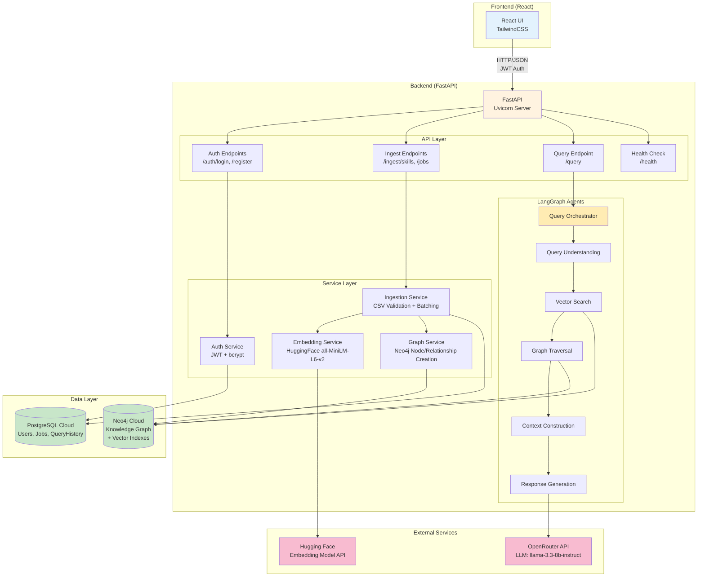

# High Level Architecture

## Technical Summary

The system employs a **monolithic FastAPI backend architecture** with direct database connections to Neo4j (graph) and PostgreSQL (relational). The core architecture follows a **pipeline-based RAG pattern** orchestrated by LangGraph, where CSV data flows through ingestion → embedding → graph construction, and user queries flow through understanding → hybrid search → LLM generation. FastAPI exposes RESTful endpoints for authentication, CSV upload, and conversational queries, while LangGraph agents coordinate complex multi-step reasoning workflows. This design prioritizes simplicity for MVP development while maintaining clear separation of concerns through service layers, enabling future extensibility without microservices complexity.

## High Level Overview

**Architectural Style**: Monolithic API (Single FastAPI Application)

The system uses a single FastAPI application that handles all backend responsibilities without service decomposition. This aligns with the PRD's technical assumptions favoring simplicity over distributed complexity for MVP scope.

**Repository Structure**: Monorepo (from PRD Technical Assumptions)

```
/
├── frontend/          # React application (separate architecture doc)
├── backend/           # FastAPI application (this document)
│   ├── api/          # API endpoints (FastAPI routers)
│   ├── agents/       # LangGraph agents and workflows
│   ├── services/     # Business logic (ingestion, query, embedding)
│   ├── models/       # Data models (Pydantic, Prisma)
│   └── utils/        # Shared utilities
├── data/             # Sample CSV files
└── docs/             # Architecture documentation
```

**Service Architecture**: Monolith - No Microservices (from PRD Technical Assumptions)

All functionality consolidated into a single deployable unit:
- Authentication and authorization
- CSV file upload and validation
- Embedding generation and graph construction
- LangGraph RAG query pipeline
- Direct database connections (Neo4j driver + Prisma ORM)

**Primary Data Flow**:

1. **Ingestion Pipeline** (CSV → Knowledge Graph):
   - User uploads CSV via `/ingest/skills` or `/ingest/jobs`
   - FastAPI validates format and required columns
   - Batch processor chunks records (1000/batch)
   - Embedding service generates vectors (Hugging Face)
   - Neo4j driver constructs graph nodes and relationships
   - Progress tracked in PostgreSQL, polled by frontend

2. **Query Pipeline** (Natural Language → AI Response):
   - User sends query to `/query` endpoint
   - LangGraph StateGraph orchestrates 5-node workflow:
     - Query Understanding → classify intent, generate embedding
     - Vector Search → Neo4j similarity search
     - Graph Traversal → Cypher queries based on intent
     - Context Construction → combine results into LLM prompt
     - Response Generation → OpenRouter API call
   - Response + source citations returned to frontend

**Key Architectural Decisions**:

- **Stateless API**: JWT tokens for auth, no session storage
- **Direct Database Access**: Neo4j Python driver + Prisma (no ORMs for Neo4j)
- **Synchronous Processing**: CSV ingestion runs synchronously with progress polling (no async workers/queues for MVP)
- **Cloud Databases**: Neo4j Aura + PostgreSQL cloud (URIs in `.env`)
- **Single Deployment Unit**: Uvicorn serves FastAPI app, connects to remote databases

## High Level Project Diagram



## Architectural and Design Patterns

### 1. API Architecture Pattern

**Chosen Pattern: REST with JSON**

**Rationale**:
- Frontend spec already defines RESTful interaction patterns
- Simpler for MVP development (no GraphQL schema complexity)
- FastAPI has excellent REST support with automatic OpenAPI docs
- Aligns with PRD's simplicity-first approach

**Alternatives Considered**:
- GraphQL: Too complex for MVP, overkill for simple CRUD + query operations
- gRPC: Unnecessary performance overhead for cloud-hosted databases

---

### 2. Code Organization Pattern

**Chosen Pattern: Layered Architecture (API → Service → Data)**

**Rationale**:
- Clear separation: API layer (routers), Service layer (business logic), Data layer (database access)
- Easy to navigate: `/api/` for endpoints, `/services/` for logic, `/models/` for schemas
- Balances simplicity with maintainability for single developer
- Natural fit for FastAPI dependency injection

**Structure**:
```
api/ → routes and request/response handling
services/ → business logic, no HTTP concerns
models/ → Pydantic schemas, Prisma models
agents/ → LangGraph workflows (special service layer)
```

---

### 3. LangGraph Orchestration Pattern

**Chosen Pattern: StateGraph with Conditional Routing**

**Rationale**:
- Query intent determines graph traversal strategy (5 intent types from PRD)
- Allows branching based on query classification
- Maintains conversation state across workflow nodes
- Enables future extensions (multi-turn conversations, replanning)

**Implementation**: `QueryUnderstanding` classifies intent → routes to appropriate Cypher patterns in `GraphTraversal` node

---

### 4. Database Access Pattern

**Chosen Pattern: Repository Pattern for PostgreSQL, Direct Driver for Neo4j**

**Rationale**:
- **PostgreSQL**: Prisma ORM with repository services abstracts data access
- **Neo4j**: Direct Python driver usage (no mature ORM for graph DBs)
- Clean separation: services call repositories, repositories manage queries
- Testable: can mock repositories for unit tests

**Implementation**:
- `repositories/user_repository.py` → Prisma queries for users
- `services/graph_service.py` → Direct Neo4j driver calls with Cypher

---

### 5. Error Handling Pattern

**Chosen Pattern: Exception-Based with Custom Exceptions**

**Rationale**:
- FastAPI natively supports HTTPException with status codes
- Python's try/except is idiomatic
- Custom exceptions for domain errors (CSVValidationError, EmbeddingError, GraphConstructionError)
- Middleware catches all exceptions and formats consistent error responses

**Pattern Example**:
```python
# Custom exceptions
class CSVValidationError(Exception): pass

# Service layer raises
if not valid_csv:
    raise CSVValidationError("Missing required columns: ID, NAME")

# API layer catches and converts
@app.exception_handler(CSVValidationError)
def validation_exception_handler(request, exc):
    return JSONResponse(status_code=400, content={"error": str(exc)})
```

---

### 6. Asynchronous Processing Pattern

**Chosen Pattern: Synchronous Processing with Progress Polling**

**Rationale**:
- Simpler for MVP: no worker infrastructure needed
- CSV ingestion runs in request context, updates PostgreSQL progress table
- Frontend polls `/ingest/status/{job_id}` every 2 seconds
- Sufficient for internal MVP with single user upload at a time

**Future Enhancement**: Move to background task queue (Celery) for concurrent uploads

---

### 7. Authentication & Authorization Pattern

**Chosen Pattern: JWT Stateless with FastAPI Security**

**Rationale**:
- Stateless: no session storage required
- FastAPI has built-in OAuth2PasswordBearer for JWT
- Simple for MVP: email/password → JWT token (24h expiry)
- Token stored in frontend localStorage

**Pattern Example**:
```python
# Login endpoint generates JWT
token = jwt.encode({"user_id": user.id, "exp": exp}, JWT_SECRET)

# Protected endpoints verify JWT
@router.get("/protected", dependencies=[Depends(get_current_user)])
async def protected_route(user: User = Depends(get_current_user)):
    ...
```

---
