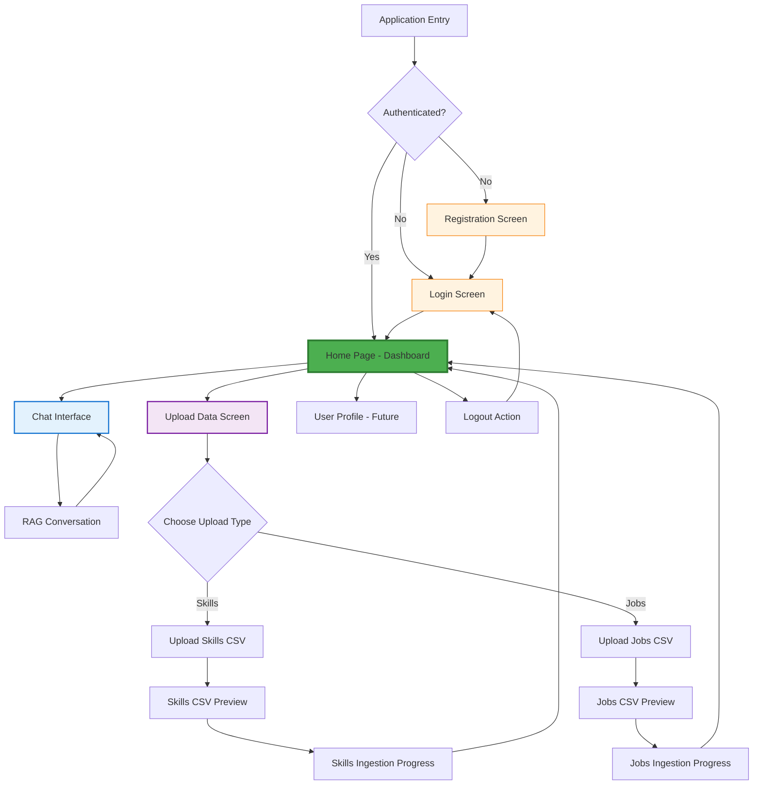
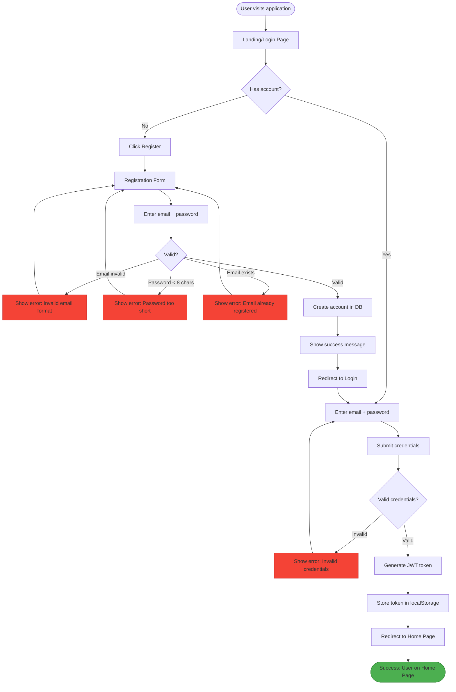
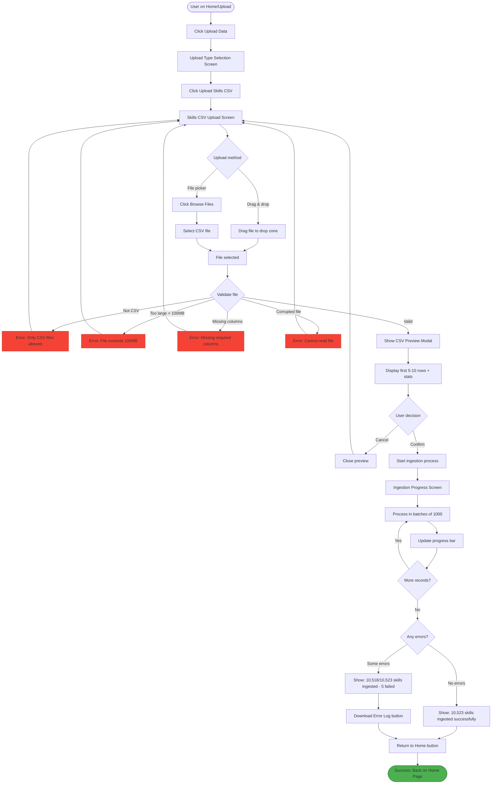
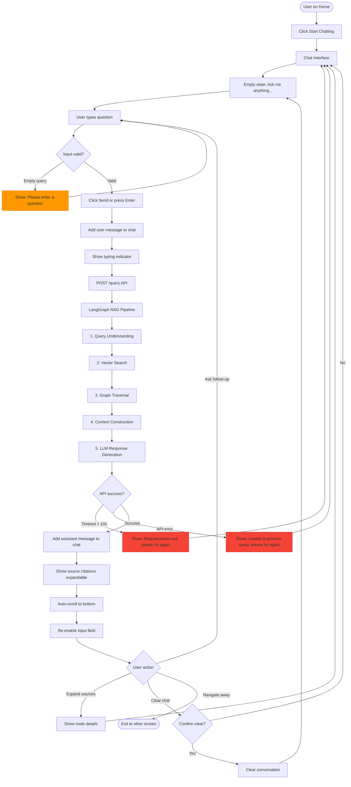

# Graph RAG System for Skills & Jobs Knowledge Graph UI/UX Specification

## Introduction

This document defines the user experience goals, information architecture, user flows, and visual design specifications for Graph RAG System for Skills & Jobs Knowledge Graph's user interface. It serves as the foundation for visual design and frontend development, ensuring a cohesive and user-centered experience.

**Change Log**

| Date | Version | Description | Author |
|------|---------|-------------|--------|
| 2025-10-22 | 1.0 | Initial UI/UX specification creation | Sally (UX Expert) |

## Overall UX Goals & Principles

### Target User Personas

**1. Career Transitioner (Primary Persona)**
- **Profile**: Working professional (28-42 years old) with 3-10 years experience seeking career advancement or lateral move
- **Technical comfort**: Moderate to high - comfortable with digital tools and chat interfaces
- **Key needs**: Understand skill adjacencies, identify realistic transition paths, validate market demand for target roles
- **Frustrations**: Fragmented information across multiple sources, time-consuming manual research, unclear ROI on skill investment
- **Quote**: "I know I want to move into data science, but I don't know what skills I'm missing or how long it will take"

**2. Skill Developer (Secondary Persona)**
- **Profile**: Early-career professional or recent graduate (22-30 years old) building initial skill foundation
- **Technical comfort**: High - digital native, expects modern conversational interfaces
- **Key needs**: Discover in-demand skills, understand skill categories and hierarchies, find high-paying opportunities aligned with interests
- **Frustrations**: Information overload, difficulty prioritizing which skills to learn first, unclear career path visualization
- **Quote**: "I want to maximize my earning potential, but there are so many technologies to choose from"

**3. Job Seeker (Tertiary Persona)**
- **Profile**: Actively searching for employment (25-45 years old, diverse technical backgrounds)
- **Technical comfort**: Varies from moderate to high
- **Key needs**: Find jobs matching existing skills, understand company landscape, access salary insights for negotiation
- **Frustrations**: Keyword-based search misses relevant opportunities, lack of company intelligence beyond job descriptions
- **Quote**: "Job boards show me the same 10 roles repeatedly - I need to discover opportunities I'm not thinking of"

### Usability Goals

1. **Effortless Onboarding** - New users can ask their first career question within 2 minutes of account creation (login → start chatting immediately)

2. **Conversational Fluency** - Users can ask questions in natural language without learning specialized syntax or query formats (no training required)

3. **Instant Comprehension** - System responses are immediately understandable with clear source attribution (users trust the information)

4. **Progressive Complexity** - Advanced features (CSV upload, data management) are accessible but not intrusive to primary chat experience

5. **Forgiving Interaction** - Users can easily correct mistakes, restart conversations, or explore alternative queries without penalty (clear chat button, edit query capability)

6. **Response Confidence** - Users understand where information comes from through transparent source citations (builds trust in graph-powered insights)

### Design Principles

1. **Conversation Over Navigation** - The chat interface is the primary interaction model. Minimize UI chrome, maximize dialogue space. Users should feel like they're talking to a knowledgeable career advisor, not navigating a complex application.

2. **Immediate Feedback** - Every user action receives instant visual response. Typing indicators during LLM processing, progress bars for file uploads, real-time validation errors. No silent failures or ambiguous states.

3. **Progressive Disclosure** - Show only what's needed, when it's needed. The default view is pure conversation. Data upload and system management features are accessible but secondary. Complexity reveals itself gradually based on user needs.

4. **Clarity Trumps Cleverness** - Simple, direct language and conventional UI patterns over innovative but unfamiliar interactions. Users should never wonder "what does this do?" or "how do I accomplish X?"

5. **Trust Through Transparency** - Always show the source of information. Graph nodes and relationships used to generate responses should be visible. Users can verify and explore the "why" behind every answer.

## Information Architecture (IA)

### Site Map / Screen Inventory



**Screen Hierarchy:**

- **Authentication Layer** (Unauthenticated)
  - Login Screen
  - Registration Screen

- **Main Application** (Authenticated)
  - **Home Page** ⭐ Primary Landing Screen - Dashboard with navigation cards
    - Navigate to Chat Interface
    - Navigate to Upload Data
    - Navigate to User Profile (Future)

  - **Chat Interface** - Conversational RAG experience
    - Message history
    - Input field for queries
    - Source citations display

  - **Upload Data Workflow**
    - **Upload Type Selection** - Choose between Skills CSV or Jobs CSV
    - **Skills CSV Upload Flow**
      - File selection (drag-and-drop or file picker)
      - CSV Preview (first 5-10 rows)
      - Ingestion Progress tracking
    - **Jobs CSV Upload Flow**
      - File selection (drag-and-drop or file picker)
      - CSV Preview (first 5-10 rows)
      - Ingestion Progress tracking

### Navigation Structure

**Primary Navigation:**

Top navigation bar with:
- **"Career Intelligence"** (logo/brand) - Clicking returns to **Home Page**
- **"Home"** link - Returns to Home Page (always accessible)
- **"Chat"** link - Quick access to Chat Interface
- **"Upload Data"** link - Quick access to Upload workflow
- **User Menu** (dropdown) - User email + "Logout" option

**Home Page Navigation:**

The Home Page acts as a dashboard with clear action cards:
- **"Start Chatting"** card - Large, prominent call-to-action leading to Chat Interface
  - Description: "Ask questions about careers, skills, and jobs"
  - Icon: Chat/Message bubble

- **"Upload Data"** card - Secondary action for data management
  - Description: "Upload Skills or Jobs CSV files"
  - Icon: Upload/Cloud icon

- **Quick Stats** (Optional) - Show system status
  - "50,234 jobs in database"
  - "10,523 skills indexed"
  - "Last updated: 3 days ago"

**Navigation Behavior:**
- All screens have consistent top navigation bar
- Active route highlighted in primary nav
- Home page is the "reset" point - users return here after completing tasks

**Breadcrumb Strategy:**

Simple breadcrumbs for Upload workflow only:
- **Upload workflow**: Home > Upload Data > Skills CSV > Preview
- **Upload workflow**: Home > Upload Data > Jobs CSV > Preview
- **Chat**: No breadcrumbs needed (single screen)

## User Flows

### Flow 1: User Registration and First Login

**User Goal:** Create an account and access the system for the first time

**Entry Points:**
- Landing page with "Sign Up" button
- Login page with "Don't have an account? Register" link

**Success Criteria:**
- User successfully creates account
- User is logged in and sees Home Page
- JWT token stored in browser

#### Flow Diagram



#### Edge Cases & Error Handling:

- **Empty email field** → Show inline validation: "Email is required"
- **Empty password field** → Show inline validation: "Password is required"
- **Network failure during registration** → Show error: "Unable to connect. Please check your connection and try again"
- **Network failure during login** → Show error: "Login failed. Please try again"
- **Token storage failure** → Log error, attempt re-login
- **User clicks "Back" during registration** → Return to login, form data cleared

**Notes:**
- No email verification required for MVP (as specified in PRD)
- Password strength indicator optional (not required)
- "Remember me" functionality not implemented in MVP

---

### Flow 2: CSV Upload - Skills

**User Goal:** Upload skills taxonomy CSV file and populate the knowledge graph

**Entry Points:**
- Home Page → Click "Upload Data" card
- Top navigation → Click "Upload Data" link

**Success Criteria:**
- Skills CSV validated successfully
- User previews and confirms data
- All records ingested into Neo4j graph
- User sees completion summary

#### Flow Diagram



#### Edge Cases & Error Handling:

- **User uploads wrong CSV (jobs instead of skills)** → Column validation catches mismatch, shows error listing missing columns
- **Empty CSV (headers only)** → Error: "CSV contains no data rows"
- **Network interruption during upload** → Show error, allow retry from beginning
- **Backend ingestion crash** → Progress shows "Processing failed" with error log download
- **User navigates away during ingestion** → Progress continues in background, show notification when complete
- **Duplicate upload (same file twice)** → Neo4j upsert handles gracefully, updates existing records
- **CSV encoding issues (UTF-8 vs ISO-8859-1)** → Backend handles common encodings, shows parse error if fails

**Notes:**
- Progress bar updates every 2 seconds via polling `/ingest/status/{job_id}`
- Estimated time remaining calculated from average processing speed
- User can upload jobs CSV immediately after skills (doesn't need to wait for completion)

---

### Flow 3: Chat - Asking Career Questions

**User Goal:** Get intelligent answers about careers, skills, and jobs through natural language queries

**Entry Points:**
- Home Page → Click "Start Chatting" card
- Top navigation → Click "Chat" link

**Success Criteria:**
- User sends query in natural language
- System processes query with RAG pipeline
- User receives relevant answer with source citations
- Conversation history maintained

#### Flow Diagram



#### Edge Cases & Error Handling:

- **Query with no graph results** → LLM responds: "I don't have information about that in my current knowledge base"
- **Multiple rapid queries** → Disable input during processing, queue subsequent queries
- **Very long response (>500 tokens)** → Response may be truncated, indicate with "..."
- **User loses internet connection** → Show offline indicator, queue messages for retry
- **Session expires during chat** → Redirect to login, preserve conversation in localStorage for recovery
- **User asks non-career question** → LLM responds politely: "I specialize in career and skills questions. Try asking about job requirements or career paths"

**Notes:**
- Message history stored in React state (cleared on page refresh unless localStorage enabled)
- Source citations show: "Based on 5 jobs, 3 skills, 2 companies" with expandable details
- Response time goal: <5 seconds for typical queries
- Typing indicator animates while waiting for LLM

## Wireframes & Mockups

### Design Files

**Primary Design Files:** To be created in Figma or similar design tool (post-specification approval)

**Design Tool Recommendation:** Figma (collaborative, component-based, developer handoff features)

**Current Status:** Conceptual wireframes defined below - detailed mockups to follow

### Key Screen Layouts

#### Screen 1: Login/Registration

**Purpose:** Authenticate users and provide account creation

**Key Elements:**
- Centered card layout on neutral background
- Logo/branding at top of card
- Email and password input fields
- "Login" primary button / "Register" secondary button
- Toggle between Login and Registration views
- Minimal distractions - focus on authentication task

**Interaction Notes:**
- Form validation shows inline errors below each field
- Success states redirect automatically (no manual navigation)
- Registration success shows brief confirmation before redirect to login
- Error states use red text with clear messaging

**Design File Reference:** `figma.com/login-screen` (placeholder)

---

#### Screen 2: Home Page (Dashboard)

**Purpose:** Primary landing screen after login - clear navigation hub

**Key Elements:**
- Top navigation bar (always visible)
- Two large action cards: "Start Chatting" (primary) and "Upload Data" (secondary)
- Optional: Quick stats showing system status (jobs count, skills count, last updated)
- Clean, spacious layout emphasizing the two main actions
- Visual hierarchy: Chat card larger/more prominent than Upload card

**Interaction Notes:**
- Cards have hover states (slight elevation, border highlight)
- Click anywhere on card navigates to respective screen
- Stats update dynamically if data changes
- User menu in top-right shows email and logout option

**Design File Reference:** `figma.com/home-page` (placeholder)

---

#### Screen 3: Chat Interface

**Purpose:** Conversational AI interface for asking career questions

**Key Elements:**
- Persistent top navigation
- Message thread (scrollable, auto-scroll to bottom on new messages)
- User messages (right-aligned, distinct color)
- Assistant messages (left-aligned, neutral color)
- Source citations (expandable below assistant messages)
- Input field with send button (bottom, fixed position)
- "Clear Chat" button (subtle, top-right of message area)
- Empty state: welcoming prompt "Ask me anything about careers, skills, and jobs!"

**Interaction Notes:**
- Messages appear with smooth scroll animation
- Typing indicator (three dots) shows while waiting for response
- Input field disabled during processing (visual indication)
- Source citations collapse/expand on click
- Enter key sends message, Shift+Enter for new line

**Design File Reference:** `figma.com/chat-interface` (placeholder)

---

#### Screen 4: Upload Data - Type Selection

**Purpose:** Choose between Skills CSV or Jobs CSV upload

**Key Elements:**
- Breadcrumb: Home > Upload Data
- Page title: "Upload Data"
- Two large, equal-sized cards: "Upload Skills CSV" and "Upload Jobs CSV"
- Each card shows brief description and icon
- Clear visual affordance (clickable cards with hover states)

**Interaction Notes:**
- Cards have distinct icons (document/table icon differentiated)
- Hover state shows border highlight and slight elevation
- Click navigates to respective upload screen
- Back button returns to Home

**Design File Reference:** `figma.com/upload-selection` (placeholder)

---

#### Screen 5: CSV Upload (Skills or Jobs)

**Purpose:** File selection and preview before ingestion

**Key Elements:**
- Breadcrumb: Home > Upload Data > Skills CSV
- Drag-and-drop zone (prominent, dashed border)
- "Browse Files" button (alternative to drag-and-drop)
- File validation feedback (checkmark for valid, error icon for invalid)
- CSV preview modal (appears after file selection)
  - Table showing first 5-10 rows
  - Record count summary
  - "Confirm Upload" and "Cancel" buttons

**Interaction Notes:**
- Drag-and-drop zone highlights on file hover
- File validation happens immediately after selection
- Errors show inline with clear messaging and retry option
- Preview modal overlays upload screen (modal backdrop)
- Cancel closes modal and returns to upload screen

**Design File Reference:** `figma.com/csv-upload` (placeholder)

---

#### Screen 6: Ingestion Progress

**Purpose:** Real-time feedback on CSV processing status

**Key Elements:**
- Breadcrumb: Home > Upload Data > Skills CSV > Progress
- Progress bar (0-100% with animated fill)
- Statistics: Records processed / total, failed count
- Estimated time remaining
- Status messages ("Processing batch 5/11...")
- Cancel button (optional, stops ingestion)
- Completion state with success summary or error log download

**Interaction Notes:**
- Progress bar updates every 2 seconds (polling backend)
- Statistics update in real-time
- On completion, "Return to Home" button appears
- If errors occurred, "Download Error Log" button appears
- User can navigate away - progress continues in background

**Design File Reference:** `figma.com/ingestion-progress` (placeholder)

## Component Library / Design System

### Design System Approach

**Approach:** Utilize existing UI component library (TailwindCSS + Headless UI or Material-UI) with minimal customization for MVP speed

**Rationale:**
- **Speed over custom branding**: Leverage battle-tested components rather than building from scratch
- **TailwindCSS recommended**: Utility-first CSS framework provides flexibility with minimal overhead
- **Headless UI for complex components**: Accessible, unstyled components (modals, dropdowns) that work perfectly with Tailwind
- **Alternative**: Material-UI if team prefers opinionated component system with built-in design language

**Implementation Strategy:**
1. Install TailwindCSS + Headless UI (or Material-UI as alternative)
2. Define custom color palette in Tailwind config
3. Create minimal wrapper components for consistent styling
4. Focus on functionality over visual uniqueness

### Core Components

#### Component 1: Button

**Purpose:** Primary interaction element for all user actions

**Variants:**
- **Primary**: Main call-to-action (blue background, white text)
- **Secondary**: Supporting actions (white background, blue border/text)
- **Danger**: Destructive actions like "Clear Chat" (red background, white text)
- **Ghost**: Minimal visual weight for tertiary actions (transparent background, text only)

**States:**
- Default (idle)
- Hover (slight background color shift, elevation)
- Active (pressed state with darker color)
- Disabled (grayed out, no pointer events, opacity 50%)
- Loading (with spinner icon, disabled interaction)

**Usage Guidelines:**
- Use Primary for main action on screen (max 1 per view)
- Use Secondary for alternative or supporting actions
- Danger buttons require confirmation dialog for destructive actions
- Ghost buttons for low-priority actions (Cancel, Back)
- Minimum touch target: 44x44px (WCAG guideline)

#### Component 2: Input Field

**Purpose:** Text input for forms (email, password, chat messages)

**Variants:**
- **Text**: Standard single-line input
- **Password**: Masked input with show/hide toggle icon
- **Textarea**: Multi-line input for chat messages
- **Search**: Input with search icon prefix

**States:**
- Default (empty, placeholder visible)
- Focus (border highlight, visible focus ring)
- Filled (user has entered text)
- Error (red border, error message below)
- Disabled (grayed out, not editable)
- Success (green checkmark icon, optional)

**Usage Guidelines:**
- Always include label (visible or screen-reader only)
- Show clear error messages below field on validation failure
- Placeholder text is hint, not replacement for label
- Focus state must be highly visible for keyboard navigation
- Character limit counter for fields with max length

#### Component 3: Card

**Purpose:** Container for grouped content and actions (Home page cards, Upload cards)

**Variants:**
- **Action Card**: Clickable card with hover effects (Home page navigation)
- **Content Card**: Non-interactive container for information display
- **Elevated Card**: With shadow for visual hierarchy

**States:**
- Default (resting state)
- Hover (for action cards - elevation increase, border highlight)
- Active (pressed state for action cards)
- Selected (optional, for multi-select scenarios)

**Usage Guidelines:**
- Action cards should have clear visual affordance (hover state, cursor pointer)
- Maintain consistent padding (16-24px recommended)
- Include clear heading and description for action cards
- Icon placement: Top-left or centered depending on card size
- Card should be keyboard accessible (tabbable if interactive)

#### Component 4: Modal / Dialog

**Purpose:** Overlay for CSV preview, confirmations, and focused interactions

**Variants:**
- **Info Modal**: Display information (CSV preview)
- **Confirmation Modal**: Require user decision (Clear chat confirmation)
- **Alert Modal**: Critical notifications or errors

**States:**
- Open (visible, backdrop overlay active)
- Closed (hidden)
- Animating (fade in/out transition)

**Usage Guidelines:**
- Always include backdrop (semi-transparent black overlay)
- Provide clear close mechanism (X button, ESC key, click outside)
- Focus trap: Tab key cycles through modal elements only
- First focusable element receives focus on open
- Return focus to trigger element on close
- Maximum width: 90vw or 600px (whichever is smaller)
- Vertically centered on screen

#### Component 5: Progress Bar

**Purpose:** Visual feedback for CSV ingestion progress

**Variants:**
- **Determinate**: Known progress (0-100%)
- **Indeterminate**: Unknown duration (pulsing animation)

**States:**
- In Progress (animated fill)
- Complete (100%, success color)
- Error (stopped progress, error color)

**Usage Guidelines:**
- Always show percentage or fraction (7,892 / 10,523)
- Include time estimate when possible
- Animate progress smoothly (not in jumps)
- Success state should be clearly different (green fill)
- Error state pauses animation and shows red

#### Component 6: Message Bubble (Chat)

**Purpose:** Display user and assistant messages in chat interface

**Variants:**
- **User Message**: Right-aligned, distinct background color
- **Assistant Message**: Left-aligned, neutral background
- **System Message**: Centered, minimal styling (optional)

**States:**
- Default (message displayed)
- Typing Indicator (animated dots for assistant)
- Error State (failed message with retry option)

**Usage Guidelines:**
- User messages: Right-aligned, blue/colored background
- Assistant messages: Left-aligned, gray/white background
- Maximum width: 70% of container (prevents overly wide bubbles)
- Include timestamp (can be hidden by default)
- Avatar optional for MVP (can add user/assistant icons later)
- Adequate padding: 12-16px
- Rounded corners: 12-16px radius

#### Component 7: Navigation Bar

**Purpose:** Persistent top navigation across all screens

**Variants:**
- **Desktop**: Full horizontal bar with all links visible
- **Mobile**: Collapsed hamburger menu

**States:**
- Default (all links visible)
- Active Route (highlighted link)
- User Menu Open (dropdown expanded)
- User Menu Closed

**Usage Guidelines:**
- Fixed position at top of viewport (sticky)
- Height: 60-64px
- Logo/brand always visible on left
- Nav links centered or left-aligned
- User menu always on far right
- Active route indicated with underline or background
- Mobile breakpoint: <768px switches to hamburger

#### Component 8: Drag-and-Drop Zone

**Purpose:** File upload area for CSV ingestion

**Variants:**
- **Empty**: Default state with placeholder
- **Hover**: File dragged over zone (highlighted)
- **File Selected**: After file drop (shows file name)

**States:**
- Default (empty, ready for file)
- Drag Over (visual highlight, user dragging file)
- File Selected (show file name, size, validation status)
- Validating (spinner while checking file)
- Error (file validation failed)
- Success (file valid, ready to upload)

**Usage Guidelines:**
- Minimum height: 200px (large enough target)
- Dashed border in default state
- Solid border on hover/drag over
- Clear icon (upload/folder icon) in center
- Text instructions: "Drag and drop CSV file here or click to browse"
- File type and size limits shown below zone
- Immediate feedback on file selection

## Branding & Style Guide

### Visual Identity

**Brand Guidelines:** Minimal custom branding for MVP - focus on clean, professional, functional design

**Design Philosophy:**
- **Simplicity over complexity** - No elaborate branding elements or visual flourishes
- **Function over form** - Interface clarity prioritized over visual uniqueness
- **Professional aesthetics** - Trust-building visual language appropriate for career intelligence
- **Scalable foundation** - Simple base that can evolve with custom branding post-MVP

**Brand Personality:**
- Intelligent and knowledgeable (not playful or casual)
- Trustworthy and professional (not flashy or sales-oriented)
- Helpful and approachable (not robotic or cold)
- Efficient and focused (not cluttered or overwhelming)

### Color Palette

| Color Type | Hex Code | Usage | TailwindCSS Class |
|------------|----------|-------|-------------------|
| **Primary** | `#2563EB` | Primary actions, links, chat user messages, active states | `bg-blue-600` / `text-blue-600` |
| **Primary Hover** | `#1D4ED8` | Hover state for primary elements | `hover:bg-blue-700` |
| **Secondary** | `#64748B` | Secondary text, supporting information, borders | `text-slate-600` / `border-slate-600` |
| **Accent** | `#3B82F6` | Highlights, badges, notifications | `bg-blue-500` |
| **Success** | `#10B981` | Success states, completed progress, positive feedback | `bg-green-500` / `text-green-500` |
| **Warning** | `#F59E0B` | Warnings, cautions, important notices | `bg-amber-500` / `text-amber-500` |
| **Error** | `#EF4444` | Errors, destructive actions, failed states | `bg-red-500` / `text-red-500` |
| **Neutral Dark** | `#1F2937` | Primary text, headings | `text-gray-800` |
| **Neutral Mid** | `#6B7280` | Secondary text, placeholders | `text-gray-500` |
| **Neutral Light** | `#F3F4F6` | Backgrounds, assistant message bubbles, disabled states | `bg-gray-100` |
| **White** | `#FFFFFF` | Page backgrounds, cards, input fields | `bg-white` |
| **Border** | `#E5E7EB` | Dividers, borders, subtle separators | `border-gray-200` |

**Color Usage Guidelines:**
- **Primary blue** for all interactive elements (buttons, links, active navigation)
- **Gray scale** for text hierarchy (dark for headings, mid for body, light for backgrounds)
- **Semantic colors** strictly for their purpose (green = success, red = error, amber = warning)
- **High contrast** maintained for all text (WCAG AA compliance: 4.5:1 for normal text)
- **Consistent application** - same color always means the same thing

### Typography

#### Font Families

- **Primary (UI)**: System font stack (no custom fonts for MVP)
  - `font-family: -apple-system, BlinkMacSystemFont, "Segoe UI", Roboto, "Helvetica Neue", Arial, sans-serif`
  - **Rationale**: Fast loading, excellent readability, native look across platforms

- **Monospace (Code/Data)**: System monospace stack
  - `font-family: "SF Mono", Monaco, "Cascadia Code", "Courier New", monospace`
  - **Usage**: CSV preview tables, technical data, code snippets

**Alternative (if custom fonts desired post-MVP):**
- **Primary**: Inter or Roboto (Google Fonts)
- **Accent**: Optional display font for logo/headings

#### Type Scale

| Element | Size | Weight | Line Height | TailwindCSS Classes |
|---------|------|--------|-------------|---------------------|
| **H1** | 36px (2.25rem) | 700 (Bold) | 1.2 (43px) | `text-4xl font-bold leading-tight` |
| **H2** | 30px (1.875rem) | 600 (Semibold) | 1.3 (39px) | `text-3xl font-semibold leading-snug` |
| **H3** | 24px (1.5rem) | 600 (Semibold) | 1.4 (34px) | `text-2xl font-semibold leading-normal` |
| **H4** | 20px (1.25rem) | 600 (Semibold) | 1.4 (28px) | `text-xl font-semibold leading-normal` |
| **Body Large** | 18px (1.125rem) | 400 (Regular) | 1.6 (29px) | `text-lg leading-relaxed` |
| **Body** | 16px (1rem) | 400 (Regular) | 1.5 (24px) | `text-base leading-normal` |
| **Body Small** | 14px (0.875rem) | 400 (Regular) | 1.5 (21px) | `text-sm leading-normal` |
| **Caption** | 12px (0.75rem) | 400 (Regular) | 1.4 (17px) | `text-xs leading-tight` |
| **Button** | 16px (1rem) | 500 (Medium) | 1.2 (19px) | `text-base font-medium` |
| **Link** | 16px (1rem) | 500 (Medium) | 1.5 (24px) | `text-base font-medium underline` |

**Typography Guidelines:**
- **H1**: Page titles only (e.g., "Upload Data", "Chat Interface")
- **H2**: Section headings (e.g., "CSV Preview", "Recent Conversations")
- **H3**: Subsection headings, card titles
- **Body**: All paragraph text, chat messages, descriptions
- **Body Small**: Supporting text, metadata, timestamps
- **Caption**: Fine print, helper text, labels

**Emphasis:**
- **Bold (700)**: Emphasis within body text, key terms
- **Semibold (600)**: Headings, labels
- **Medium (500)**: Buttons, links, interactive elements
- **Regular (400)**: Body text (default)

### Iconography

**Icon Library:** Heroicons (recommended) or Material Icons

**Icon System:**
- **Heroicons**: Free, MIT-licensed, designed by Tailwind Labs
  - Available in Outline (24x24) and Solid (20x20) variants
  - Perfect match for TailwindCSS ecosystem
  - URL: https://heroicons.com

**Alternative:**
- **Material Icons**: Google's icon system if using Material-UI
- **Lucide Icons**: Clean, consistent alternative to Heroicons

**Icon Usage:**

| Context | Icon | Style | Size |
|---------|------|-------|------|
| Chat/Messaging | ChatBubbleLeftRightIcon | Outline | 24px |
| Upload | CloudArrowUpIcon | Outline | 24px |
| File/Document | DocumentTextIcon | Outline | 24px |
| User Profile | UserCircleIcon | Solid | 32px |
| Success Checkmark | CheckCircleIcon | Solid | 20px |
| Error | XCircleIcon | Solid | 20px |
| Warning | ExclamationTriangleIcon | Solid | 20px |
| Info | InformationCircleIcon | Outline | 20px |
| Close/Cancel | XMarkIcon | Outline | 20px |
| Menu (Hamburger) | Bars3Icon | Outline | 24px |
| Chevron Down | ChevronDownIcon | Outline | 16px |
| Search | MagnifyingGlassIcon | Outline | 20px |

**Usage Guidelines:**
- **Consistent sizing**: Use 16px, 20px, or 24px (avoid arbitrary sizes)
- **Inline with text**: Icons should align with text baseline
- **Color inheritance**: Icons inherit text color for consistency
- **Accessible labels**: Always provide aria-label for icon-only buttons
- **Outline vs Solid**: Outline for general UI, Solid for status/emphasis

### Spacing & Layout

**Spacing System:** TailwindCSS default spacing scale (based on 0.25rem / 4px increments)

| Size | Value | Usage | Tailwind Class |
|------|-------|-------|----------------|
| **xs** | 4px (0.25rem) | Tight spacing, icon gaps | `gap-1`, `p-1` |
| **sm** | 8px (0.5rem) | Compact spacing, form elements | `gap-2`, `p-2` |
| **md** | 12px (0.75rem) | Default element spacing | `gap-3`, `p-3` |
| **base** | 16px (1rem) | Standard spacing unit | `gap-4`, `p-4` |
| **lg** | 20px (1.25rem) | Generous spacing | `gap-5`, `p-5` |
| **xl** | 24px (1.5rem) | Section spacing, card padding | `gap-6`, `p-6` |
| **2xl** | 32px (2rem) | Large section gaps | `gap-8`, `p-8` |
| **3xl** | 48px (3rem) | Major section breaks | `gap-12`, `p-12` |

**Layout Grid:**
- **Container max-width**: 1280px (Tailwind `max-w-7xl`)
- **Page margins**: 16px mobile, 24px tablet, 32px desktop
- **Card padding**: 16-24px depending on content density
- **Section spacing**: 32-48px between major sections
- **Element gaps**: 12-16px between related elements

**Responsive Breakpoints (TailwindCSS default):**
- **sm**: 640px (tablet)
- **md**: 768px (small laptop)
- **lg**: 1024px (laptop)
- **xl**: 1280px (desktop)
- **2xl**: 1536px (large desktop)

**Spacing Guidelines:**
- **Consistent rhythm**: Use multiples of 4px for all spacing
- **Breathing room**: Don't cram elements - generous whitespace improves clarity
- **Visual grouping**: Reduce spacing within groups, increase between groups
- **Responsive scaling**: Reduce padding/gaps on mobile (use responsive utilities)

## 8. Accessibility Requirements

### Compliance Target

**MVP:** No formal accessibility compliance required (as per PRD)

**Post-MVP:** WCAG 2.1 Level AA compliance recommended for broader reach and legal protection

**Rationale for Post-MVP Compliance:**
- **Legal risk mitigation**: ADA compliance increasingly expected for digital services
- **Market expansion**: Accessible design reaches users with permanent, temporary, or situational disabilities (estimated 15-20% of population)
- **SEO benefits**: Many accessibility practices (semantic HTML, alt text) improve search rankings
- **Quality signal**: Accessibility often correlates with overall code quality and usability

### Key Requirements for MVP (Foundational Best Practices)

Even without formal compliance, we'll implement foundational accessibility practices to prevent technical debt:

#### 1. **Visual Requirements**

**Color Contrast:**
- Text-to-background contrast minimum 4.5:1 for normal text (WCAG AA standard)
- Large text (18px+ or 14px+ bold) minimum 3:1 contrast
- Interactive elements (buttons, links) maintain contrast in all states (hover, focus, disabled)
- **Testing**: Use browser DevTools contrast checker during development

**Focus Indicators:**
- All interactive elements (buttons, links, inputs) have visible focus ring
- Focus ring: 2px solid outline with high contrast color (TailwindCSS `ring-2 ring-blue-500`)
- Focus ring never removed without replacement visual indicator
- **Testing**: Tab through interface - all interactive elements must show focus

**Text Sizing:**
- Base font size: 16px (browser default)
- Users can zoom to 200% without horizontal scrolling
- No fixed-width containers that break at high zoom
- **Testing**: Zoom browser to 200% and verify usability

#### 2. **Interaction Requirements**

**Keyboard Navigation:**
- All features accessible via keyboard (no mouse-only interactions)
- Logical tab order follows visual layout (top-to-bottom, left-to-right)
- Modal dialogs trap focus (Tab cycles within modal only)
- ESC key closes modals and dropdowns
- Enter/Space activates buttons and links
- **Testing**: Navigate entire application using only keyboard

**Screen Reader Basics:**
- Semantic HTML elements (`<button>`, `<nav>`, `<main>`, `<form>`, not generic `<div>` for interactive elements)
- All images have alt text (or `alt=""` for decorative images)
- Form inputs have associated `<label>` elements
- ARIA labels for icon-only buttons (e.g., `aria-label="Close modal"`)
- Heading hierarchy follows logical structure (no skipped levels: H1 → H2 → H3)
- **Testing**: Test with screen reader (macOS VoiceOver, NVDA on Windows)

**Touch Targets:**
- Minimum touch target size: 44x44px (WCAG guideline)
- Adequate spacing between interactive elements (8px minimum)
- **Testing**: Test on mobile device - all buttons easily tappable

#### 3. **Content Requirements**

**Alternative Text:**
- All `` elements have descriptive alt text
- Decorative images use `alt=""` to hide from screen readers
- Complex images (charts, diagrams) include longer text descriptions

**Heading Structure:**
- Page title uses `<h1>` (one per page)
- Section headings follow hierarchy (H1 → H2 → H3, no skipping)
- Headings describe content accurately (not just visual styling)

**Form Labels:**
- Every input has visible or screen-reader-only label
- Error messages associated with fields using `aria-describedby`
- Required fields indicated with text, not just asterisk

### Testing Strategy

#### MVP Testing (Minimal)
- **Keyboard navigation test**: Tab through all screens, verify all features accessible
- **Focus visibility check**: Ensure focus ring visible on all interactive elements
- **Zoom test**: Verify interface usable at 200% zoom
- **Color contrast check**: Run automated contrast checker on key screens

#### Post-MVP Testing (Comprehensive)
- **Automated scanning**: Run axe DevTools or WAVE on all screens
- **Screen reader testing**: Test with VoiceOver (macOS/iOS), NVDA (Windows), TalkBack (Android)
- **Keyboard-only navigation**: Complete task flows without mouse
- **WCAG audit**: Formal compliance audit with checklist
- **User testing with assistive technology**: Recruit users with disabilities for usability testing

### Implementation Notes

**TailwindCSS Accessibility Features:**
- Built-in focus ring utilities (`ring-*` classes)
- Screen-reader-only text utility (`sr-only` class)
- Responsive breakpoints support mobile accessibility
- No custom CSS needed for basic accessibility

**Headless UI Accessibility:**
- Components (modals, dropdowns) are fully accessible by default
- Focus management handled automatically
- Keyboard interactions built-in (ESC to close, arrow keys for navigation)
- ARIA attributes applied correctly

**Quick Wins:**
- Use semantic HTML (biggest impact, lowest effort)
- Never remove focus outlines without replacement
- Test with keyboard regularly during development
- Add alt text as images are created (not as afterthought)

---

## 9. Responsiveness Strategy

### Breakpoint System

We'll use TailwindCSS's default breakpoint system with strategic adaptation at each level:

| Breakpoint | Width | Device Context | Primary Use Case |
|------------|-------|----------------|------------------|
| **Mobile** | < 640px | Phone (portrait) | Chat-first experience, single-column layouts |
| **Tablet** | 640px - 1024px | Phone (landscape), Tablet | Hybrid layouts, collapsible sidebars |
| **Desktop** | 1024px - 1280px | Standard laptop/desktop | Full feature access, multi-column layouts |
| **Wide** | > 1280px | Large monitors | Optimized spacing, enhanced data visualization |

### Adaptation Patterns by Screen

#### 1. **Layout Changes**

**Mobile (< 640px)**
- **Home Page**: Single-column action cards, full-width
- **Chat Interface**: Full-screen chat (no sidebars), floating input at bottom
- **Upload**: Vertical wizard steps, full-width cards
- **Navigation**: Hamburger menu (top-left), user profile icon (top-right)

**Tablet (640px - 1024px)**
- **Home Page**: 2-column grid for action cards
- **Chat Interface**: Optional toggleable history sidebar (overlay style)
- **Upload**: 2-column preview tables with horizontal scroll
- **Navigation**: Condensed horizontal nav with icons + text

**Desktop (1024px+)**
- **Home Page**: 3-column grid with enhanced spacing
- **Chat Interface**: Persistent left sidebar (conversation history), main chat area, optional right info panel
- **Upload**: Multi-column tables, drag-and-drop zones with larger hit areas
- **Navigation**: Full horizontal navigation bar with all labels visible

#### 2. **Navigation Changes**

**Mobile Navigation Pattern**:
```
[☰ Menu]                    [Profile Icon]
--------------------------------
When opened:
[Home]
[Chat]
[Upload Data]
[Settings]
[Logout]
```

**Desktop Navigation Pattern**:
```
[Logo/Brand] [Home] [Chat] [Upload Data]              [User: John Doe ▼]
```

**Interaction Changes**:
- Mobile: Tap targets minimum 44x44px, increased spacing between interactive elements
- Desktop: Hover states, tooltips, right-click context menus (future)
- Tablet: Hybrid - support both touch and mouse/trackpad

#### 3. **Content Priority Shifts**

**Mobile-First Content Strategy**:
- **Chat**: Message bubbles expand to full width, timestamps on separate line
- **Home Cards**: Action cards show icon + title + short description only
- **Upload Progress**: Vertical progress bars, filename truncated with ellipsis
- **Forms**: Single-column form fields, labels above inputs

**Desktop Enhancements**:
- **Chat**: Compact message bubbles (max-width: 70%), inline timestamps
- **Home Cards**: Full descriptions, additional metadata visible
- **Upload Progress**: Horizontal progress bars, full filenames, batch status table
- **Forms**: Multi-column forms where logical (e.g., First Name | Last Name)

#### 4. **Component-Specific Responsiveness**

**Chat Message Bubble**:
- Mobile: `max-w-full` (edge-to-edge), padding reduced
- Desktop: `max-w-[70%]` (allows for conversation flow), generous padding

**Upload Drag-and-Drop Zone**:
- Mobile: Hidden - replaced with "Choose File" button (better for mobile file pickers)
- Desktop: Visible large drop zone with hover states

**Data Tables (CSV Preview)**:
- Mobile: Card-based view (each row = card with key-value pairs)
- Tablet: Horizontal scroll with sticky first column
- Desktop: Full table view with sorting/filtering

**Modal Dialogs**:
- Mobile: Full-screen overlay (edge-to-edge)
- Desktop: Centered modal with max-width, backdrop blur

### Performance Considerations

- **Lazy Load Images**: Use `loading="lazy"` for any user avatars or icons
- **Conditional Rendering**: Don't render desktop-only components on mobile (e.g., right info panels)
- **Touch Optimization**: Disable hover effects on touch devices using `@media (hover: none)`
- **Font Loading**: System fonts eliminate FOUT/FOIT issues across all devices

### Testing Strategy

**Breakpoint Testing**:
- Test at exact breakpoint boundaries (639px, 640px, 1023px, 1024px, 1279px, 1280px)
- Use Chrome DevTools device emulation for common devices (iPhone 12/13/14, iPad, Desktop)

**Interaction Testing**:
- Mobile: Test with actual touch gestures (tap, swipe, pinch-zoom)
- Desktop: Test keyboard shortcuts, hover states, focus management
- Tablet: Test both touch and trackpad/mouse interactions

---

## 10. Animation & Micro-interactions

### Motion Design Philosophy

**Principle:** Animation serves function, not decoration. Every motion should communicate state, guide attention, or provide feedback.

**Design Approach:**
- **Subtle over flashy** - Animations enhance, don't distract
- **Fast and responsive** - Users should never wait for animations (max 300ms for most transitions)
- **Purposeful only** - No animation for animation's sake
- **Respect user preferences** - Honor `prefers-reduced-motion` for accessibility

### Core Animation Patterns

#### 1. **State Transitions** (150-200ms)

**Button Interactions:**
- **Hover**: Background color darkens (150ms ease-out)
- **Active/Press**: Scale to 0.98 with darker background (100ms ease-in)
- **Loading State**: Spinner fades in (200ms), button text opacity 0.7

**Example (TailwindCSS)**:
```jsx
className="transition-all duration-150 hover:bg-blue-700 active:scale-98"
```

**Input Focus:**
- **Focus**: Border color change + ring appears (150ms ease-out)
- **Error**: Border shakes horizontally 2-3px (keyframe animation, 300ms)
- **Success**: Checkmark icon slides in from right (200ms ease-out)

**Card Hover:**
- **Elevation increase**: Shadow expands (200ms ease-out)
- **Border highlight**: Border color transition (150ms)
- **Slight scale**: Transform scale(1.02) for prominence (200ms)

#### 2. **Page/Screen Transitions** (250-300ms)

**Route Changes:**
- **Chat → Home**: Fade out current, fade in new (250ms with 50ms overlap)
- **Upload screens**: Slide left/right for wizard steps (300ms ease-in-out)
- **Modal open**: Fade + scale from 0.95 to 1.0 (250ms ease-out)
- **Modal close**: Reverse animation (200ms ease-in)

**Rationale for Speed:**
- 250-300ms feels responsive without being jarring
- Faster than 200ms feels abrupt, slower than 400ms feels sluggish
- Overlap animations (50-100ms) create smoother perceived transitions

#### 3. **Feedback Animations** (Immediate)

**User Message Send:**
1. Message bubble slides up from bottom (300ms ease-out)
2. Auto-scroll to bottom (smooth scroll, 400ms)
3. Input field clears instantly (no animation needed)

**Typing Indicator (Assistant):**
- Three dots pulse sequentially (800ms loop)
- Each dot: opacity 0.3 → 1.0 → 0.3
- Staggered delay: 160ms between each dot

**File Upload Success:**
- Checkmark icon draws in with stroke animation (400ms)
- Background color transitions to success green (200ms)
- Confetti burst (optional, can be disabled for reduced motion)

**Progress Bar:**
- Width increases smoothly (transition: width 300ms ease-out)
- Percentage updates every 2 seconds (no animation on number change)
- Completion: Background flashes green briefly (500ms pulse)

#### 4. **Attention-Guiding Animations**

**Error Messages:**
- **Shake animation** (300ms): Horizontal shake 4px left-right-left
- **Fade in** (200ms): Error text and icon appear
- **Icon pulse** (once): Error icon briefly scales to 1.1 then back (400ms)

**Notification Toast (Future):**
- **Slide in from top-right** (300ms ease-out)
- **Persist** for 4-5 seconds
- **Slide out** or fade out (250ms ease-in)
- **Hover pauses** auto-dismiss timer

**New Message Indicator:**
- **Badge pulse** (if user scrolled up and new message arrives)
- **Glow effect** on "Scroll to bottom" button (2-second pulse loop)

### Micro-interaction Inventory

#### Login/Registration Screen
| Interaction | Animation | Duration | Purpose |
|-------------|-----------|----------|---------|
| Input focus | Border color + ring | 150ms | Indicate active field |
| Form submit | Button loading spinner | 200ms fade-in | Show processing |
| Validation error | Input shake + error text fade | 300ms + 200ms | Draw attention to error |
| Success | Redirect with fade | 250ms | Smooth transition |

#### Home Page
| Interaction | Animation | Duration | Purpose |
|-------------|-----------|----------|---------|
| Card hover | Elevation + border highlight | 200ms | Indicate clickability |
| Card click | Scale down briefly then route | 150ms + 250ms | Tactile feedback + transition |
| Stats update | Number count-up animation | 800ms | Show dynamic data |

#### Chat Interface
| Interaction | Animation | Duration | Purpose |
|-------------|-----------|----------|---------|
| Message send | Slide up from bottom | 300ms | Visual confirmation |
| Typing indicator | Pulsing dots (loop) | 800ms loop | Show processing |
| Response arrives | Fade in + slide up | 300ms | Draw attention |
| Source expand | Rotate chevron + expand content | 200ms + 300ms | Show state change |
| Clear chat | Fade out messages | 200ms | Visual feedback |
| Auto-scroll | Smooth scroll | 400ms | Reduce disorientation |

#### Upload Workflow
| Interaction | Animation | Duration | Purpose |
|-------------|-----------|----------|---------|
| Drag over | Border pulse + background tint | 150ms | Indicate drop zone |
| File drop | Success checkmark draw-in | 400ms | Confirm action |
| Validation error | Shake + error icon | 300ms + 200ms | Draw attention |
| Preview modal open | Backdrop fade + modal scale | 250ms | Focus attention |
| Progress update | Width transition | 300ms | Smooth visual progress |
| Completion | Success pulse + checkmark | 500ms + 400ms | Clear completion signal |

### Animation Implementation

**TailwindCSS Utilities:**
```jsx
// Transition utilities
transition-colors       // Color transitions (150ms default)
transition-all         // All properties (150ms default)
duration-200           // 200ms
ease-in-out            // Smooth acceleration curve

// Transform utilities
hover:scale-105        // Grow on hover
active:scale-98        // Shrink on press
translate-y-2          // Slide down 8px

// Custom animations (in tailwind.config.js)
animate-pulse          // Pulsing effect (built-in)
animate-spin           // Spinner (built-in)
animate-bounce         // Bounce (built-in, use sparingly)
```

**Custom Keyframe Animations:**
```javascript
// tailwind.config.js
module.exports = {
  theme: {
    extend: {
      keyframes: {
        shake: {
          '0%, 100%': { transform: 'translateX(0)' },
          '25%': { transform: 'translateX(-4px)' },
          '75%': { transform: 'translateX(4px)' },
        },
        slideUp: {
          '0%': { transform: 'translateY(10px)', opacity: 0 },
          '100%': { transform: 'translateY(0)', opacity: 1 },
        },
        draw: {
          '0%': { strokeDashoffset: '100' },
          '100%': { strokeDashoffset: '0' },
        }
      },
      animation: {
        shake: 'shake 300ms ease-in-out',
        slideUp: 'slideUp 300ms ease-out',
        draw: 'draw 400ms ease-out',
      }
    }
  }
}
```

### Accessibility Considerations

**`prefers-reduced-motion` Support:**
```css
@media (prefers-reduced-motion: reduce) {
  * {
    animation-duration: 0.01ms !important;
    animation-iteration-count: 1 !important;
    transition-duration: 0.01ms !important;
  }
}
```

**Implementation:**
- Users with vestibular disorders can enable reduced motion in OS settings
- Animations reduce to instant state changes (no motion)
- Essential feedback still visible (e.g., error states), just without animation
- Test with: macOS System Preferences → Accessibility → Display → Reduce Motion

### Performance Guidelines

**Animation Performance Budget:**
- **60 FPS target**: Animations must not drop below 60 FPS
- **GPU-accelerated properties only**: transform, opacity (avoid animating width/height directly when possible)
- **Layer promotion**: Use `will-change` sparingly for complex animations
- **Avoid layout thrashing**: Batch DOM reads before writes

**Optimization Techniques:**
- Use CSS transforms instead of position changes
- Animate opacity, not display/visibility
- Use `requestAnimationFrame` for JavaScript animations
- Debounce scroll/resize handlers

### Animation Don'ts

❌ **Never animate:**
- Every single interaction (causes fatigue)
- Long durations (>500ms for UI feedback)
- Complex path animations (save for special occasions)
- Background colors on scroll (performance killer)

❌ **Avoid:**
- Animations that block user interaction
- Infinite loops (except loading indicators)
- Animations that distract from primary task
- Motion that serves no functional purpose

---

## 11. Performance Considerations

### Performance Goals

**Target Metrics:**

| Metric | Target | Critical Threshold | Measurement |
|--------|--------|-------------------|-------------|
| **First Contentful Paint (FCP)** | < 1.5s | < 2.5s | Lighthouse, Web Vitals |
| **Largest Contentful Paint (LCP)** | < 2.5s | < 4.0s | Core Web Vitals |
| **Time to Interactive (TTI)** | < 3.5s | < 5.0s | Lighthouse |
| **Cumulative Layout Shift (CLS)** | < 0.1 | < 0.25 | Core Web Vitals |
| **First Input Delay (FID)** | < 100ms | < 300ms | Core Web Vitals |
| **Chat Query Response** | < 5s | < 10s | Custom tracking (PRD requirement) |
| **CSV Upload Validation** | < 2s | < 5s | Custom tracking |
| **CSV Ingestion Progress Update** | Every 2s | Every 5s | Polling interval |

**Rationale:**
- FCP/LCP targets align with Google's "Good" Core Web Vitals thresholds
- Chat response <5s matches PRD performance requirement
- CSV validation <2s prevents user frustration during upload
- Progress updates every 2s provide responsive feedback without server overload

### Loading Performance

#### 1. **Initial Load Optimization**

**Code Splitting:**
```javascript
// React lazy loading for routes
const ChatInterface = lazy(() => import('./screens/ChatInterface'));
const UploadData = lazy(() => import('./screens/UploadData'));
const IngestionProgress = lazy(() => import('./screens/IngestionProgress'));

// Suspense fallback
<Suspense fallback={<LoadingSpinner />}>
  <Routes>
    <Route path="/chat" element={<ChatInterface />} />
    <Route path="/upload" element={<UploadData />} />
  </Routes>
</Suspense>
```

**Bundle Size Targets:**
- **Initial bundle**: < 200 KB gzipped (main app + home page)
- **Route chunks**: < 50 KB gzipped per lazy-loaded route
- **Vendor chunk**: < 150 KB gzipped (React, React Router, TailwindCSS utilities)

**Tree Shaking:**
- Import only needed TailwindCSS utilities (purge unused in production)
- Use named imports from libraries (e.g., `import { useState } from 'react'`)
- Avoid importing entire icon libraries (use individual icon imports)

#### 2. **Asset Optimization**

**Fonts:**
- System font stack (no web fonts) = 0 KB network transfer
- Instant text rendering (no FOUT/FOIT)

**Images/Icons:**
- SVG icons (Heroicons) inline or cached (< 5 KB total)
- User avatars (future): WebP format with fallback, lazy loaded
- Placeholder skeletons while loading

**CSS:**
- TailwindCSS purged CSS: < 20 KB gzipped in production
- Critical CSS inlined in `<head>` for above-the-fold content
- No external CSS dependencies

#### 3. **Caching Strategy**

**Service Worker (Future - Post-MVP):**
- Cache static assets (JS, CSS, icons) for offline support
- Cache chat history locally for instant load
- Network-first for API calls, cache-first for assets

**Browser Caching:**
- Static assets: `Cache-Control: max-age=31536000, immutable` (1 year)
- HTML: `Cache-Control: no-cache` (always revalidate)
- API responses: `Cache-Control: no-store` (never cache sensitive data)

### Runtime Performance

#### 1. **React Optimization**

**Component Memoization:**
```javascript
// Memoize expensive chat message rendering
const ChatMessage = memo(({ message }) => {
  return <MessageBubble content={message.content} />;
});

// Memoize callbacks to prevent re-renders
const handleSend = useCallback((text) => {
  sendMessage(text);
}, [sendMessage]);
```

**Virtual Scrolling (if needed):**
- For chat history >100 messages, consider `react-window` or `react-virtualized`
- Only render visible messages + buffer (renders 10-20 messages instead of 500+)
- Significant performance boost for long conversations

**State Management:**
- Context API for global state (auth, user profile)
- Local state for UI-only concerns (input values, modal open/closed)
- Avoid unnecessary context re-renders (split contexts by update frequency)

#### 2. **CSV Processing Performance**

**File Validation:**
- Client-side validation before upload (file type, size limit)
- First-pass validation in browser (check headers, count rows) - max 2 seconds
- Stream parsing for large files (don't load entire 100MB CSV into memory)

**Progress Tracking:**
- Poll `/ingest/status/{job_id}` every 2 seconds
- Backend returns: `{ processed: 7892, total: 10523, batchNumber: 8, estimatedTimeRemaining: 45 }`
- Use `useSWR` or React Query with 2-second polling interval

**Error Handling:**
- Show partial success (10,518/10,523 ingested, 5 failed)
- Provide error log download (CSV of failed rows)
- Allow retry without re-uploading entire file (future enhancement)

#### 3. **Chat Interface Performance**

**Message Rendering:**
- Paginate message history (load 50 messages initially, "Load More" for older)
- Use `key` prop correctly (message ID, not array index) for efficient React reconciliation
- Debounce typing indicator updates (don't re-render on every keystroke)

**API Call Optimization:**
- Debounce input (500ms) before showing suggestions (future feature)
- Cancel in-flight requests if new query submitted
- Show optimistic UI updates (message appears immediately, spinner while waiting for response)

**Source Citation Rendering:**
- Lazy render citation details (expand on click, don't render all upfront)
- Limit displayed citations (show 5, "Show all 12 sources" link)

### Network Optimization

#### 1. **API Request Optimization**

**Request Batching:**
- Batch multiple small API calls when possible
- Use GraphQL or custom batch endpoint for multi-resource fetches (future)

**Compression:**
- Enable gzip/brotli compression on FastAPI backend
- Request headers: `Accept-Encoding: gzip, deflate, br`
- Typical compression: 70-80% reduction for JSON responses

**Request Priorities:**
- Critical: Chat query API (high priority, low latency)
- Important: Progress polling, authentication
- Low priority: Usage stats, analytics (defer if needed)

#### 2. **Data Fetching Strategies**

**Chat Query:**
- POST `/query` with streaming response (Server-Sent Events) for real-time token streaming (future)
- Current MVP: Single response after full LLM completion
- Timeout: 10 seconds (show error if LLM takes longer)

**Progress Polling:**
- Use SWR with `refreshInterval: 2000` (auto-polling)
- Pause polling when tab not visible (`document.hidden`)
- Cancel polling on completion or error

**Prefetching:**
- Prefetch chat interface when user hovers "Start Chatting" card (future)
- Prefetch user profile data on login

#### 3. **Error Recovery**

**Retry Logic:**
- Automatic retry for network errors (exponential backoff: 1s, 2s, 4s)
- User-initiated retry for timeout errors
- Clear error messages with retry button

**Offline Handling:**
- Detect offline state: `window.navigator.onLine`
- Show offline banner
- Queue messages for retry when connection restored (future)

### Data Management

#### 1. **State Management Performance**

**React Context Optimization:**
```javascript
// Split contexts to prevent unnecessary re-renders
<AuthContext.Provider>  {/* Rarely changes */}
  <UserContext.Provider>  {/* Changes on profile update */}
    <ChatContext.Provider>  {/* Changes frequently */}
      <App />
    </ChatContext.Provider>
  </UserContext.Provider>
</AuthContext.Provider>
```

**Local Storage:**
- Store JWT token (< 1 KB)
- Cache chat history for session recovery (limit to 50 messages, ~25 KB)
- Store user preferences (theme, reduced motion, etc.)

**Memory Management:**
- Clear old chat messages from state after pagination (don't keep 1000+ messages in memory)
- Cleanup intervals/listeners on component unmount
- Avoid memory leaks from event listeners, timers

#### 2. **CSV Data Handling**

**Client-Side Limits:**
- Max file size: 100 MB (enforced client-side before upload)
- Max rows displayed in preview: 10 rows (don't render all 50,000 rows)
- Use pagination for large CSV previews (future enhancement)

**Backend Processing:**
- Batch size: 1000 records per batch (as specified in PRD)
- Progress updates: Every batch completion
- Estimated time: Calculate from average batch processing time

### Monitoring & Metrics

#### 1. **Performance Monitoring (Post-MVP)**

**Real User Monitoring (RUM):**
- Track Core Web Vitals (LCP, FID, CLS) in production
- Monitor API response times (p50, p95, p99)
- Track error rates and types

**Tools:**
- Google Analytics 4 with Web Vitals plugin
- Sentry for error tracking
- Custom dashboards for chat query latency

#### 2. **Development Monitoring**

**Lighthouse CI:**
- Run Lighthouse audits on every build
- Fail build if performance score < 80
- Track performance trends over time

**React DevTools Profiler:**
- Profile component render times during development
- Identify unnecessary re-renders
- Optimize expensive components

#### 3. **Key Metrics to Track**

**User-Facing:**
- Chat query response time (time from send to first token)
- CSV upload validation time
- CSV ingestion time (total and per-batch)
- Page load time (FCP, LCP)

**Technical:**
- Bundle sizes (main, vendor, route chunks)
- API error rates
- Memory usage (heap size)
- Number of re-renders per interaction

### Performance Budget

**Network Budget:**
- Initial page load: < 500 KB total transfer
- Route transition: < 100 KB additional transfer
- API response sizes: < 50 KB per response (except CSV upload)

**Runtime Budget:**
- Main thread idle time: > 50% (allow browser to remain responsive)
- JavaScript execution time: < 2 seconds on initial load
- Memory usage: < 100 MB for typical session

**Timeline:**
- Measure baseline after initial implementation
- Set stricter budgets for post-MVP based on baseline
- Fail CI/CD pipeline if budgets exceeded

### Quick Wins

**Immediate Optimizations:**
1. Use system fonts (saves 50-200 KB network transfer)
2. Code split by route (reduces initial bundle by 30-50%)
3. Lazy load non-critical components
4. Use TailwindCSS purge (reduces CSS from 3 MB to < 20 KB)
5. Enable gzip compression on API responses

**Post-MVP Enhancements:**
1. Implement service worker for offline support
2. Add virtual scrolling for long chat histories
3. Stream LLM responses (Server-Sent Events)
4. Implement GraphQL for optimized data fetching
5. Add CDN for static assets

---

## 12. Next Steps

### Design Phase Handoff

#### Design Deliverables Checklist

**High-Fidelity Mockups (Figma/Sketch):**
- [ ] Login/Registration screen (desktop + mobile)
- [ ] Home Page (desktop + mobile + tablet)
- [ ] Chat Interface (desktop + mobile, empty state + active conversation)
- [ ] Upload Data - Type Selection (desktop + mobile)
- [ ] CSV Upload screen with drag-and-drop (desktop + mobile)
- [ ] CSV Preview modal (desktop + mobile)
- [ ] Ingestion Progress screen (desktop + mobile, in-progress + completed + error states)
- [ ] Navigation bar states (desktop + mobile hamburger menu)
- [ ] Modal/dialog designs (confirmation, alerts, info)
- [ ] Error states for all screens

**Component Library (Design System):**
- [ ] All 8 core components documented with variants and states
- [ ] Color palette swatches with hex codes and usage guidelines
- [ ] Typography scale with font sizes, weights, line heights
- [ ] Spacing tokens (4px grid system)
- [ ] Iconography set (Heroicons with specific icons mapped)
- [ ] Button states (default, hover, active, disabled, loading)
- [ ] Input field states (default, focus, error, success, disabled)
- [ ] Card variants (action, content, elevated)

**Interaction Specifications:**
- [ ] Animation timing documentation (150ms, 200ms, 300ms transitions)
- [ ] Hover state behaviors
- [ ] Click/tap feedback patterns
- [ ] Loading state animations (typing indicator, spinners, progress bars)
- [ ] Error animation specifications (shake, pulse, fade-in)

**Design Handoff:**
- [ ] Figma/Sketch file shared with developer access
- [ ] Design tokens exported (colors, typography, spacing)
- [ ] CSS/TailwindCSS configuration file provided
- [ ] Asset exports (SVG icons if custom, logo files)
- [ ] Responsive breakpoint screenshots (mobile, tablet, desktop)

#### Design Review Meeting Agenda

1. **Walkthrough of user flows** (20 min)
   - Login → Home → Chat flow
   - Login → Home → Upload flow
   - Edge case flows (errors, empty states, loading states)

2. **Component library review** (15 min)
   - Button, input, card, modal specifications
   - Color palette and accessibility compliance
   - Typography and iconography

3. **Responsive design review** (10 min)
   - Mobile, tablet, desktop breakpoint behaviors
   - Navigation pattern changes across screen sizes
   - Content priority shifts

4. **Animation and micro-interaction review** (10 min)
   - State transition timings
   - Feedback animations
   - Accessibility (reduced motion support)

5. **Q&A and feedback** (15 min)
   - Clarify ambiguities
   - Confirm technical feasibility
   - Document any design adjustments needed

---

### Development Phase Handoff

#### Pre-Development Setup Checklist

**Environment Setup:**
- [ ] Initialize React project (`create-react-app` or Vite)
- [ ] Install TailwindCSS (`npm install -D tailwindcss postcss autoprefixer`)
- [ ] Install Headless UI (`npm install @headlessui/react`)
- [ ] Install React Router (`npm install react-router-dom`)
- [ ] Install Heroicons (`npm install @heroicons/react`)
- [ ] Install SWR or React Query for data fetching (`npm install swr`)
- [ ] Configure TailwindCSS with custom color palette
- [ ] Set up ESLint and Prettier for code quality
- [ ] Initialize Git repository and create feature branches

**Backend Integration:**
- [ ] Confirm FastAPI endpoints (POST `/auth/register`, POST `/auth/login`, POST `/query`, POST `/upload/skills`, POST `/upload/jobs`, GET `/ingest/status/{job_id}`)
- [ ] Confirm request/response formats (JSON schemas)
- [ ] Set up CORS configuration for local development
- [ ] Configure JWT token storage and refresh logic
- [ ] Test API endpoints with Postman/Insomnia

**Development Standards:**
- [ ] Define folder structure (components, screens, hooks, utils, services)
- [ ] Set up TypeScript (optional but recommended)
- [ ] Configure environment variables (.env for API base URL)
- [ ] Set up testing framework (Jest + React Testing Library)
- [ ] Define code review process and PR templates

#### Implementation Priority (MVP)

**Phase 1: Authentication (Week 1)**
- [ ] Login screen UI
- [ ] Registration screen UI
- [ ] JWT token storage (localStorage)
- [ ] Protected routes (redirect to login if not authenticated)
- [ ] Basic error handling (invalid credentials, network errors)

**Phase 2: Home Page & Navigation (Week 1)**
- [ ] Home page with action cards
- [ ] Top navigation bar (desktop + mobile hamburger)
- [ ] Routing setup (React Router)
- [ ] User menu dropdown (profile + logout)

**Phase 3: Chat Interface (Week 2-3)**
- [ ] Chat UI layout (message thread, input field)
- [ ] Message bubble components (user vs assistant)
- [ ] Send message functionality (POST `/query`)
- [ ] Typing indicator animation
- [ ] Source citation expandable sections
- [ ] Auto-scroll to bottom on new messages
- [ ] Clear chat functionality
- [ ] Error handling (timeout, API errors)

**Phase 4: Upload Workflow (Week 3-4)**
- [ ] Upload type selection screen
- [ ] Drag-and-drop zone (desktop) + file picker (mobile)
- [ ] File validation (type, size, headers)
- [ ] CSV preview modal
- [ ] Ingestion progress screen
- [ ] Progress polling (every 2 seconds)
- [ ] Completion/error states
- [ ] Error log download

**Phase 5: Polish & Testing (Week 4-5)**
- [ ] Responsiveness testing (mobile, tablet, desktop)
- [ ] Animation implementation (transitions, micro-interactions)
- [ ] Accessibility testing (keyboard nav, focus states, screen reader)
- [ ] Performance optimization (code splitting, lazy loading)
- [ ] Cross-browser testing (Chrome, Firefox, Safari, Edge)
- [ ] Error state coverage (all screens)
- [ ] Loading state coverage (all async operations)

#### Development Checklist (Per Screen)

For each screen implementation:
- [ ] Desktop layout implemented
- [ ] Mobile layout implemented (< 640px)
- [ ] Tablet layout tested (640px - 1024px)
- [ ] All button states (hover, active, disabled, loading)
- [ ] All input states (focus, error, success, disabled)
- [ ] Error messages displayed correctly
- [ ] Loading indicators shown during async operations
- [ ] Keyboard navigation works (tab order, enter/space activation)
- [ ] Focus states visible
- [ ] Screen reader tested (basic ARIA labels)
- [ ] Animations implemented with reduced-motion support
- [ ] Component added to Storybook (optional but recommended)

---

### Testing Strategy

#### Testing Checklist

**Unit Testing:**
- [ ] Component rendering tests (React Testing Library)
- [ ] User interaction tests (button clicks, form submissions)
- [ ] State management tests (context, hooks)
- [ ] Utility function tests (validation, formatting)
- [ ] Target: >80% code coverage

**Integration Testing:**
- [ ] API integration tests (mock API responses)
- [ ] User flow tests (login → chat, login → upload)
- [ ] Error handling tests (network failures, timeouts)
- [ ] Authentication flow tests (login, logout, token refresh)

**End-to-End Testing (Optional for MVP):**
- [ ] Full user journey tests (Cypress or Playwright)
- [ ] Critical paths: Login → Chat → Query → Response
- [ ] Critical paths: Login → Upload → Progress → Completion

**Accessibility Testing:**
- [ ] Keyboard navigation test (all screens)
- [ ] Focus visibility test (tab through all interactive elements)
- [ ] Screen reader test (VoiceOver on macOS, NVDA on Windows)
- [ ] Color contrast check (automated tool: axe DevTools)
- [ ] Zoom test (200% browser zoom, verify usability)

**Performance Testing:**
- [ ] Lighthouse audit (performance score >80)
- [ ] Bundle size check (initial < 200 KB gzipped)
- [ ] Core Web Vitals (LCP <2.5s, FID <100ms, CLS <0.1)
- [ ] Chat response time (<5s for typical query)
- [ ] CSV upload validation time (<2s)

**Cross-Browser Testing:**
- [ ] Chrome (latest)
- [ ] Firefox (latest)
- [ ] Safari (latest)
- [ ] Edge (latest)
- [ ] Mobile Safari (iOS)
- [ ] Chrome Mobile (Android)

**Responsive Testing:**
- [ ] Mobile portrait (375px - iPhone SE)
- [ ] Mobile landscape (667px - iPhone SE)
- [ ] Tablet portrait (768px - iPad)
- [ ] Tablet landscape (1024px - iPad)
- [ ] Desktop (1280px - standard laptop)
- [ ] Wide desktop (1920px - external monitor)

---

### Launch Readiness Criteria

#### Pre-Launch Checklist

**Functional Completeness:**
- [ ] All user stories from PRD implemented
- [ ] All screens designed and developed
- [ ] All user flows functional end-to-end
- [ ] Error handling covers all failure scenarios
- [ ] Loading states implemented for all async operations

**Quality Assurance:**
- [ ] No critical bugs (P0/P1 severity)
- [ ] Performance targets met (FCP <1.5s, LCP <2.5s, chat <5s)
- [ ] Accessibility basics in place (keyboard nav, focus states)
- [ ] Cross-browser compatibility verified
- [ ] Mobile responsiveness verified

**Security:**
- [ ] JWT tokens stored securely (httpOnly cookies or secure localStorage)
- [ ] No sensitive data exposed in client-side code
- [ ] HTTPS enforced in production
- [ ] API endpoints use authentication headers
- [ ] Input validation on all forms (client + server)

**Documentation:**
- [ ] README with setup instructions
- [ ] API integration documentation
- [ ] Component library documented (Storybook or equivalent)
- [ ] Deployment guide
- [ ] User guide (optional for MVP)

**Deployment:**
- [ ] Production build configuration (optimized, minified)
- [ ] Environment variables configured for production
- [ ] CI/CD pipeline set up (automated testing, deployment)
- [ ] Error tracking configured (Sentry or equivalent)
- [ ] Analytics configured (Google Analytics or equivalent)

#### Launch Day Checklist

**Pre-Launch (1 hour before):**
- [ ] Final production build tested
- [ ] Database migrations applied (backend team)
- [ ] SSL certificate verified
- [ ] DNS records configured
- [ ] Monitoring dashboards ready (server metrics, error tracking)

**Launch (Go-Live):**
- [ ] Deploy to production
- [ ] Verify all pages load correctly
- [ ] Test critical user flows (login, chat, upload)
- [ ] Monitor error rates (Sentry dashboard)
- [ ] Monitor server metrics (CPU, memory, response times)

**Post-Launch (First 24 hours):**
- [ ] Monitor user activity and error rates
- [ ] Respond to critical bugs within 1 hour
- [ ] Track performance metrics (Core Web Vitals)
- [ ] Collect user feedback
- [ ] Document any issues in issue tracker

---

### Post-Launch Considerations

#### Immediate Post-Launch (Week 1-2)

**User Feedback Collection:**
- [ ] Set up feedback mechanism (in-app feedback form or email)
- [ ] Monitor user behavior analytics (which features used most)
- [ ] Track error rates and types
- [ ] Identify UX friction points (high drop-off rates, confusing flows)

**Bug Fixes:**
- [ ] Prioritize critical bugs (P0: blocking users, P1: significant impact)
- [ ] Address high-frequency errors first
- [ ] Fix cross-browser compatibility issues discovered in production

**Performance Monitoring:**
- [ ] Review Core Web Vitals data (real user metrics)
- [ ] Identify slow pages or operations
- [ ] Optimize based on real-world performance data

#### Short-Term Enhancements (Month 1-3)

**Usability Improvements:**
- [ ] Chat history persistence (save conversations to database)
- [ ] Conversation management (rename, delete, archive chats)
- [ ] Source citation enhancements (deeper graph node exploration)
- [ ] Search within chat history
- [ ] Export chat transcript (PDF or text)

**Upload Enhancements:**
- [ ] Bulk upload (multiple CSV files at once)
- [ ] Upload scheduling (future-dated ingestion)
- [ ] Data versioning (track CSV upload history)
- [ ] Rollback capability (revert to previous data version)

**Performance Optimizations:**
- [ ] Implement virtual scrolling for long chat histories
- [ ] Add service worker for offline support
- [ ] Stream LLM responses (Server-Sent Events)
- [ ] Implement CDN for static assets
- [ ] Optimize bundle sizes (code splitting improvements)

#### Long-Term Roadmap (Month 3-6)

**Advanced Features:**
- [ ] User profile management (preferences, settings)
- [ ] Multi-user support (teams, collaboration)
- [ ] Advanced search filters (by date, source type, entity type)
- [ ] Data visualization (skill maps, career path diagrams)
- [ ] Recommendations engine (suggested queries, career paths)
- [ ] API access for developers (programmatic query access)

**Accessibility Improvements:**
- [ ] WCAG 2.1 Level AA compliance audit
- [ ] Screen reader optimization
- [ ] Voice input support (speech-to-text for queries)
- [ ] High contrast mode
- [ ] Keyboard shortcuts documentation

**Platform Expansion:**
- [ ] Mobile apps (iOS, Android - React Native)
- [ ] Browser extensions (Chrome, Firefox)
- [ ] Desktop app (Electron)
- [ ] API integrations (Slack, Microsoft Teams)

---

### Success Metrics

#### Key Performance Indicators (KPIs)

**User Engagement:**
- Daily active users (DAU)
- Queries per session (average 5-10 expected)
- Session duration (target: 10-15 minutes per session)
- Return user rate (target: >40% within first week)

**System Performance:**
- Average query response time (target: <5s)
- Uptime percentage (target: >99.5%)
- Error rate (target: <1% of requests)
- CSV ingestion success rate (target: >95%)

**User Satisfaction:**
- Task completion rate (target: >80%)
- User-reported satisfaction (survey, target: >4/5)
- Feature usage distribution (identify most/least used features)
- Feedback sentiment analysis (positive vs negative)

**Business Metrics (if applicable):**
- User growth rate (week-over-week)
- Feature adoption rate (% of users trying upload vs chat)
- Data quality (accuracy of graph relationships, as perceived by users)

#### Continuous Improvement Loop

1. **Collect Data** (Weekly)
   - Review analytics dashboards
   - Read user feedback
   - Monitor error logs

2. **Analyze Trends** (Bi-weekly)
   - Identify patterns in user behavior
   - Spot recurring issues or pain points
   - Prioritize improvements based on impact

3. **Iterate** (Monthly)
   - Implement top-priority improvements
   - A/B test new features or UX changes
   - Deploy and monitor results

4. **Measure Impact** (Ongoing)
   - Compare KPIs before/after changes
   - Validate assumptions with user testing
   - Adjust strategy based on results

---

**Document Complete**

This UI/UX specification is now ready for design and development handoff. All sections have been thoroughly documented with clear guidelines, rationale, and actionable next steps.

**Next Actions:**
1. **Design Team**: Create high-fidelity mockups in Figma based on wireframes and specifications
2. **Development Team**: Review technical feasibility, estimate effort, and begin environment setup
3. **Project Manager**: Schedule design review meeting and kick off development sprints
4. **Stakeholders**: Review and approve specification before proceeding to implementation

---

*Document Version: 1.0*
*Last Updated: October 22, 2025*
*Status: Complete - Ready for Handoff*
